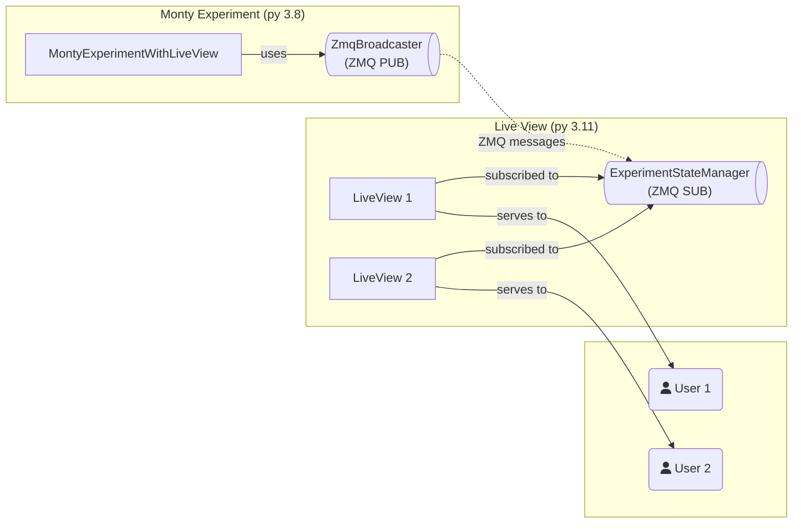

# LiveView Experiment Monitor

Real-time web dashboard for monitoring Monty experiments.

## Prerequisites

tbp.monty conda environment must be set up:

```bash
conda env create
conda activate tbp.monty
pip install -e .  # Install tbp.monty package
```

## Usage

**1. Setup (one-time):**

```bash
./contrib/liveview_experiment/scripts/setup.sh
```

**2. Run experiment:**

```bash
./contrib/liveview_experiment/scripts/run.sh
```

**3. View dashboard (if Python >= 3.11):**

http://127.0.0.1:8000

**Note**: On Python 3.8, the web dashboard is not available, but pub/sub streaming still works. Use `experiment.broadcaster` to stream data from parallel processes.

## Details

- **One-liner setup**: `./contrib/liveview_experiment/scripts/setup.sh` handles everything
- Setup script automatically installs tbp.monty package if needed (handles antlr4/setuptools compatibility)
- Run script starts experiment with LiveView monitoring
- Config files stay in `contrib/` (git-friendly, no copying)
- **Pub/sub streaming**: Works on Python 3.8+ (see `STREAMING_USAGE.md`)
- **Web dashboard**: Requires Python >= 3.11 (pyview-web). On Python 3.8, pub/sub streaming still works.

## Architecture

The LiveView system uses a two-process architecture with ZMQ pub/sub for cross-process communication:



## Streaming Data from Parallel Processes

The LiveView supports pub/sub for streaming data from parallel processes (threads, async tasks, etc.) into a unified dashboard. See `STREAMING_USAGE.md` for detailed examples.

**Quick example:**
```python
# From any parallel process
broadcaster = experiment.broadcaster
await broadcaster.publish_metric("loss", 0.5, epoch=1)
await broadcaster.publish_data("sensor_data", {"value": 123})
```

## Troubleshooting

### Segmentation Faults

If you experience segmentation faults when running experiments, this may be due to conflicts between the LiveView server thread and native libraries (habitat-sim, torch). Try:

1. **Disable LiveView temporarily**:
   ```yaml
   enable_liveview: false
   ```

2. **Run without LiveView**:
   ```bash
   python run.py experiment=randrot_10distinctobj_surf_agent_with_liveview \
     hydra.searchpath=[contrib/liveview_experiment/conf] \
     enable_liveview=false
   ```

3. **Check logs** for specific error messages

The experiment will continue to run even if LiveView fails to start.

## Code Quality

Run complexity analysis to check code quality:

```bash
./contrib/liveview_experiment/scripts/analyze_complexity.sh
```

This analyzes:
- Cyclomatic complexity
- Nesting levels
- Function length
- Parameter counts
- Maintainability Index

Results are saved to `complexity_report.json`.

## Customization

- Edit `templates/experiment.html` for UI changes
- Edit experiment config to change port: `liveview_port: 8001`
- Use `experiment.broadcaster` to publish data from parallel processes
- Disable LiveView if needed: `enable_liveview: false`
