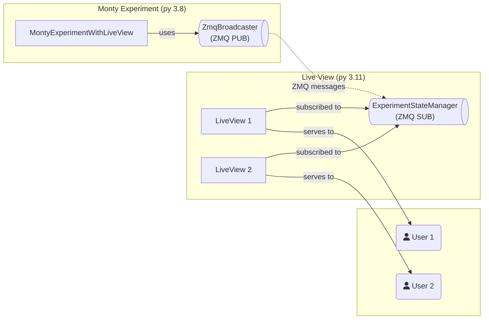

# LiveView Experiment Monitor

A demonstration of server-side web UI patterns for monitoring Monty experiments, inspired by Erlang/Elixir LiveView. This implementation uses [pyview](https://github.com/ogrodnek/pyview) to provide real-time dashboards with minimal JavaScript, keeping most UI logic in server-side Python.

## Overview

This contrib demonstrates how to build interactive web interfaces for experiments without complex client-side JavaScript or polling. The architecture separates concerns: the experiment runs in one process (Python 3.8), while the web server runs in another (Python 3.11+), communicating via ZeroMQ pub/sub.

## Quick Start

**Prerequisites:** tbp.monty conda environment must be set up:

```bash
conda env create
conda activate tbp.monty
pip install -e .
```

**Setup (one-time):**

```bash
./contrib/liveview_experiment/scripts/setup.sh
```

**Run experiment with LiveView:**

```bash
./contrib/liveview_experiment/scripts/run.sh [experiment_name]
```

The script supports two modes:

1. **With LiveView config** (recommended for custom setups):

   - If a config exists in `contrib/liveview_experiment/conf/experiment/`, it will be used with all values from the YAML
   - Example: `./contrib/liveview_experiment/scripts/run.sh randrot_10distinctobj_surf_agent_with_liveview`

2. **With base config** (works with any experiment, at least theoretically):
   - If no LiveView config exists, the script uses the base config from `conf/experiment/` and automatically:
     - Sets the LiveView experiment target
     - Adds LiveView configuration (ports, host, enable flag)
     - Disables wandb and excessive logging handlers
   - Example: `./contrib/liveview_experiment/scripts/run.sh randrot_noise_77obj_5lms_dist_agent`

**View dashboard:**

http://127.0.0.1:8000

## Architecture

The system uses a **two-process, message-driven architecture** to bridge Python version constraints and enable real-time monitoring:



### Design Overview

1. **Two-process separation**: Experiment (Python 3.8) and web server (Python 3.11+) run independently
2. **Message-driven communication**: ZeroMQ pub/sub for inter-process updates
3. **Server-side rendering**: pyview handles state management and UI updates in Python
4. **No client-side polling**: WebSocket-based updates eliminate JavaScript polling loops

### Communication Layers

- **Inter-process**: ZeroMQ pub/sub (experiment → LiveView server)
- **Intra-process**: pyview's Python-internal pub/sub (state manager → LiveView instances)
- **Client-server**: WebSocket (LiveView → browser)

### Code Flow

**LiveView Server (Python 3.11+):**

- [`main()`](src/liveview_server_standalone.py) - Entry point, starts server
  - [`ServerOrchestrator.run_with_zmq()`](src/server_orchestrator.py) - Orchestrates server and ZMQ subscriber
  - [`LiveViewServerSetup.create_app()`](src/server_setup.py) - Creates PyView app with [`ExperimentLiveView`](src/liveview_experiment.py)
  - [`ExperimentStateManager`](src/state_manager.py) - Manages shared state, receives updates via [`ZmqMessageProcessor`](src/zmq_message_processor.py)

**Experiment Process (Python 3.8):**

- [`run.py`](../run.py) → [`main()`](../src/tbp/monty/frameworks/run.py) - Hydra instantiates experiment from config
  - [`MontyExperimentWithLiveView`](src/monty_experiment_with_liveview.py) - Extends [`MontyExperiment`](../src/tbp/monty/frameworks/experiments/monty_experiment.py)
  - Sets up [`ZmqBroadcaster`](src/zmq_broadcaster.py) via [`BroadcasterInitializer`](src/broadcaster_initializer.py)
  - Overrides lifecycle methods (`pre_step()`, `post_step()`, `pre_episode()`, `post_epoch()`, `run()`) to publish state updates

**Configuration:**

The script supports two configuration approaches:

1. **LiveView configs** (in `contrib/liveview_experiment/conf/experiment/`):

   - Extend base configs and add LiveView-specific settings
   - Set `_target_` to `MontyExperimentWithLiveView`
   - Configure `zmq_port`, `liveview_port`, `enable_liveview`, and disable wandb
   - Example: [`randrot_10distinctobj_surf_agent_with_liveview.yaml`](conf/experiment/randrot_10distinctobj_surf_agent_with_liveview.yaml)

2. **Base configs** (in `conf/experiment/`):
   - Use any existing experiment config directly
   - The script automatically adds LiveView support via command-line options:
     - Sets `_target_` to `MontyExperimentWithLiveView`
     - Adds LiveView configuration fields
     - Disables wandb and excessive logging handlers
   - Example: `randrot_noise_77obj_5lms_dist_agent`

[`MontyExperimentWithLiveView`](src/monty_experiment_with_liveview.py) reads config and initializes [`ZmqBroadcaster`](src/zmq_broadcaster.py) accordingly

## Customization

Each experiment can customize its LiveView by providing:

- **HTML template**: Edit [`templates/experiment.html`](templates/experiment.html) or create experiment-specific templates
- **Python LiveView class**: Extend or modify [`ExperimentLiveView`](src/liveview_experiment.py) for custom UI logic
- **Configuration**: Set `liveview_port`, `zmq_port`, `enable_liveview` in experiment YAML (see [`conf/experiment/`](conf/experiment/))

## Scripts and Tools

This contrib includes single-shot scripts for common tasks:

- `setup.sh` - One-time setup of LiveView server environment
- `run.sh` - Run experiment with LiveView dashboard
- `analyze_complexity.sh` - Code complexity analysis

See [`scripts/README.md`](scripts/README.md) for all available scripts.

## Notes

This is a demonstration/prototype implementation. The patterns shown here (two-process architecture, message-driven design, server-side UI logic) can be adapted for other experiments or projects. The code quality reflects the exploratory nature of this work.
