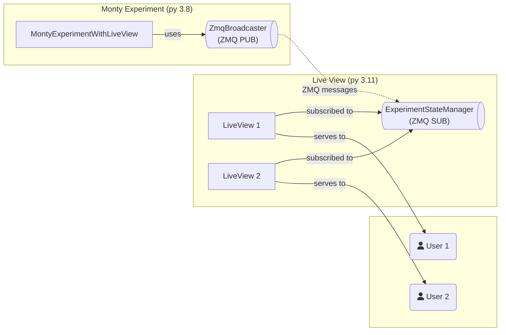

# LiveView Experiment Monitor

Real-time web dashboard for monitoring Monty experiments.

## Prerequisites

tbp.monty conda environment must be set up:

```bash
conda env create
conda activate tbp.monty
pip install -e .  # Install tbp.monty package
```

## Usage

**1. Setup (one-time):**

```bash
./contrib/liveview_experiment/scripts/setup.sh
```

**2. Run experiment:**

```bash
./contrib/liveview_experiment/scripts/run.sh
```

**3. View dashboard (if Python >= 3.11):**

http://127.0.0.1:8000

**Note**: On Python 3.8, the web dashboard is not available, but pub/sub streaming still works. See [`STREAMING_USAGE.md`](STREAMING_USAGE.md) for details.

## Architecture

The LiveView system uses a two-process architecture with ZMQ pub/sub for cross-process communication:



### Code Flow Overview

**LiveView Server (Python 3.11+):**

- [`main()`](src/liveview_server_standalone.py) - Entry point, starts server
  - [`ServerOrchestrator.run_with_zmq()`](src/server_orchestrator.py) - Orchestrates server and [`run_zmq_subscriber()`](src/liveview_server_standalone.py)
  - [`LiveViewServerSetup.create_app()`](src/server_setup.py) - Creates PyView app with [`ExperimentLiveView`](src/liveview_experiment.py)
  - [`ExperimentStateManager`](src/state_manager.py) - Manages shared state, receives updates via [`ZmqMessageProcessor`](src/zmq_message_processor.py)

**Experiment Process (Python 3.8):**

- [`run.py`](../run.py) → [`main()`](../src/tbp/monty/frameworks/run.py) - Hydra instantiates experiment from config
  - [`MontyExperimentWithLiveView`](src/monty_experiment_with_liveview.py) - Extends [`MontyExperiment`](../src/tbp/monty/frameworks/experiments/monty_experiment.py)
  - Sets up [`ZmqBroadcaster`](src/zmq_broadcaster.py) via [`BroadcasterInitializer`](src/broadcaster_initializer.py)
  - Overrides `pre_step()`, `post_step()`, `pre_episode()`, `post_epoch()`, `run()` to publish state updates

**Configuration:**

- Experiment config (e.g., [`randrot_10distinctobj_surf_agent_with_liveview.yaml`](conf/experiment/randrot_10distinctobj_surf_agent_with_liveview.yaml)) sets `zmq_port`, `liveview_port`, `enable_liveview`
- [`MontyExperimentWithLiveView`](src/monty_experiment_with_liveview.py) reads config and initializes [`ZmqBroadcaster`](src/zmq_broadcaster.py) accordingly

## Streaming Data from Parallel Processes

Stream data from parallel processes (threads, async tasks, etc.) into the dashboard. See [`STREAMING_USAGE.md`](STREAMING_USAGE.md) for examples.

```python
broadcaster = experiment.broadcaster
broadcaster.publish_metric("loss", 0.5, epoch=1)
broadcaster.publish_data("sensor_data", {"value": 123})
```

## Customization

- Edit [`templates/experiment.html`](templates/experiment.html) for UI changes
- Configure in experiment YAML: `liveview_port`, `zmq_port`, `enable_liveview` (see [`conf/experiment/`](conf/experiment/))
- Use `experiment.broadcaster` to publish data from parallel processes

## Code Quality

Run complexity analysis:

```bash
./contrib/liveview_experiment/scripts/analyze_complexity.sh
```

See [`scripts/README.md`](scripts/README.md) for available scripts.
