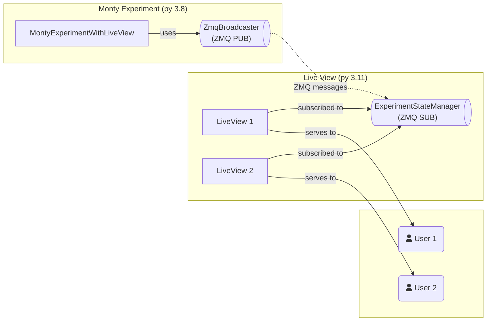

# LiveView Experiment Monitor

A demonstration of server-side web UI patterns for monitoring Monty experiments, inspired by Erlang/Elixir LiveView. This implementation uses [pyview](https://github.com/ogrodnek/pyview) to provide real-time dashboards with minimal JavaScript, keeping most UI logic in server-side Python.

## Overview

This contrib demonstrates how to build interactive web interfaces for experiments without complex client-side JavaScript or polling. The architecture separates concerns: the experiment runs in one process (Python 3.8), while the web server runs in another (Python 3.11+), communicating via ZeroMQ pub/sub.

## Quick Start

**Prerequisites:** tbp.monty conda environment must be set up:

```bash
conda env create
conda activate tbp.monty
pip install -e .
```

**Setup (one-time):**

```bash
./contrib/liveview_experiment/scripts/setup.sh
```

**Run experiment with LiveView:**

```bash
# Single-process mode (one episode at a time):
./contrib/liveview_experiment/scripts/run.sh [experiment_name]

# Parallel mode (run episodes across multiple processes):
./contrib/liveview_experiment/scripts/run_parallel.sh [experiment_name] [num_parallel] [episodes]
```

The scripts support two modes:

1. **With LiveView config** (for custom setups with explicit config):

   - If a config exists in `contrib/liveview_experiment/conf/experiment/`, it is used as-is
   - Example: `./contrib/liveview_experiment/scripts/run.sh randrot_10distinctobj_surf_agent_with_liveview`

2. **With base config** — parameterized, works with ANY upstream experiment:
   - If no LiveView-specific config exists, the script takes the base config from `src/tbp/monty/conf/experiment/` and automatically layers LiveView settings via Hydra CLI overrides:
     - Sets `_target_` to `MontyExperimentWithLiveView`
     - Adds `liveview_host`, `liveview_port`, `zmq_port`, `enable_liveview`, `sensor_image_throttle_ms`
     - Disables wandb and monty handlers (`wandb_handlers=[]`, `monty_handlers=[]`)
     - Auto-suffixes `run_name` with `_with_liveview` (customizable via `LIVEVIEW_RUN_NAME_SUFFIX` env var)
   - No per-experiment YAML files needed

**Examples — all 77-object benchmark experiments:**

```bash
# Single-LM surface agent (99.57% correct, ~97s/episode)
./contrib/liveview_experiment/scripts/run.sh randrot_noise_77obj_surf_agent

# Single-LM distant agent (96.97% correct, ~57s/episode)
./contrib/liveview_experiment/scripts/run.sh randrot_noise_77obj_dist_agent

# 5-LM distant agent (92.21% correct, ~96s/episode)
./contrib/liveview_experiment/scripts/run.sh randrot_noise_77obj_5lms_dist_agent

# Base surface agent (100% correct, ~24s/episode)
./contrib/liveview_experiment/scripts/run.sh base_77obj_surf_agent

# Base distant agent (98.27% correct, ~24s/episode)
./contrib/liveview_experiment/scripts/run.sh base_77obj_dist_agent

# Parallel mode: 4 workers, first 10 episodes only
./contrib/liveview_experiment/scripts/run_parallel.sh randrot_noise_77obj_surf_agent 4 :10

# Custom run name suffix (default is _with_liveview):
LIVEVIEW_RUN_NAME_SUFFIX=_debug ./contrib/liveview_experiment/scripts/run.sh randrot_noise_77obj_surf_agent
```

**View dashboard:**

http://127.0.0.1:8000

> **Note:** The 77obj experiments need pretrained models under `$MONTY_MODELS/pretrained_ycb_v12/`. If missing, a symlink `pretrained_ycb_v12 -> pretrained_ycb_v11` will work (v12 is a rename of v11).

## Architecture

The system uses a **two-process, message-driven architecture** to bridge Python version constraints and enable real-time monitoring:


```mermaid
flowchart LR
    subgraph Users[" "]
        User1("fa:fa-user User 1")
        User2("fa:fa-user User 2")
    end

    subgraph LiveViewServer["`Live View (py 3.11)`"]
        StateManager@{ shape: das, label: "ExperimentStateManager\n(ZMQ SUB)" }
        LiveView1[LiveView 1] -- subscribed to --> StateManager
        LiveView2[LiveView 2] -- subscribed to --> StateManager
    end

    subgraph MontyExperiment["Monty Experiment (py 3.8)"]
        %% Sensors[Sensors] -- publishes via --> ZmqBroadcaster
        %% LearningModules[Learning Modules] -- publishes via --> ZmqBroadcaster
        %% ProgressLoggers[Progress Loggers] -- publishes via --> ZmqBroadcaster
        Experiment[MontyExperimentWithLiveView] -- uses --> ZmqBroadcaster
        ZmqBroadcaster@{ shape: das, label: "ZmqBroadcaster\n(ZMQ PUB)" }
    end

    ZmqBroadcaster -. ZMQ messages .-> StateManager
    LiveView1 -- serves to --> User1
    LiveView2 -- serves to --> User2
```

### Environment Variables

| Variable | Default | Description |
|---|---|---|
| `MONTY_LOGS` | `~/tbp/results/monty/` | Output directory for experiment logs and results |
| `MONTY_MODELS` | `~/tbp/results/monty/pretrained_models` | Directory containing pretrained model checkpoints |
| `MONTY_DATA` | `~/tbp/data` | Directory containing experiment data (e.g., YCB objects) |
| `WANDB_DIR` | same as `MONTY_LOGS` | Weights & Biases logging directory |
| `LIVEVIEW_RUN_NAME_SUFFIX` | `_with_liveview` | Suffix appended to the run name for LiveView-mode experiments |

### Design Overview

1. **Two-process separation**: Experiment (Python 3.8) and web server (Python 3.11+) run independently
2. **Message-driven communication**: ZeroMQ pub/sub for inter-process updates
3. **Server-side rendering**: pyview handles state management and UI updates in Python
4. **No client-side polling**: WebSocket-based updates eliminate JavaScript polling loops

### Communication Layers

- **Inter-process**: ZeroMQ pub/sub (experiment → LiveView server)
- **Intra-process**: pyview's Python-internal pub/sub (state manager → LiveView instances)
- **Client-server**: WebSocket (LiveView → browser)

### Code Flow

**LiveView Server (Python 3.11+):**

- [`main()`](src/liveview_server_standalone.py) - Entry point, starts server
  - [`ServerOrchestrator.run_with_zmq()`](src/server_orchestrator.py) - Orchestrates server and ZMQ subscriber
  - [`LiveViewServerSetup.create_app()`](src/server_setup.py) - Creates PyView app with [`ExperimentLiveView`](src/liveview_experiment.py)
  - [`ExperimentStateManager`](src/state_manager.py) - Manages shared state, receives updates via [`ZmqMessageProcessor`](src/zmq_message_processor.py)

**Experiment Process (Python 3.8):**

- [`run.py`](../run.py) → [`main()`](../src/tbp/monty/frameworks/run.py) - Hydra instantiates experiment from config
  - [`MontyExperimentWithLiveView`](src/monty_experiment_with_liveview.py) - Extends [`MontyExperiment`](../src/tbp/monty/frameworks/experiments/monty_experiment.py)
  - Sets up [`ZmqBroadcaster`](src/zmq_broadcaster.py) via [`BroadcasterInitializer`](src/broadcaster_initializer.py)
  - Overrides lifecycle methods (`pre_step()`, `post_step()`, `pre_episode()`, `post_epoch()`, `run()`) to publish state updates

**Configuration:**

The script supports two configuration approaches:

1. **LiveView configs** (in `contrib/liveview_experiment/conf/experiment/`):

   - Extend base configs and add LiveView-specific settings
   - Set `_target_` to `MontyExperimentWithLiveView`
   - Configure `zmq_port`, `liveview_port`, `enable_liveview`, and disable wandb
   - Example: [`randrot_10distinctobj_surf_agent_with_liveview.yaml`](conf/experiment/randrot_10distinctobj_surf_agent_with_liveview.yaml)

2. **Base configs** (in `conf/experiment/`):
   - Use any existing experiment config directly
   - The script automatically adds LiveView support via command-line options:
     - Sets `_target_` to `MontyExperimentWithLiveView`
     - Adds LiveView configuration fields
     - Disables wandb and excessive logging handlers
   - Example: `randrot_noise_77obj_5lms_dist_agent`

[`MontyExperimentWithLiveView`](src/monty_experiment_with_liveview.py) reads config and initializes [`ZmqBroadcaster`](src/zmq_broadcaster.py) accordingly

## Customization

Each experiment can customize its LiveView by providing:

- **HTML template**: Edit [`templates/experiment.html`](templates/experiment.html) or create experiment-specific templates
- **Python LiveView class**: Extend or modify [`ExperimentLiveView`](src/liveview_experiment.py) for custom UI logic
- **Configuration**: Set `liveview_port`, `zmq_port`, `enable_liveview` in experiment YAML (see [`conf/experiment/`](conf/experiment/))

## Scripts and Tools

This contrib includes single-shot scripts for common tasks:

- `setup.sh` - One-time setup of LiveView server environment
- `run.sh` - Run experiment with LiveView dashboard
- `analyze_complexity.sh` - Code complexity analysis

See [`scripts/README.md`](scripts/README.md) for all available scripts.

## Notes

This is a demonstration/prototype implementation. The patterns shown here (two-process architecture, message-driven design, server-side UI logic) can be adapted for other experiments or projects. The code quality reflects the exploratory nature of this work.

---

## All Available Experiments

Every upstream experiment can be run with LiveView via mode 2 (no per-experiment YAML needed). Dashboard at http://127.0.0.1:8000.

> **Legend:** 📷 = shows camera/sensor images in dashboard | 📊 = evidence chart (all experiments show this)

**LiveView-specific configs** (in `contrib/liveview_experiment/conf/experiment/`):
```bash
./contrib/liveview_experiment/scripts/run.sh randrot_10distinctobj_surf_agent_with_liveview
./contrib/liveview_experiment/scripts/run.sh tutorial_surf_agent_2obj_with_liveview
```

**77-object benchmarks:**
```bash
# 📷 Surface agent — camera views shown (auto-enabled via save_raw_obs override)
./contrib/liveview_experiment/scripts/run.sh randrot_noise_77obj_surf_agent  # 99.57%, ~97s/ep
./contrib/liveview_experiment/scripts/run.sh base_77obj_surf_agent            # 100.00%, ~24s/ep
# Distant agent: fixed camera observes from distance
./contrib/liveview_experiment/scripts/run.sh randrot_noise_77obj_dist_agent   # 96.97%, ~57s/ep
./contrib/liveview_experiment/scripts/run.sh base_77obj_dist_agent            # 98.27%, ~24s/ep
# 5-LM distant agent: 5 learning modules voting
./contrib/liveview_experiment/scripts/run.sh randrot_noise_77obj_5lms_dist_agent  # 92.21%, ~96s/ep
```

**10-object benchmarks:**
```bash
# 📷 All surface agent experiments — camera views shown (auto-enabled via override)
./contrib/liveview_experiment/scripts/run.sh randrot_noise_10distinctobj_surf_agent
./contrib/liveview_experiment/scripts/run.sh randrot_noise_10simobj_surf_agent
./contrib/liveview_experiment/scripts/run.sh randomrot_rawnoise_10distinctobj_surf_agent
./contrib/liveview_experiment/scripts/run.sh base_config_10distinctobj_surf_agent
./contrib/liveview_experiment/scripts/run.sh base_10simobj_surf_agent
./contrib/liveview_experiment/scripts/run.sh randrot_10distinctobj_surf_agent
# Distant agent experiments
./contrib/liveview_experiment/scripts/run.sh base_config_10distinctobj_dist_agent
./contrib/liveview_experiment/scripts/run.sh randrot_noise_10distinctobj_dist_agent
./contrib/liveview_experiment/scripts/run.sh randrot_noise_10distinctobj_dist_on_distm
./contrib/liveview_experiment/scripts/run.sh randrot_noise_10distinctobj_5lms_dist_agent
./contrib/liveview_experiment/scripts/run.sh randrot_noise_10simobj_dist_agent
# Multi-object with distractors
./contrib/liveview_experiment/scripts/run.sh base_10multi_distinctobj_dist_agent
```

**Training-only:**
```bash
./contrib/liveview_experiment/scripts/run.sh only_surf_agent_training_10obj
./contrib/liveview_experiment/scripts/run.sh only_surf_agent_training_10simobj
./contrib/liveview_experiment/scripts/run.sh only_surf_agent_training_allobj
./contrib/liveview_experiment/scripts/run.sh only_surf_agent_training_numenta_lab_obj
```

**Supervised pre-training:**
```bash
./contrib/liveview_experiment/scripts/run.sh supervised_pre_training_base
./contrib/liveview_experiment/scripts/run.sh supervised_pre_training_5lms
./contrib/liveview_experiment/scripts/run.sh supervised_pre_training_5lms_all_objects
./contrib/liveview_experiment/scripts/run.sh supervised_pre_training_flat_objects_wo_logos
./contrib/liveview_experiment/scripts/run.sh supervised_pre_training_logos_after_flat_objects
./contrib/liveview_experiment/scripts/run.sh supervised_pre_training_curved_objects_after_flat_and_logo
./contrib/liveview_experiment/scripts/run.sh supervised_pre_training_objects_with_logos_lvl1_comp_models
./contrib/liveview_experiment/scripts/run.sh supervised_pre_training_objects_with_logos_lvl1_comp_models_burst_sampling
./contrib/liveview_experiment/scripts/run.sh supervised_pre_training_objects_with_logos_lvl1_monolithic_models
./contrib/liveview_experiment/scripts/run.sh supervised_pre_training_objects_with_logos_lvl2_comp_models
./contrib/liveview_experiment/scripts/run.sh supervised_pre_training_objects_with_logos_lvl3_comp_models
```

**Compositional / inference:**
```bash
./contrib/liveview_experiment/scripts/run.sh infer_comp_lvl1_with_comp_models
./contrib/liveview_experiment/scripts/run.sh infer_comp_lvl1_with_comp_models_and_burst_sampling
./contrib/liveview_experiment/scripts/run.sh infer_comp_lvl1_with_monolithic_models
./contrib/liveview_experiment/scripts/run.sh infer_comp_lvl2_with_comp_models
./contrib/liveview_experiment/scripts/run.sh infer_comp_lvl3_with_comp_models
```

**📷 Unsupervised — camera views shown:**
```bash
./contrib/liveview_experiment/scripts/run.sh surf_agent_unsupervised_10distinctobj
./contrib/liveview_experiment/scripts/run.sh surf_agent_unsupervised_10distinctobj_noise
./contrib/liveview_experiment/scripts/run.sh surf_agent_unsupervised_10simobj
# No camera (save_raw_obs: false)
./contrib/liveview_experiment/scripts/run.sh unsupervised_inference_distinctobj_dist_agent
./contrib/liveview_experiment/scripts/run.sh unsupervised_inference_distinctobj_surf_agent
```

**📷 World image / scanned model — camera views shown:**
```bash
./contrib/liveview_experiment/scripts/run.sh world_image_on_scanned_model
./contrib/liveview_experiment/scripts/run.sh world_image_from_stream_on_scanned_model
./contrib/liveview_experiment/scripts/run.sh bright_world_image_on_scanned_model
./contrib/liveview_experiment/scripts/run.sh dark_world_image_on_scanned_model
./contrib/liveview_experiment/scripts/run.sh hand_intrusion_world_image_on_scanned_model
./contrib/liveview_experiment/scripts/run.sh multi_object_world_image_on_scanned_model
./contrib/liveview_experiment/scripts/run.sh randrot_noise_sim_on_scan_monty_world
```

**Tutorials:**
```bash
./contrib/liveview_experiment/scripts/run.sh tutorial/first_experiment
./contrib/liveview_experiment/scripts/run.sh tutorial/surf_agent_2obj_eval
./contrib/liveview_experiment/scripts/run.sh tutorial/surf_agent_2obj_train
./contrib/liveview_experiment/scripts/run.sh tutorial/surf_agent_2obj_unsupervised
./contrib/liveview_experiment/scripts/run.sh tutorial/dist_agent_5lm_2obj_eval
./contrib/liveview_experiment/scripts/run.sh tutorial/dist_agent_5lm_2obj_train
./contrib/liveview_experiment/scripts/run.sh tutorial/omniglot_inference
./contrib/liveview_experiment/scripts/run.sh tutorial/omniglot_training
./contrib/liveview_experiment/scripts/run.sh tutorial/monty_meets_world_2dimage_inference
```
