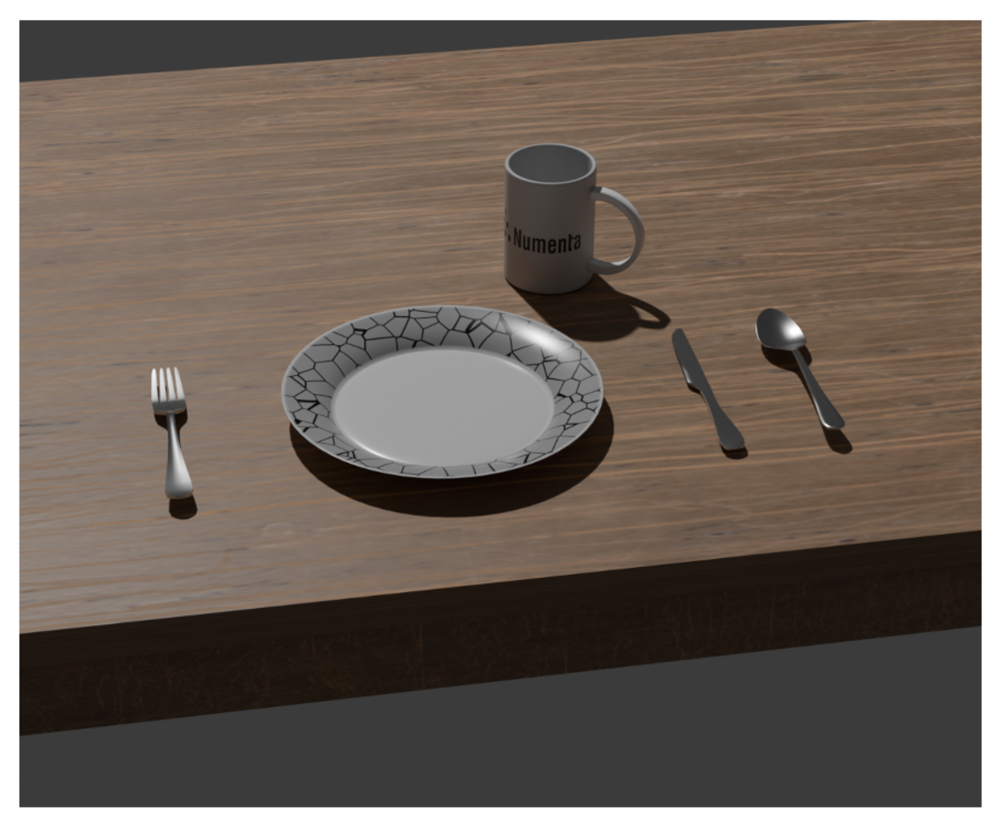
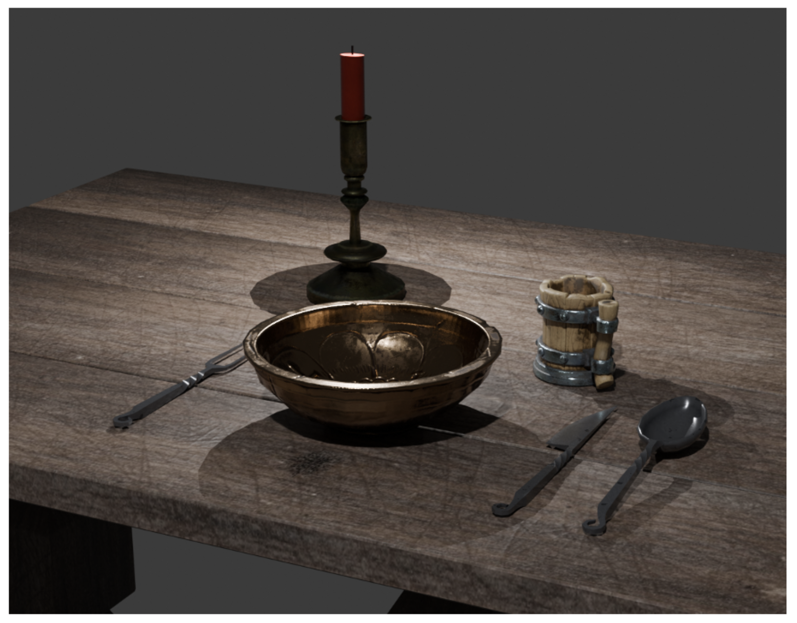

### The Task Setup

Imagine a Monty system learns a dinner table setting with normal cutlery and plates (see example images below). Separately, the system learns about medieval instances of cutlery and plates, but never sees them arranged in a dinner table setting. If Monty was to then see a medieval dinner table setting for the first time, it should be able to recognize the arrangement as a dinner table setting with reasonable confidence, even if the constituent objects are somewhat different from those present when the compositional object was first learned. There are a few approaches that could realize this.

### Class-Like Models

The simplest, and potentially sufficient, approach is that some LMs will learn more abstract, class-like representations of objects. For example, while one LM might learn to distinguish the medieval mug and modern mug, another LM may learn both of these as a coarse "mug" object that does not distinguish between the two. When a higher-level LM learns the compositional dinner-plate setup, the abstract mug representation would be associated at the relevant location. When Monty later performs inference on the medieval dinner table, "mug" will still become active, and the dinner table setup can be recognized for what it is.

If working on this Future Work item, we would advise beginning with this approach, rather than the SDR encoding work below.

### SDR Similarity Encoding

An alternative, potentially complementary approach is that the encoding of object IDs could capture their similarity in dimensions such as shape. When an incoming SDR is received in a higher-level LM, fuzzy matching would enable the recognition of a compositional object, even where the precise child object differs (e.g. medieval vs. modern mug).

We have already implemented the ability to [encode object IDs using sparse-distributed representations (SDRs)](https://github.com/thousandbrainsproject/tbp.evidence_sdr_matching), and in particular can use this as a way of capturing similarity and dissimilarity between objects. Using such encodings in learned [Hierarchical Connections](add-top-down-connections.md), we should observe a degree of natural generalization when recognizing compositional objects.

We should note that we are still determining whether overlapping bits between SDRs is the best way to encode object similarity. As such, we are also open to exploring this task with alternative approaches, such as directly making use of values in the evidence-similarity matrix (from which SDRs are currently derived).

### Evaluation Methods

When assessing the above approaches, it is important that Monty is not overly tolerant. For example, if a baseball is placed where the mug should go in the dinner table arrangement, then this is clearly a new compositional object, and the higher-level LM should not falsely perceive the dinner table setup.

*Example of a standard dinner table setting with modern cutlery and plates that the system could learn from.*

*Example of a medieval dinner table setting with medieval cutlery and plates that the system could be evaluated on, after having observed the individual objects in isolation.*
