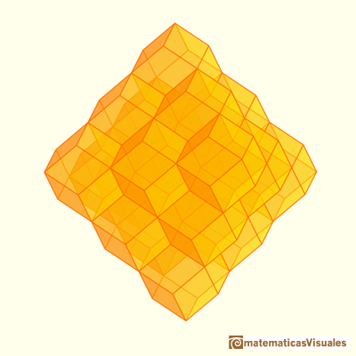
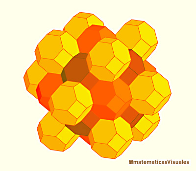

Our [constrained object models](../../how-monty-works/learning-module/object-models.md#object-models) represent space during learning as tessellated cubes (voxels). The presence of features in each of these voxels then informs the construction of a point cloud that we later use for K-D tree search.

It may be that querying these voxels directly, for example with a hash table, could represent a more efficient method of search than our current K-D tree method ([see this related item for further discussion](../framework-improvements/find-faster-alternative-to-kdtree-search.md)). While our past investigations have indicated that K-D tree search is quite efficient, this may differ with hardware appropriately matched to a specific algorithm. Moreover, K-D trees have the disadvantage that, during significant updates to the point cloud (i.e. learning), the tree must generally be reconstructed. A long-term aim however is that Monty can continuously learn in an online manner, prompting the desire to avoid such a rebuilding process. Direct voxel-querying with methods such as hash tables may be an approach to avoid this issue.

A problem arises, however, with simply using the existing voxel-based representation. In particular, cubes are a poor way of tessellating 3D space when concerned with cell membership: points that fall just within the corner of a cube are still considered a member of that cube, yet are more distant from the voxel center than points that fall just within the face-center of a cube. This is what is known as *anisotropy*, or a lack of uniformity in all directions. In Monty, this has the practical risk of biasing which voxel a point belongs to, depending on which direction a sensor is moving. This could impact the precision with which the location and pose of an object is resolved, additionally harming classification accuracy. This issue will be more pronounced as our models become sparser (as voxels cover a larger proportion of space), yet [sparser models are an important long term aim of ours](./use-models-with-fewer-points.md).

More isotropic methods of tessellating (i.e. a non-overlapping, gap-free space filling process) in 3D space include using the rhombic dodecahedron or the truncated octahedron. The images below show the 3D tessellations formed by these solids. An outcome of this work would be to implement a custom learning module that uses such a tessellation instead of cubical voxels. We would then want to evaluate the effect, if any, on using one format over the other in terms of classification and pose accuracy. Should these alternative approaches prove promising from an accuracy standpoint, further work could explore algorithms that search for members in a reference frame by querying membership in a polyhedral cell directly.

A complementary benefit could also apply even with the existing conversion from a voxel grid to a point cloud that occurs after learning. In particular, the collection of observations within a voxel (including surface normal directions, sensed colors, etc.) are averaged over to determine the properties of that voxel (and hence the properties of the point cloud member that it becomes). Anisotropy can bias which observations fall within certain voxels, resulting in a poorer match between features stored in the learned models, and those queried at inference time when L-2 Euclidean distance is used.

### Rhombic Dodecahedron

### Truncated Octahedron

Image credit: https://www.matematicasvisuales.com

Note that the aim of this work is to improve the computational properties of Monty. An interesting aside however is that a 2D slice through certain tessellations may result in a triangular or hexagonal tiling, similar to 2D grid cells in biology. Together with [making hypothesis updates more similar to leaky-integrate and fire neurons](./improve-bounded-evidence-performance.md), this could represent an intriguing side effect where computational constraints result in Monty's representations being more brain like.