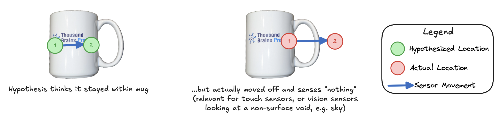
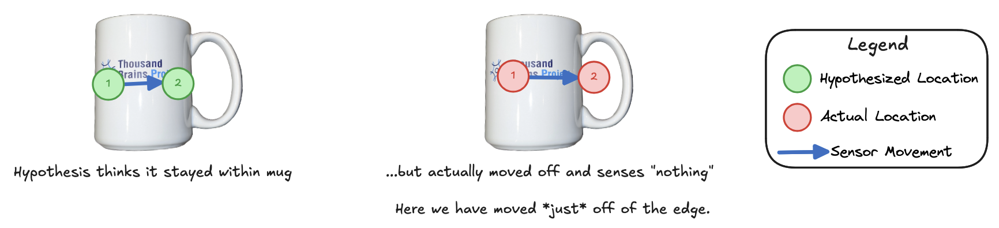

There are a few instances where a Monty system moves off an object, sensing nothing/empty space. For example, this can occur due to a model-free driven action like a saccade moving off the object and staring at a void (such as the sky), or the surface agent leaving the surface of the object.

Currently we have methods to move the sensor back on to the object, however we do not make use of the information that there was no object at the perceived location. This is valuable information, as the absence of the object at a location will be inconsistent with some object and pose hypotheses - hypotheses that should therefore have their associated evidence reduced. This setup is shown in the diagram below.

*Example of a sensor moving off of an object and observing nothing.*

To address this, we need to update how these observations are processed such that:
1. These observations are formulated as an appropriate "null"-type observation - there is no surface to observe, and so there should be no morphological features. However, there would still be a location (e.g. where the finger tip is hovering), and there can be non-morphological features like color.
2. These observations are still passed to the learning module.
3. The learning module's evidence-update appropriately results in negative evidence, as no object model should ever store a "null" feature that would match this observation.

### What if a hypothesis itself has moved out of the reference frame?

See [Use Out of Reference Frame Movements](/use-out-of-reference-frame-movements.md)

### What if the movement is just off the surface of the object?

This situation is shown in the below diagram:

In this case, while some hypotheses on the surface of the object might be close (even within the neighborhood tolerance) to the sensors actual location, these will receive negative evidence, as they will predict being on the actual object. This is the desired behavior, as the LM should not predict that it is still on the object if it is no longer sensing it.

*Example of a sensor moving off of an object and observing nothing when it is close to the object's surface.*

### Gotchas to Watch Out For

From an initial look, this change might appear relatively straightforward, however we have found ourselves repeatedly facing conceptual or practical issues when visiting this task. A few potenital gotchas to consider:
i. We need to ensure that any change to how sensor modules pass these observations to an LM do not interfere with the existing policies. In particular, the distant agent's random saccade policy has a `undo_last_action` that moves the sensor back onto the object if it moves off of. Similarly, after performing a hypothesis testing jump, a `handle_failed_jump` process reverses the last action.
ii. During learning, we want to ensure that observations associated with these "null" morphological features are not stored, i.e. are not learned as part of any model.
iii. The FeatureChangeSM has additional logic for determining when to pass an observation to the LMs, and this needs to be accounted for in any changes.
iv. The buffer uses information about on-object observations to filter data, so some elements here may need updating.

NOTE: The instance where Monty moves onto *another* object (for example, a distant wall, or a nearby hand) is already handled by the existing matching process in Monty. In particular, this should result in unexpected sensory input if an LM believes it is still on the original object, and therefore will result in negative evidence.