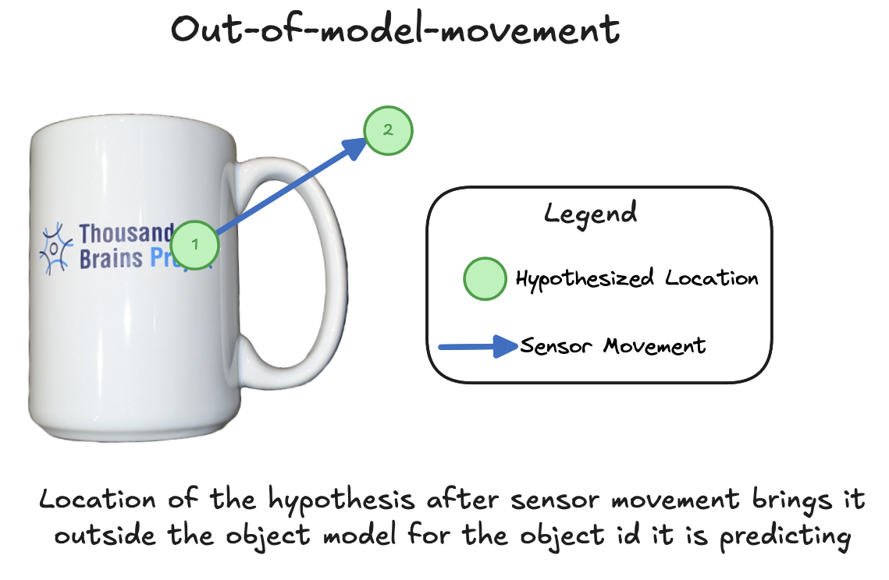

This task relates to [Use Off Object Observations](./use-off-object-observations.md), and so it is recommended that you read that description first.

Consider the situation described under using off-object observations. What if a hypothesis actually believes it moved out of the model's space? Or alternatively, what if Monty senses something (such as another object), but the hypothesis again believes it has moved out of the model's space? This setup is shown diagrammatically below:

*Example of a sensor movement resulting in the hypothesis moving out of the learned model of an object. Note a hypothesis need not be correct to become out-of-model; a hypothesis simply needs to move far away from any learned model points.*

> [!NOTE]
> In the past we have sometimes referred to this as an "out of reference frame" movement. However, it is most accurate to describe the reference frame as the unbounded representational space where a model is learned. As such, describing it as an out-of-model-movement (OOMM) is more accurate.

We believe the best approach is that the LM would retain the OOMM hypothesis for a short period of time (perhaps 2-3 steps in the current, discrete version of Monty). If it then moves back into the model space before this time has elapsed, then the hypothesis can continue to accumulate evidence.

If a hypothesis stays outside of the model space for too long however, then the hypothesis should receive strong negative evidence. In the resampling version of Monty, this would effectively be handled by the evidence slope being sufficiently small that the hypothesis is deleted.

This approach ensures that a Learning Module is not expected to maintain a long-term memory of objects it is not currently on. At the same time, it means that we can move out of a model, which can be a useful way to test other hypotheses (i.e. for objects where we do expect to find something there). By then moving back onto the object and continuing to accumulate evidence, certain hypotheses can continue to grow.

## Evaluations
-  See the description of the 7 vs 1 and i vs ı under [Use Off Object Observations](./use-off-object-observations.md) for a concrete example of where the above described situation is relevant for classification.
- It is recommended to develop experiments that specifically evaluate the use of out-of-model movements to help resolve this classification issue in tandem with off-object observations. 

## Other details
- If a most-likely-hypothesis moves out of a model and becomes "clamped" at that evidence value as a result, it should not continue to pass information up in a hierarchy of LMs. Intuitively, if we believe we are on a mug at location x, and then move to location y which is off of the mug, then we should not communicate to the next LM in the hierarchy that there is a mug at location y.
- What about object permanence, for example when moving back to where the object was after a significant period of time has elapsed? This should be captured via hierarchy - a higher-level LM would have a scene-like representation, and could use top-down biasing to help the LM in question recall what object it had just been observing. The mechanism here for OOMM only maintains hypotheses for a short period of time as a brief trace to enable returning to an object if a sensor strays off of it.

## Potential "gotchas" to be aware of:
- Currently hypotheses receive negative evidence when they move out of the model; by making the proposed change, we may find that certain (incorrect) hypotheses are eliminated more slowly. However, in practice, the window for maintaining an OOMM hypothesis is so short that it will hopefully have a negligible impact on the number of matching steps for convergence. Moreover, this change may be necessary to enable Monty to accommodate sparser models, which is one of our current aims (see [Use Models With Fewer Points](./use-models-with-fewer-points.md)). Without this, we risk punishing hypotheses that are simply between stored points in a sparse model.
- We previously performed some early experiments evaluating the immediate elimination of hypotheses that undergo out-of-model-movements. We found that when there is no location noise, it can help reduce the hypothesis space without any negative impact on accuracy. However, as uncertainty about where the sensor is located was introduced, often good hypotheses were eliminated. We expect that the approach proposed here (clamp hypotheses for a few steps before deleting them) should help prevent this from happening.
- Finally, see our [discontinued RFC on this topic](https://github.com/thousandbrainsproject/tbp.monty/pull/366/files) for potential considerations around unsupervised learning and incomplete models. These will likely require returning to in the future as a follow-up task.