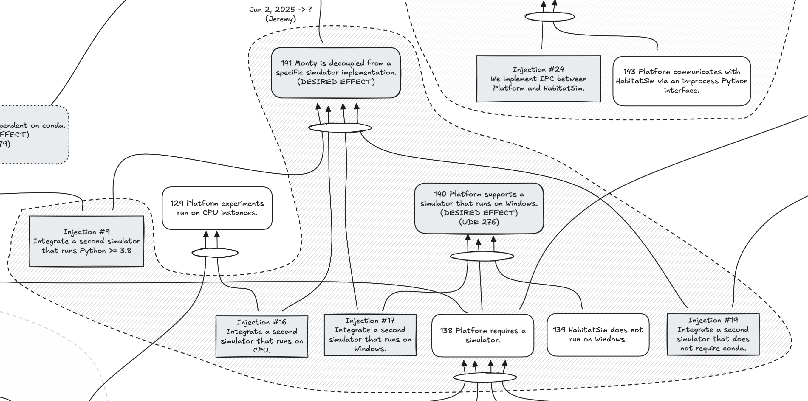

If we (Injection #9 Integrate a second simulator that runs Python >= 3.8) and we **(Injection #16 Integrate a second simulator that runs on CPU)** and we (Injection #17 Integrate a second simulator that runs on Windows) and we (Injection #19 Integrate a second simulator that does not require conda), then we achieve the desired effect (141 Monty is decoupled from a specific simulator implementation).

It is worth pointing out that integrating a simulator that runs on Python >= 3.8, on CPU, on Windows, and does not require conda might come down to selecting and integrating a single simulator that meets all of the criteria and not multiple units of work.

(127 HabitatSim>0.2. appears to require GPU to run) and if we **(Injection #16 Integrate a second simulator that runs on CPU)** then (129 Platform experiments run on CPU instances).

## Related work

- [Injection #9: Integrate a second simulator that runs Python >= 3.8](./injection-9-integrate-a-second-simulator-that-runs-python-38.md)
- [Injection #17: Integrate a second simulator that runs on Windows.](./injection-17-integrate-a-second-simulator-that-runs-on-windows.md)
- [Injection #19: Integrate a second simulator that does not require conda.](./injection-19-integrate-a-second-simulator-that-does-not-require-conda.md)
