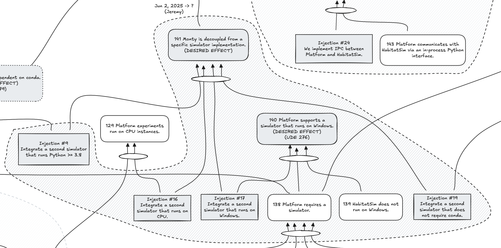

If we (Injection #9 Integrate a second simulator that runs Python >= 3.8) and we (Injection #16 Integrate a second simulator that runs on CPU) and we **(Injection #17 Integrate a second simulator that runs on Windows)** and we (Injection #19 Integrate a second simulator that does not require conda), then we achieve the desired effect (141 Monty is decoupled from a specific simulator implementation).

It is worth pointing out that integrating a simulator that runs on Python >= 3.8, on CPU, on Windows, and does not require conda might come down to selecting and integrating a single simulator that meets all of the criteria and not multiple units of work.

If we **(Injection #17 Integrate a second simulator that runs on Windows)** and (138 Platform requires a simulator) and (139 HabitatSim does not run on Windows), then we achieve the desired effect (140 Platform supports a simulator that runs on Windows).

## Related work

- [Injection #9: Integrate a second simulator that runs Python >= 3.8](./injection-9-integrate-a-second-simulator-that-runs-python-38.md)
- [Injection #16: Integrate a second simulator that runs on CPU.](./injection-16-integrate-a-second-simulator-that-runs-on-cpu.md)
- [Injection #19: Integrate a second simulator that does not require conda.](./injection-19-integrate-a-second-simulator-that-does-not-require-conda.md)
