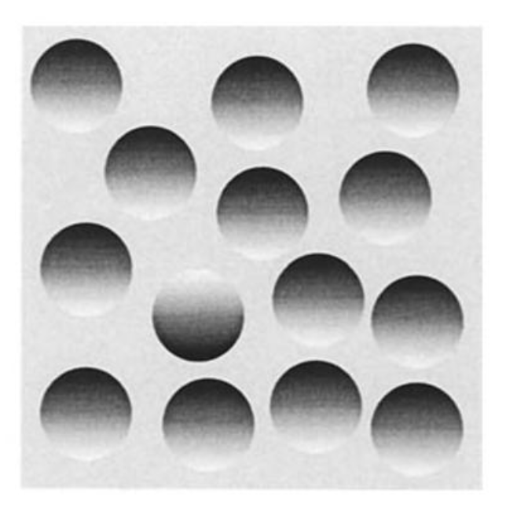

Monty relies significantly on estimated depth for figuring out how its vision sensor patch moves in 3D space, as well as for extracting 3D morphological features (surface normals and curvature directions). Currently we use a depth sensor in our simulator for this, but many real-world applications would not have access to such a sensor. In particular, cameras that natively extract depth information can be expensive, and suffer from limitations such as poor depth estimation in sunlit conditions, or when surfaces are highly reflective. Having the option to estimate depth in other ways would improve Monty's applicability in settings where only standard RGB cameras are available.

For this task, one could test existing computer vision techniques that estimate depth based, for example, on parallax. We are particularly interested in techniques that are motivated by how biological systems solve this.

To assist with this task, a [video overview of depth processing in the brain and computer vision systems, and their relevance to Monty, is available here](https://www.youtube.com/watch?v=6xr42m5vjbM). Below is a discussion summarizing some of the content of this video, as well as how these ideas might be combined to improve depth estimation in Monty. 

## Depth Estimation in the Brain and Artificial Systems

Depth estimation is classically divided into monocular and binocular techniques. Given the sensorimotor nature of Monty, the discussion below first emphasizes whether methods are sensorimotor or not.

### Depth Cameras
- This is what an "as-is" implementation of Monty would use, as these match the nature of the RGB-D camera that we simulate in Habitat.
- The most common methods, unlike biological vision, are very passive.
- In particular, Time-of-Flight and Structured-Light emit light and process the returning signal. However, the nature of the output/"action" is always the same (a fixed light signal), and does not vary in an active way.
- These methods can fail in conditions such as bright sunlight or reflective surfaces, both of which can disrupt the nature of the returning light signal that they measure.

### Sensorimotor cues of depth in biology
- These are processes where the source of depth signal is based on *how* the system is acting in order to modulate its input.
- Convergence: the movement of the two sensors (eyes) until they receive converging inputs. Binocular in nature.
- Accommodation: the change in focus of the lens required to achieve focus at a point of fixation. Monocoular in nature.
- Relative motion/parallax
    - Movement revealing the relative positions of features.
    - This is a mixed source, in that it can be sensorimotor if the agent itself is moving. However, motion parallax can also be based on the sole movement of things external to the observer.

Relevance to Monty
- You could imagine using two standard 2D cameras, where Monty uses a combination of model-free and model-based heuristics to infer how far away things are (i.e. an initial depth hypothesis).
- It then moves the cameras (convergence) and adjusts the lenses (accommodation) in order to achieve overlapping, focused images.
- Based on the degree of convergence and lens adjustment, an improved estimate of depth can be inferred.
- This could form an interactive sensorimotor loop with ever-increasing accuracy of the depth estimates, complemented with some of the signals discussed further below.

### Mono-ocular, non-sensorimotor depth queues 
- Detail / fineness of textures
    - Distant objects are associated with less detail.
    - It would be straightforward to have a heuristic estimating depth based on this, but how this information is combined with other sources would need to be carefully considered, as this heuristic is often not right.
- Lights and shadows, occlusion of objects, and distortion of textures
    - The 3D structure of an environment/object impacts all of these elements.
    - This is likely something that could be derived from a model-based hypothesis of the world's structure, i.e. different internal hypotheses of the world are compared to the incoming information - only some hypotheses would be consistent with the observed shadows, occlusion, etc.
    - It might also be possible to have an initial estimate/infer depth from these queues in a "model-free" way.
        - This might be analogous to our sub-cortical, model-free motor policy, in that a simple system could provide an initial estimate of depth based on low-level sensory cues.
        - This would be consistent with the fact that in humans, depth from shadows is partly estimated w.r.t. to our head, not gravity, implying we don't necessarily correct for our orientation in the world.
        - You can experience this yourself with the image below
            - We have a bias to expect that light (the sun) generally comes from above, so all but one of the circles look like they are recessed.
            - If you turn your head upside down, they look like they are coming out of the image like buttons. I.e. there is no internal model accounting for the fact that the sun should now be coming from "below".
            - It may be that this relies on a model-based method which is anchored to the head; alternatively, this is more of a model-free technique employed by our brains.

### Binocular, non-sensorimotor depth queues
- Definitions
    - Binocular disparity: "the difference in image location of an object seen by the left and right eyes, resulting from the eyes' horizontal separation (parallax)"
    - Stereopsis: "the perception of 3D depth due to binocular vision... the brain uses binocular disparity to extract depth information from the two-dimensional retinal images"
- Disparity
    - Key for fine-grained 3D depth perception.
    - Neurons in the brain are sensitive to different levels of disparity.
    - Points that lie at the same distance as the object of focus will fall on corresponding retinal points, while objects closer or farther away will fall on non-corresponding points.
    - How to actually determine which points in each image correspond to one another is not a simple task, and this is a complex subject.
    - This video is a good description of how it works in current artificial systems, as well as the problem setup:
        - https://www.youtube.com/watch?v=O7B2vCsTpC0&list=PLG4TTWPgryYEqyEiCuKu1WnUWUdfzumuZ
        - It is interesting to note that, for artificial systems to work, the cameras must know where they are, i.e. require an afferent signal about their relative displacement -- fortunately, this is a reasonable assumption from a biological perspective.

### Combining depth information
- Many of these depth cues could be combined to provide a refined 3D depth map for further processing in Monty (e.g., point-normal and surface curvature extraction).
- This could include combining bottom-up information with top-down feedback, and performing iterative refinement over time.
- The sensorimotor depth cues described earlier might provide a coarse "anchoring" for depth values (e.g., the object is x meters away), while non-sensorimotor signals might provide fine-grained information about the surface of that object.