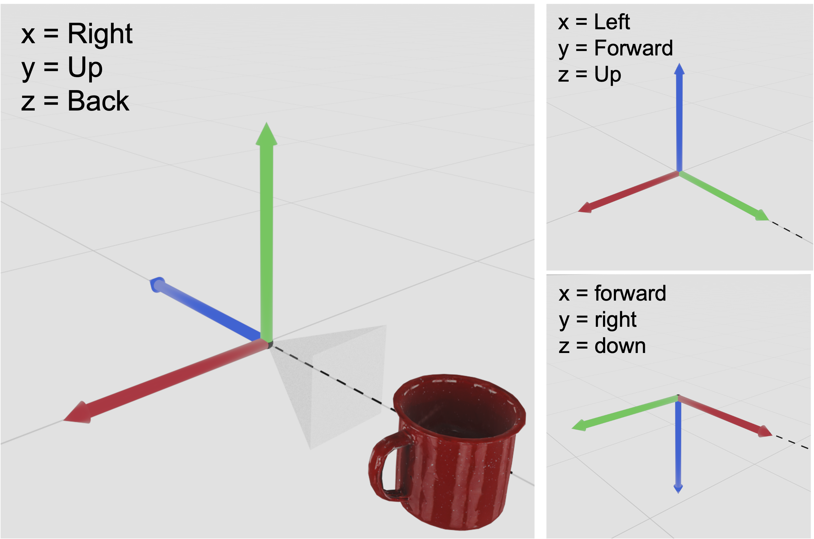

# Coordinate Systems and Conventions

There are many ways to specify a coordinate system in three dimensions, and it's notoriously easy to make mental mistakes or coding errors when working in 3D. This is especially true when converting between coordinate systems, which we often need to do when working with cameras, actuators, object models, simulators, visualization libraries, etc.

This document describes Monty's adopted 3D conventions and provides a few common conversion formulas to map between them. While there is a bit of discussion and background, the primary aim is to give users and developers a quick reference and cut through the confusion.

### Cartesian Conventions

Let's say you are given the xyz coordinates (1, 0, 0), relative to your body. Is the point 1 meter directly in front of you? Or is it above you, or off to your right? Without additional metadata, we can't really say.

More specifically, we need to know which _physical direction_ each axis points along. By physical direction, we mean one of
 - Left or Right
 - Up or Down
 - Forward or Backward

An axis-direction mapping is known as an [axes convention](https://en.wikipedia.org/wiki/Axes_conventions). For example, if the axes convention is (X = Right, Y = Up, Z = Backward), then the point (1, 0, 0) would lie 1 unit length to the right. We'll refer to this axes convention as right-up-backward, and it happens to be the axes convention assumed throughout Monty.

**Monty uses the right-up-backward axes convention**. More specifically,
 - The x-axis points to the right.
 - The y-axis points straight up.
 - The z-axis points backwards (i.e. directly behind you).

Note that when we say that an axis "points" in some direction, the positively-oriented direction of the axis is implied. When we're being explicit about a positive or negative axis orientation, we write +X, -X, +Y, etc.

**Be advised**: Since +Z points backwards, -Z points straight ahead. Most people tend to associate "forward" with "positive", which is probably why flipping z-values is a common mistake.

### Spherical Coordinates
<!--  -->

As with cartesian coordinate systems, Monty's choice of spherical coordinate system convention is common but not universal. Monty uses the so-called "forward-aligned zero angle axis" convention, which means that
  - The azimuth (yaw) angle is measured away from the forward axis.
  - The elevation (pitch) is measured upward from the horizontal plane.
 
 Put differently, a point that lies along the forward axis will have the angular coordinates (azimuth = 0, elevation = 0). Turning left increases azimuth, and pitching upward increases elevation.
 
We don't need to discuss other conventions, but it is good to be aware of them since reference material may lead you astray. Mismatched conventions will lead to incorrect conversion formualae.

### Mapping Between Cartesian and Spherical Coordinates

### Example: 2-DOF Gimbal Distant Agent

### Rotations
