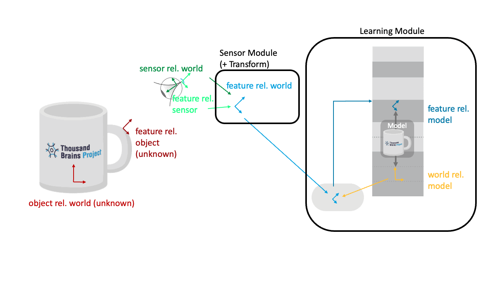

In a sensorimotor learning setup one naturally encounters several different reference frames in which information can be represented. Additionally, Monty has it's internal reference frames in which is learns models of objects. Those can get confusing to wrap your head around and keep track of so here is a brief overview of all the reference frames involved in a typical Monty setup.

# Reference Frames in a Typical Monty Experiment

### Object rel. World
- [dark green] The object in the world that has an orientation in the world (unknown to Monty)
### Feature rel. Object
- [darkest green] All the features on the object in the world which have an orientation relative to the object (also unknown to the Monty)
### Sensor rel. World/Body
- [yellow] The sensor’s orientation in the world (known through proprioception or motor efference copies)
### Feature rel. Sensor
- [dark yellow] The feature orientation relative to the sensor (surface normal and curvature direction extracted from the camera image)
### Feature rel. World/Body
- [bright green] The estimated orientation of the sensed feature in the world (sensor_rel_world * feature_rel_sensor, currently happens to the depth values in DepthTo3DLocations while the surface normal and curvature extraction then happens in the SM but we are planning to pull the transform into the SM)
### Object rel. Model
- [bluementa] Hypothesized orientation of the learned model relative to the object (in the world). This orientation needs to be inferred by the LM based on its sensory inputs. There are usually multiple hypotheses.
### Feature rel. Model
- [dark blue] Rotation of the currently sensed feature relative to the object model in the LM (feature_rel_world * object_rel_model).

## Keeping Input to the LM Constant as the Sensor Moves
The transform in the sensor module combines the sensor pose in the world with the sensed pose of the features relative to the sensor. This way, if the sensor moves while fixating on a point on the object, that feature pose will not change (see animation below). We are sending the same location and orientation of the feature in the world to the LM, no matter from which angle the sensor is "looking" at it.

This is one of the key definitions of the [CMP](../observations-transforms-sensor-modules.md#cmp-and-the-state-class): The pose sent out from all SMs is in a common reference frame. In Monty, we use the [DepthTo3DLocations](../../../src/tbp/monty/frameworks/environment_utils/transforms.py) transform for this calculation and report locations and orientations in an (arbitrary) world reference frame.

## Applying the Pose Hypothesis as the Object Rotates

If the object changes its pose in the world, the pose hypothesis in the LM comes into play. The LM has a hypothesis on how the object is rotated in the world relative to its model of the object. This is essentially the rotation that needs to be applied to rotate the incoming features and movements into the model’s reference frame.

The plot below only shows one pose hypothesis, but in practice, Monty has many of them, and it needs to infer this pose from what it is sensing (dark green orientations are unknown).

If the object is in a different rotation than how it was learned, all the features on the object will be sensed in different orientations and location in the world. This needs to be compensated by the light blue projection of the pose hypothesis.

What is not shown in this image is that the same rotation transform is also applied to the movement vector (displacement) that is applied to update the hypothesized location on the object.

# Reference Frame Transforms for Voting
Voting in Monty happens in object space. We directly translate between the object’s RF of the sending LM to the object RF of the receiving LM. This relies on the assumption that both LMs learned the object at the same time, and hence their RFs line up in orientation and displacement (since we receive features rel. world, which will automatically line up if the LMs learn the object at the same time). Otherwise, we could store one displacement between their RFs and apply that in addition.

The two LMs receive input from two sensors that sense different locations and orientations in space. They receive that as a pose in a common coordinate system (rel. world in the image below). Since the sensors are at different locations on the object and our hypotheses are “locations of sensor rel. model” we can’t just vote on the hypotheses directly but have to account for the relative sensor displacement. So the sensor that is sensing the handle of the cup needs to incorporate the offset to the sensor that senses the rim to be able to use its hypotheses.

This offset can be easily calculated from the difference of the two LM’s inputs as those poses are in a common coordinate system. The sending LM attaches its sensed pose in the world to the vote message it sends out (along with its hypotheses about the locations on the mug) and the receiving LM compares it with its own sensed pose and applies the difference to the vote hypotheses.

Check out our evidence LM documentation for [more details on voting](../learning-module/evidence-based-learning-module.md#voting-with-evidence).