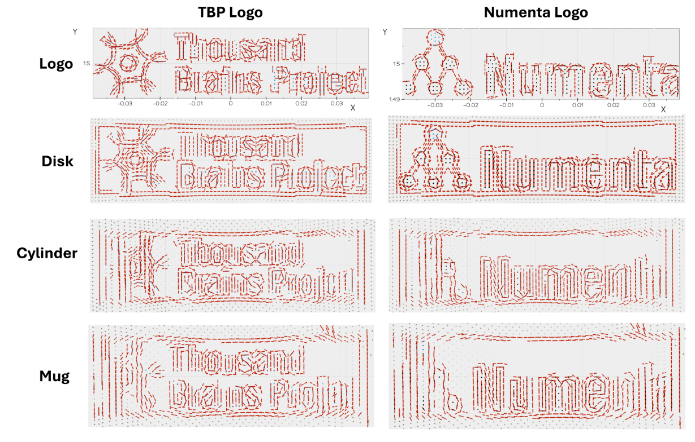

# TwoDSensorModule

`TwoDSensorModule` is a sensor module for learning 2D surface models of 3D objects. 

The module treats local texture edges as pose information and treats motion across the object as motion in a transported 2D coordinate system. This makes it possible to learn flattened edge layouts from curved surfaces while still sending `location`, `displacement`, and `pose_vectors` fields that downstream learning modules already understand.

For the detailed implementation notes, edge-detection math, movement derivation, and current experiment results, see the [TwoDSensorModule reference manual](). 

## What Problem It Solves

A standard RGBD sensor module (`CameraSM`) can estimate 3D locations, surface normals, and curvature directions at the center of a patch. That is useful for modeling 3D shape, but has difficulty distinguishing information that is 2D texture printed or painted onto a surface such as our [compostionality dataset](). For example, the TBP and Numenta logos on a disk or mug are defined by 2D edge layouts, even though the surface carrying the logo may be curved.

`TwoDSensorModule` addresses this by building a local 2D model of the surface texture. It still starts from RGBD observations, but it changes the interpretation of the outgoing message:

- The first two coordinates of `location` and `displacement` are the learned 2D surface model.
- The third coordinate is fixed at zero for compatibility with Monty's 3D-shaped message fields.
- When a reliable texture edge is detected, `pose_vectors` represents the local 2D edge direction rather than the original 3D curvature frame.

This keeps the representation compatible with Monty's existing learning modules while letting the learned graph describe a 2D surface layout. 

## How It Works

`TwoDSensorModule` has two main capabilities.

First, it detects a dominant texture-edge orientation in the RGB patch. The edge detector aggregates image-gradient evidence across the patch, scores whether there is a coherent edge, and rejects edges that look like depth discontinuities rather than texture on the object's surface. A detected logo edge can then become the pose feature that the learning module stores.

Second, it tracks movement in a local 2D reference frame. As the sensor moves over a curved surface, the tangent plane changes from one point to the next. `TwoDSensorModule` maintains a transported tangent frame so that the local 2D axes move smoothly across the surface. It then projects each 3D step into that frame and applies a curvature-aware correction so the accumulated displacement better approximates distance along the surface rather than a flattened chord through space.

## Recognizing Compositional Objects

In current experiments, `TwoDSensorModule` can learn 2D surface models of logo-bearing objects in the Compositionality Dataset across several supporting surfaces, as shown above.  

<!-- TODO: Add inference results (heatmap) --> 

Surface-transfer experiments also show that models learned on one surface can often recognize the same logo-bearing objects on another surface.  

## Current Limitations

The current implementation has several important constraints:

- It detects one dominant texture edge per patch, so corners, repeated textures, or competing edges can produce ambiguous orientations.
- It embeds the 2D chart in a 3D-shaped message by fixing `z = 0`. 
- Curved surfaces with nonzero Gaussian curvature cannot be flattened without distortion, and the learned model depend on the exploration path for these objects.
