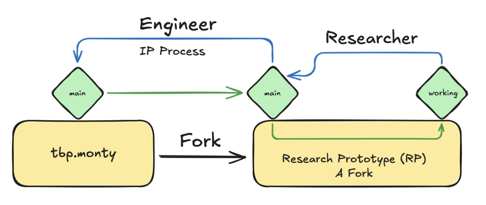
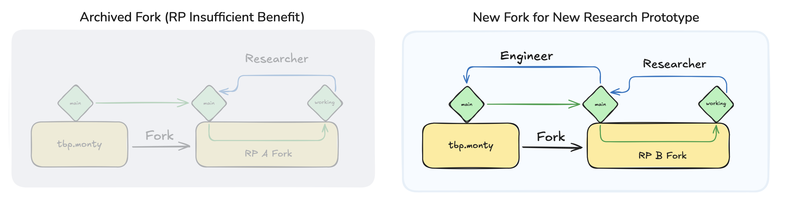
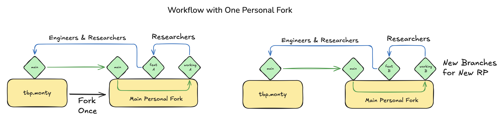

- Start Date: 2025-08-15
- RFC PR: (leave this empty, it will be filled in after RFC is merged)

# Summary

This RFC proposes some guidance on the workflow that TBP researchers (or community members doing research) should follow when contributing code to Monty.

# Motivation

Research benefits from rapidly exploring new ideas and features. At the same time, we want to ensure that Monty is a stable platform built on high-quality code. In [RFC 14](https://github.com/thousandbrainsproject/tbp.monty/blob/main/rfcs/0014_conducting_research_while_building_a_stable_platform.md), we established a workflow for integrating code into Monty that balances these two objectives. The intent of this RFC is to provide additional, concrete guidelines to realize this new workflow and ensure it is successful.

When this RFC is merged, the intent is to transfer most of its contents into an updated page (or pages) in our documentation.

# Definitions

- *Research Prototype (RP)*: A rapidly implemented feature intended to evaluate a research idea. This can establish or refute the hypothesized benefits of the idea, as well as enable measuring other qualities associated with it.
- *Implementation Project (IP)*: The process of refactoring a Research Prototype (as well as potentially `tbp.monty` itself) in order to merge a feature that was proven useful by an RP into the platform code-base (`thousandbrainsproject/tbp.monty`).

# Guidance on Research Workflows

As earlier noted, the following guidance is designed to complement [RFC 14 Conducting Research While Building a Stable Platform](https://github.com/thousandbrainsproject/tbp.monty/blob/main/rfcs/0014_conducting_research_while_building_a_stable_platform.md). Please refer to that RFC first if you are not familiar with its contents.

## Workflow for TBP Researchers: from Research Prototype to Implementation Project

Below is a recommended workflow for researchers; however, it is guidance only, and can be revisited if we find certain elements are not working.

### Setup
1. Begin a new Research Prototype by creating a fork of [tbp.monty](https://github.com/thousandbrainsproject/tbp.monty/):

When creating the fork, the owner should be set to the `thousandbrainsproject` organization:

Give your fork a name like `feat.description_of_prototype`:

If your RP is related to a particular [RFC](https://thousandbrainsproject.readme.io/docs/request-for-comments-rfc), it can be helpful to link to this RFC in the fork description, which will appear under the About heading.

2. Clone the new fork, and then create a new development branch that is appropriately named.
    - Your fork should now have a `main` branch, and a feature branch or branches where you will carry out active work.

### Workflow
- The aim is to progressively implement the Research Prototype via a series of PRs into the `main` branch of your RP fork.
    - Please try to formulate PRs into the main branch as _atomic_ PRs for review by other researchers.
    - Note that _atomic_ does not always mean small, although it is a common finding that PRs (especially by researchers!) are too large. Rather, atomic means that the PR represents a full, minimally self-contained change. The PR should not depend on code that will be added in the future, although context can be provided where helpful re. future changes.
- When you open a PR into your fork's `main` branch, it is generally recommended that you tag at least one other TBP researcher for review.
    - The aim is that RP work should be regularly reviewed and discussed with other researchers; getting reviews early, particularly for complex or conceptually important changes, reduces the chance that significant effort will be spent on a change that might be in a suboptimal direction.
    - However, researchers should use their own judgement to weigh the benefits of reviews on every atomic change against the benefit of quick iteration and experimentation.
- During your work, ensure you regularly update your fork and its branches with any upstream changes to `thousandbrainsproject/tbp.monty`. This will reduce the chance that a longer RP-project is associated with significant merge conflicts when you later wish to merge it into the primary Monty code-base.
- When a research prototype has been fully implemented and its merits established through evaluations and visualizations, the `main` branch is ready to form the basis of an Implementation Project.
- The Implementation Project (IP) involves any necessary refactoring of the Research Prototype to ensure it adheres to the [guidelines of the platform](https://thousandbrainsproject.readme.io/docs/code-style-guide) before merging into `tbp.monty`. For more information, see [the description of the IP process in RFC 14 Conducting Research While Building a Stable Platform](https://github.com/thousandbrainsproject/tbp.monty/blob/main/rfcs/0014_conducting_research_while_building_a_stable_platform.md#implementation-project).
- As a brief summary of the IP process, please see the below extract:

> The implementation project is a project because it may require major refactoring of the prototype or of Monty in order to integrate the new capability. It may be a single pull request, or it may be a long running effort as we reorganize all of Monty. The working prototype is helpful as it becomes a working specification of what needs to be implemented.
>
> This is the stage at which maintaining platform stability comes into consideration, not before.
>
> -- [RFC 14](https://github.com/thousandbrainsproject/tbp.monty/blob/main/rfcs/0014_conducting_research_while_building_a_stable_platform.md)

The workflow is shown in the below diagram:

Green arrows indicate pulling from upstream, blue arrows indicate PRs. Above the blue arrows, a suggestion is provided for whether a researcher or engineer would more suitable to review the PR. If you are contributing as a non-Maintainer, it will be the responsibility of the Maintainer you tag to determine who is most suitable to review the PR.

Below shows the potential follow-up workflow. In the example shown, the first RP (RP "A") did not demonstrate significant benefit, and the fork is archived without ever going through the IP process. A new fork is made to work on a new RP / feature.

### Regarding Code Quality Specified in Other Guideline
- When writing code for the RP, you may choose to follow the [official guidance for the platform](https://thousandbrainsproject.readme.io/docs/code-style-guide). 
- The advantage of doing so while working on the RP is that it can reduce the amount of work required for the IP stage.
- However, adhering to these guidelines is often not possible without first carrying out a significant refactor of the code, or through a time-consuming design process.
- As such, researchers should not follow these guidelines if it will introduce significant delays. Rather, the guidance they provide (e.g., being mindful of how state is added or accessed in code) can provide general tips for writing high-quality code from the beginning.

### Other Comments
- Your new fork will not have any controls in place to prevent force pushes from other [Members of the TBP organization](https://github.com/orgs/thousandbrainsproject/people). We therefore ask that everyone exercise care in working with the forks of other team members. If you are going to be interacting with another contributor's fork significantly (see e.g. discussion of multiple researchers using one fork further below), you can run the command `git remote set-url upstream --push "readonly"`, changing `upstream` to the fork in question. This will help prevent accidental pushes to the remote.
- Similarly, GitHub Workflows (such as unit tests and linting) will not automatically run in your new fork. It is recommended that you regularly run linting and unit-tests in your local environment when developing. 

### Alternative Workflows

#### `dev` Branch as Intermediary
- A slight modification to the above is to have an intermediary `dev` branch. This can serve as a useful end-point for more rapid PRs, where a single researcher might review these. Then, when the `dev` branch has reached a sufficient level of maturity, a PR to `main` can be opened, and feedback at that point sought from a broader set of the research team. This is shown diagrammatically below. TBP researchers are welcome to try this workflow to see if it provides a smoother process.

#### `tbp.monty` as a Dependency
- Another alternative is to have `tbp.monty` as a dependency, and simply subclass or overwrite any functions that need to be altered.
- This can clearly demarcate what parts of the code have changed, and might be particularly suitable when creating a new child-class, or an entirely new function. Examples of this might be implementing a new data-loader for a particular dataset, or a new type of sensor module.
- This approach is less well suited when significant parts of the existing code need to be altered in-place. While still doable, it can be challenging with this approach and a standard `diff` to see what is genuinely new.

#### Feature Branches (Not Feature Forks)
- Another possibility is using branches within existing personal forks as a way of managing Research Prototypes.
- In this case, a new pair of branches is made in your personal fork whenever starting work on a Research Prototype.
- We have decided that for internal use-cases, this risks becoming overwhelming with the number of RPs/features that we explore, so is generally best avoided.
- It also does not provide the same visibility to the community about existing prototypes that are reaching a mature stage of development, as these forks are often private.
- However, if you are a member of the community doing research and you are unable to create multiple forks on your profile, this can be a good approach to adopt.

This approach is shown diagrammatically below:

### Discontinued Research Prototypes
- Sometimes a research idea will not bear fruit. This is fine, indeed we expect this to happen from time to time, and it is the primary reason we expect the proposed workflow to be faster than merging all changes into `tbp.monty`. When an RP does not demonstrate a fundamental improvement, you should archive the fork in question.

### Non-Prototype PRs from Researchers
- Researchers may also open PRs directly into `thousandbrainsproject/tbp.monty`, such as a refactor that is useful for them or other researchers, and which is not specific to their current feature project.
- This will often be desirable if it constrains the complexity of a Research Prototype, and improves the quality of the platform. 
- However, such PRs should be of general benefit if they are to be opened in this way. In other words, even if a Research Prototype is ultimately abandoned and archived, PRs directly into `tbp.monty` should still have been useful on their own merits.
- When contemplating such PRs, it is important to consider when a change is suitable for a researcher to work on, vs. when it would benefit from an engineer's expertise. For example, major refactors, or features that are primarily about infrastructure tooling, are likely to be a poorer fit for a TBP researcher's focus.

### PRs without RFCs
- Researchers are reminded that not all research work requires an [RFC](https://thousandbrainsproject.readme.io/docs/request-for-comments-rfc) before it can be carried out. For example, a significant idea might require a single line of code to evaluate, in which case it is quicker to simply make the change and report the results, rather than begin with the RFC process.

### Multiple Researchers Working on a Single Research Prototype
- From time-to-time, two or more researchers may be working on ideas that could be considered elements of a single, over-arching Research Prototype. In this case, it is perfectly acceptable for them to use a shared RP fork.
- As with typical Research Prototypes, this work should still regularly be synced with the upstream `tbp.monty`. The main difference is that the collaborating researchers can submit PRs into this shared fork.
- This enables them to each pull changes from this shared fork, minimizing the chance of merge conflicts if they are working on similar parts of the code.
- When adopting this approach, it is advised that all researchers working on this shared fork adopt a collaborative workflow. The two main strategies for this are:
    - Pair programming: this can be an excellent way to make progress together on a complex feature that requires multiple perspectives, or is addressing shared objectives. If pair programming, it is also NOT necessary to have an additional PR review before merging code into you shared fork.
    - Ask that the collaborator/other researcher reviews all PRs made by you into the fork: this ensures that one researcher isn't unaware of changes to the upstream that they are depending on.

## Workflow for Community Members Conducting Research

(note to TBP reviewers of this RFC: the below includes a bit of repetition of [our existing guidance in the Future Work section](https://thousandbrainsproject.readme.io/docs/project-roadmap), and [on making PRs](https://thousandbrainsproject.readme.io/docs/pull-requests), but the aim will be to make this guidance a bit clearer, including the motivation)

### Before Starting Any Code Work

We're very excited to have contributions from the community to `tbp.monty`. Before you begin any significant work on code that is of a research nature, we first ask that you follow the below guidelines:
- Please contact us (for example, by creating a post [on the Discourse forums](https://thousandbrains.discourse.group/)) if you have identified one of our existing [Future Work](https://thousandbrainsproject.readme.io/docs/project-roadmap) items that you would like to work on. Reaching out to us directly is a great way to begin the discussion about possible approaches you are considering. This can also help save time in case a Future Work item is no longer relevant, or has changed in nature since the Readme.com documentation was last updated.
- The next step for any major code change is to then propose your idea in the form of [the RFC process](https://thousandbrainsproject.readme.io/docs/request-for-comments-rfc).

Following the above guidance will ensure you do not spend a large amount of time on a code implementation that is never utilized.

### Workflow for Contributing Code

If you are a member of the community working on a research idea, then we would recommend you also follow the above guidance under [Workflow for TBP Researchers: from Research Prototype to Implementation Project](#workflow-for-tbp-researchers-from-research-prototype-to-implementation-project). The main additional points to highlight are:
- When creating the fork, you should set yourself as the owner (it will not be possible to set the Thousand Brains Project as the owner).
- Unless you have a paid account, you will only be able to have a single personal fork of `tbp.monty`. If this is the case, you can follow the workflow described under [Feature Branches (Not Feature Forks)](#feature-branches-not-feature-forks).
- We recommend that you tag a Maintainer of the TBP (i.e. using the `@` feature on GitHub) when making PRs into your feature branch. This will help get involvement from a Maintainer (including TBP research team members) at an early stage of your work. Once you have tagged a Maintainer, we will triage and determine the most appropriate member of the team to review the PR. In some instances, the Maintainer may abstain from reviewing these PRs.
- Similarly, if you believe an RP is suitable to become an IP, you are welcome to tag one of the Maintainers to discuss this.