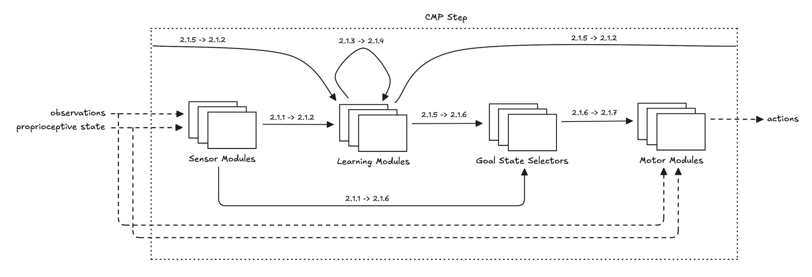

- Start Date: 2025-08-06
- RFC PR: (leave this empty, it will be filled in after RFC is merged)

# Cortical Messaging Protocol (CMP) v1

The key words "MUST", "MUST NOT", "REQUIRED", "SHALL", "SHALL NOT", "SHOULD", "SHOULD NOT", "RECOMMENDED",  "MAY", and "OPTIONAL" in this document are to be interpreted as described in [BCP 14](https://www.rfc-editor.org/info/bcp14), [IETF RFC 2119](https://www.rfc-editor.org/rfc/rfc2119), [IETF RFC 8174](https://www.rfc-editor.org/rfc/rfc8174) when, and only when, they appear in all capitals, as shown here.

## 1 Key Concepts

CMP defines connectivity and communication within a Thousand Brains System.

Communication within a Thousand Brains System is conveyed via variable-length Cortical Messages.

CMP supports unicast and multicast delivery of data.

The data flow in CMP is unidirectional, from the sender to one or more receivers.

CMP is a connectionless protocol that maintains message boundaries with no connection setup or feature negotiation.

### 1.1 Constraints

The Thousand Brains Theory imposes a number of constraints that a CMP implementation MUST maintain.

#### 1.1.1 Message Propagation Delay

The Cortical Message propagation delay between the same sender and the same receiver MUST be constant for all steps.

#### 1.1.2 Module Processing Duration

Each Module MUST take constant time to receive, process, and emit Cortical Messages.

#### 1.1.3 Module Processing Completeness

Each Module MUST process all received Cortical Messages.

## 2 Functional Specification

CMP proceeds in non-overlapping steps made up of atomic phases. In each phase, Cortical Messages can be created, in-transit, or delivered. Creation and delivery happen transactionally, all-at-once, in a single, indivisible operation.

Each CMP step begins when the Thousand Brains System receives observations and proprioceptive state from the environment. Each CMP step ends when the Thousand Brains System outputs actions.

### 2.1 Step

A CMP step is a sequence of the following, ordered, atomic phases:

1. Sensor Modules
2. Learning Modules Receive
3. Learning Modules Vote
4. Learning Modules Tally
5. Learning Modules Output
6. Goal State Selectors
7. Motor Modules

_**Figure 1.** Overview of message flow within a single CMP Step. Message lifetimes are annotated with corresponding phase numbers._

#### 2.1.1 Sensor Modules

The Sensor Modules phase begins when the Thousand Brains System receives observations and proprioceptive state from the environment. During this phase, the Sensor Modules process observations and proprioceptive state and each generates zero, one, or more Cortical Messages. The phase ends when all new in-transit Cortical Messages are created.

All Cortical Messages generated in this phase are from Sensor Modules and are in-transit to either Learning Modules or Goal State Selectors. No Cortical Messages are delivered in this phase.

| In-transit
| ---
| Learning Module (previous step) $\rightarrow$ Learning Module
| Sensor Module $\rightarrow$ Learning Module
| Sensor Module $\rightarrow$ Goal State Selector

#### 2.1.2 Learning Modules Receive

During the Learning Modules Receive phase, the Cortical Messages from Sensor Modules phase are aggregated along with the Cortical Messages from the previous step's Learning Modules Output phase. These aggregated Cortical Messages are then received by the Learning Modules.

No Cortical Messages are generated in this phase. All in-transit Cortical Messages to be received by Learning Modules are delivered to the Learning Modules.

| In-transit
| ---
| Sensor Module $\rightarrow$ Goal State Selector

| Delivered
| ---
| Learning Module (previous step) $\rightarrow$ Learning Module
| Sensor Module $\rightarrow$ Learning Module

#### 2.1.3 Learning Modules Vote

Once the Learning Modules are finished processing their received Cortical Messages, each one generates zero, one, or more Cortical Messages corresponding to their vote.

All Cortical Messages generated in this phase are from Learning Modules and are in-transit to other Learning Modules. No Cortical Messages are delivered in this phase.

| In-transit
| ---
| Sensor Module $\rightarrow$ Goal State Selector
| Learning Module $\rightarrow$ Learning Module

#### 2.1.4 Learning Modules Tally

During the Learning Modules Tally phase, the Cortical Messages from Learning Modules are received by the Learning Modules.

No Cortical Messages are generated in this phase. All in-transit Cortical Messages to be received by Learning Modules are delivered to the Learning Modules.

| In-transit
| ---
| Sensor Module $\rightarrow$ Goal State Selector

| Delivered
| ---
| Learning Module $\rightarrow$ Learning Module

#### 2.1.5 Learning Modules Output

During the Learning Modules Output phase, each Learning Module generates zero, one, or two Cortical Messages. The phase ends when all new in-transit Cortical Messages are created.

All Cortical Messages generated in this phase are from Learning Modules and are in-transit to either Learning Modules or Goal State Selectors. No Cortical Messages are delivered in this phase.

| In-transit
| ---
| Sensor Module $\rightarrow$ Goal State Selector
| Learning Module $\rightarrow$ Learning Module (next step)
| Learning Module $\rightarrow$ Goal State Selector

#### 2.1.6 Goal State Selectors

During the Goal State Selectors phase the Cortical Messages from Sensor Modules and Learning Modules intended for Goal State Selectors are aggregated. These aggregated Cortical Messages are then delivered to the Goal State Selectors. Each Goal State Selector then generates exactly one in-transit Cortical Message intended for the Motor Modules. The phase ends when all new in-transit Cortical Messages are created.

All in-transit Cortical Messages to be received by Goal State Selectors are delivered to the Goal State Selectors. All Cortical Messages generated in this phase are from Goal State Selectors and are in-transit to Motor Modules.

| In-transit
| ---
| Learning Module $\rightarrow$ Learning Module (next step)
| Goal State Selector $\rightarrow$ Motor Module

| Delivered
| ---
| Sensor Module $\rightarrow$ Goal State Selector
| Learning Module $\rightarrow$ Goal State Selector

#### 2.1.7 Motor Modules

During the Motor Modules phase the Cortical Messages from Goal State Selectors are delivered to the Motor Modules. The Motor Modules process the Cortical Messages and output actions. The phase ends when all actions are created.

No Cortical Messages are generated in this phase. All in-transit Cortical Messages to be received by Motor Modules are delivered to the Motor Modules.

| In-transit
| ---
| Learning Module $\rightarrow$ Learning Module (next step)

| Delivered
| ---
| Goal State Selector $\rightarrow$ Motor Module
