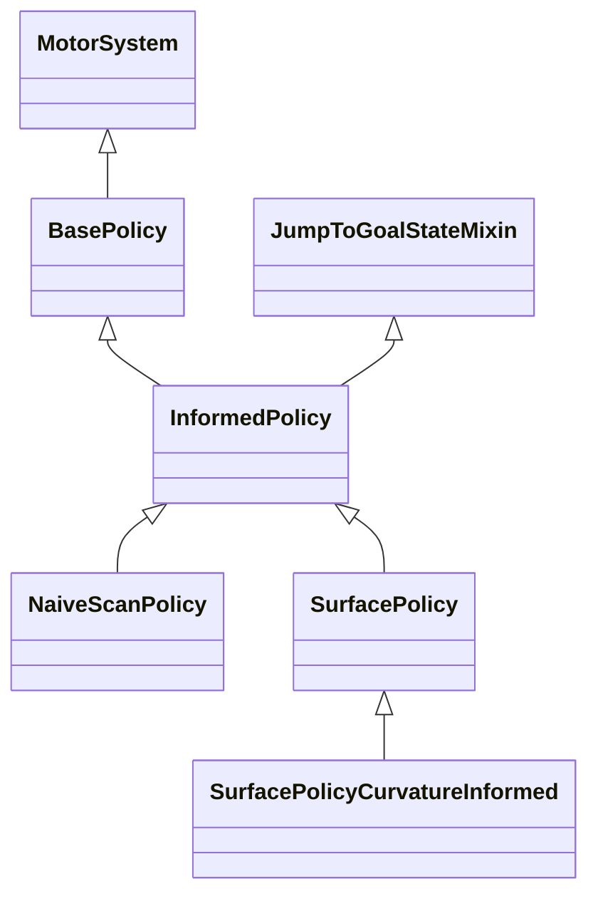
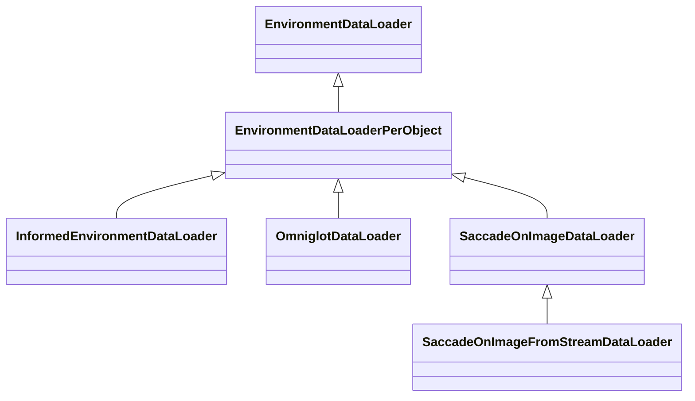
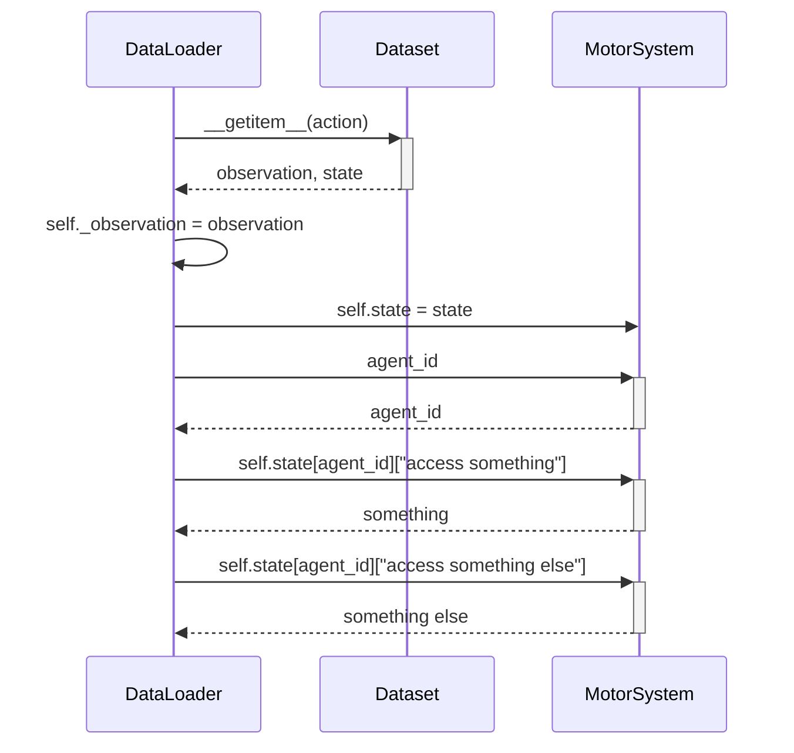
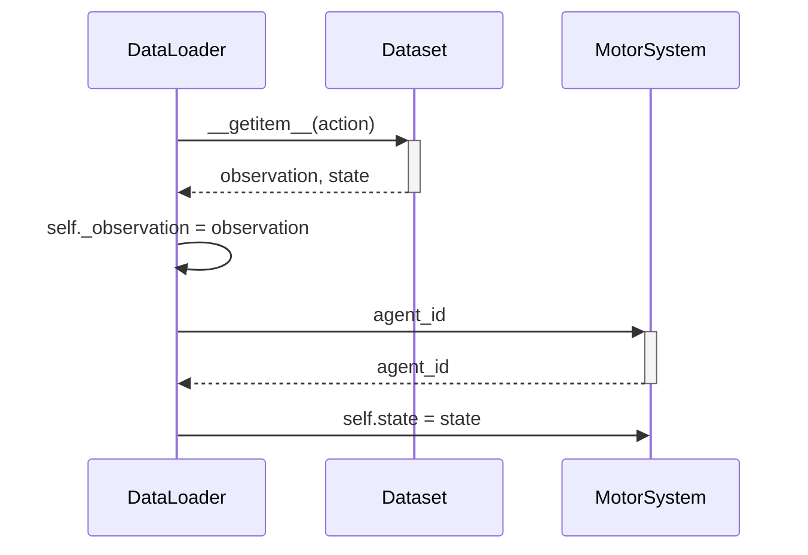

- Start Date: 2025-02-10
- RFC PR: (leave this empty, it will be filled in after RFC is merged)

# Summary

Currently, `InformedEnvironmentDataLoader` implements a motor policy algorithm. This RFC outlines a proposal to extract motor policies from `InformedEnvironmentDataLoader` and move them to the `MotorSystem` and related code.

# Motivation

We want to enable the research goal of "Improve Unsupervised Learning." Additionally, we want to reduce the responsibility of classes and reduce dependencies between them while making the code easier to understand, test, and change.

To achieve the above, we want the [Monty class](https://github.com/thousandbrainsproject/tbp.monty/blob/071c604b91f020850a14b73c5298c2b686d49b94/src/tbp/monty/frameworks/models/abstract_monty_classes.py#L15) to be able to dynamically swap out motor policies in the motor system, and to support multiple agents with possibly different motor policies in parallel. Taking the code architecture into account, we also want the [MontyExperiment class](https://github.com/thousandbrainsproject/tbp.monty/blob/071c604b91f020850a14b73c5298c2b686d49b94/src/tbp/monty/frameworks/experiments/monty_experiment.py#L47) to be the only interface between the [Monty class](https://github.com/thousandbrainsproject/tbp.monty/blob/071c604b91f020850a14b73c5298c2b686d49b94/src/tbp/monty/frameworks/models/abstract_monty_classes.py#L15) and the environment.

As a step toward the above, we do not want the DataLoaders to interface with the MotorSystem directly.  The [DataLoaders are on the environment side of this interface](https://github.com/thousandbrainsproject/tbp.monty/blob/071c604b91f020850a14b73c5298c2b686d49b94/src/tbp/monty/frameworks/environments/embodied_data.py#L112). The [MotorSystem is on the Monty side of this interface](https://github.com/thousandbrainsproject/tbp.monty/blob/071c604b91f020850a14b73c5298c2b686d49b94/src/tbp/monty/frameworks/models/motor_policies.py#L45).

# Guide-level explanation

> Explain the proposal as if it was already included in Monty and you were teaching it to another Monty user. That generally means:
>
> - Introducing new named concepts.
> - Explaining the feature largely in terms of examples.
> - Explaining how Monty developers should *think* about the feature and how it should impact the way they use Monty. It should explain the impact as concretely as possible.
> - If applicable, provide sample error messages, deprecation warnings, or migration guidance.
> - If applicable, describe the differences between teaching this to existing Monty users and new Monty users.
> - If applicable, include pictures or other media if possible to visualize the idea.
> - If applicable, provide pseudo plots (even if hand-drawn) showing the intended impact on performance (e.g., the model converges quicker, accuracy is better, etc.).
> - Discuss how this impacts the ability to read, understand, and maintain Monty code. Code is read and modified far more often than written; will the proposed feature make code easier to maintain?
>
> Keep in mind that it may be appropriate to defer some details to the [Reference-level explanation](#reference-level-explanation) section.
>
> For implementation-oriented RFCs, this section should focus on how developer contributors should think about the change and give examples of its concrete impact. For administrative RFCs, this section should provide an example-driven introduction to the policy and explain its impact in concrete terms.

# Reference-level explanation

> This is the technical portion of the RFC. Explain the design in sufficient detail that:
>
> - Its interaction with other features is clear.
> - It is reasonably clear how the feature would be implemented.
> - Corner cases are dissected by example.
>
> The section should return to the examples from the previous section and explain more fully how the detailed proposal makes those examples work.

## Current State

### MotorSystem Class Diagram



### DataLoader Class Diagram



### Policy algorithms

#### BasePolicy

> [!NOTE]
> BasePolicy is never used directly, except in tests. It is always subclassed and the subclass is used.

See [0000_extract_motor_policies_from_dataloader/basepolicy_sd.md](0000_extract_motor_policies_from_dataloader/basepolicy_sd.md).

#### InformedPolicy

See [0000_extract_motor_policies_from_dataloader/informedpolicy_sd.md](0000_extract_motor_policies_from_dataloader/informedpolicy_sd.md).

#### NaiveScanPolicy

See [0000_extract_motor_policies_from_dataloader/naivescanpolicy_sd.md](0000_extract_motor_policies_from_dataloader/naivescanpolicy_sd.md).

#### SurfacePolicy

See [0000_extract_motor_policies_from_dataloader/surfacepolicy_sd.md](0000_extract_motor_policies_from_dataloader/surfacepolicy_sd.md).

#### SurfacePolicyCurvatureInformed

See [0000_extract_motor_policies_from_dataloader/surfacepolicycurvatureinformed_sd.md](0000_extract_motor_policies_from_dataloader/surfacepolicycurvatureinformed_sd.md).

### DataLoader algorithms

It is noteworthy that reviewing any of the above policy algorithms does not capture all of the policy interactions. What currently happens is that the `DataLoader` invokes different methods on the `MotorSystem`/`*Policy` when executing. These invocations is what I mean by "DataLoader algorithms." Below, is an examination of how each `DataLoader` interacts with the `MotorSystem`/`*Policy`.

First, the observed pairings of the `DataLoader` and the `MotorSystem`/`*Policy` in the current Monty configurations are:
- `EnvironmentDataLoaderPerObject`
    - `BasePolicy` (used in `base_config_test.py`). See [environmentdataloaderperobject_basepolicy_sd.md](0000_extract_motor_policies_from_dataloader/environmentdataloaderperobject_basepolicy_sd.md).
- `InformedEnvironmentDataLoader`
    - `InformedPolicy`. See [informedenvironmentdataloader_informedpolicy_sd.md](0000_extract_motor_policies_from_dataloader/informedenvironmentdataloader_informedpolicy_sd.md).
    - `NaiveScanPolicy`. The interaction is the same as with the `InformedPolicy`. See [informedenvironmentdataloader_naivescanpolicy_sd.md](0000_extract_motor_policies_from_dataloader/informedenvironmentdataloader_naivescanpolicy_sd.md).
    - `SurfacePolicy`. See [informedenvironmentdataloader_surfacepolicy_sd.md](0000_extract_motor_policies_from_dataloader/informedenvironmentdataloader_surfacepolicy_sd.md).
    - `SurfacePolicyCurvatureInformed`. See [informedenvironmentdataloader_surfacepolicycurvatureinformed_sd.md](0000_extract_motor_policies_from_dataloader/informedenvironmentdataloader_surfacepolicycurvatureinformed_sd.md).
- `SaccadeOnImageDataLoader`
    - `InformedPolicy`. See [saccadeonimagedataloader_informedpolicy_sd.md](0000_extract_motor_policies_from_dataloader/saccadeonimagedataloader_informedpolicy_sd.md).
- `SaccadeOnImageFromStreamDataLoader`
    - `InformedPolicy`. See [saccadeonimagefromstreamdataloader_informedpolicy_sd.md](0000_extract_motor_policies_from_dataloader/saccadeonimagefromstreamdataloader_informedpolicy_sd.md).

## Future State

### Immediate changes

#### Access the state before passing it to the motor system

By examining the `DataLoader` algorithms above, we can see the following pattern quite often:



Aside from retrieving the `agent_id` (maybe this can be memoized?), there is no need to keep on accessing the `self.motor_system.state` repeatedly since the `state` is returned to the `DataLoader` by the `Dataset` directly. Instead, make the requisite access in the `DataLoader` and store the needed data. Then, set the motor system state once and don't access it again. This pattern will reduce the current number of interactions without changing any of the functionality.

The result would be:



### Random Notes

* `NaiveScanPolicy` does not seem to use any of the `InformedPolicy` initialization that it invokes.

* `BasePolicy` sets `self.is_predefined` as a signal to `MotorSystem` to switch the `__call__` invocation to `predefined_call`, but uses `self.file_names_per_episode is not None` as the check whether to retrieve actions from a file in `post_episode`.

* `SurfacePolicy.get_next_action` check of `if not hasattr(self, "processed_observations"):` can never be `False` because `InformedPolicy.__init__` initializes `self.processed_observations = None` and:
    ```python
    >>> class Obj:
    ...     def __init__(self):
    ...             self.potato = None
    ...
    >>> o = Obj()
    >>> hasattr(o, "potato")
    True
    >>> class Obj2:
    ...     def __init__(self):
    ...             pass
    ...
    >>> o2 = Obj2()
    >>> hasattr(o2, "potato")
    False
    ```

* `InformedPolicy`, `NaiveScanPolicy`, `SurfacePolicy`, and `SurfacePolicyCurvatureInformed` do not use `JumpToGoalStateMixin` in their `__call__` methods. The `derive_habitat_goal_state` (which invokes the mixin) is only called in `InformedEnvironmentDataLoader.execute_jump_attempt`.

* `SurfacePolicyCurvatureInformed.avoid_revisiting_locations` has an inconsistent `while loop` exit structure. One branch sets the while loop `searching_for_heading` variable to `False`, while another branch returns out of the while loop with `return None`.
    ```python
        if not conflicts:  # We have a valid heading
            searching_for_heading = False

            logging.debug("The final direction from conflict checking:")
            logging.debug(self.tangential_vec)
            self.update_tangential_reps(vec_form=self.tangential_vec)

        elif self.search_counter >= self.max_steps:
            logging.debug("Abandoning search, no directions without conflict")
            logging.debug("Therefore using original headng")

            self.update_tangential_reps(vec_form=vec_copy)

            return None
        else:
            ...
    ```

* `DataLoader` invoking `pre_episode` on the motor system seems inappropriate. I think it is done since the `DataLoader` is directly activating the motor system, but could likely be reworked once `DataLoader` no longer interacts with the motor system.

* `EnvironmentDataLoaderPerObject.reset_agent` reaching into motor system state for the second time is excessive. Should do it before setting motor system state (althought this may go away if interaction is removed):
    ```python
    self._observation, self.motor_system.state = self.dataset.reset()
    self._counter = 0

    # Make sure to also reset action variables when resetting agent during
    # pre-episode
    self._action = None
    self._amount = None
    self.motor_system.state[self.motor_system.agent_id]["motor_only_step"] = False
    ```

* `InformedEnvironmentDataLoader.__iter__` and `.__next__` overwrite inherited methods without calling them. This hints that inheritance class hierarchy may not be appropriate here.

* `InformedEnvironmentDataLoader.__iter__` and `SaccadeOnImageDataLoader.__iter__` comments that it overwrites the original because we don't want to reset the agent since it was already done in `pre_episode`. However, this is also true for `EnvironmentDataLoaderPerObject`, yet there is no `EnvironmentDataLoaderPerObject.__iter__` that overrides the inherited method. Is this difference significant?

* `InformedEnvironmentDataLoader.handle_successful_jump` checks `isinstance(self.motor_system, SurfacePolicy)` and directly manipulates the motor system internals if the motor system is a `SurfacePolicy`.

* What is the significance of `InformedEnvironmentDataLoader.first_step` setting `self.state[agent_id]["motor_only_step"] = True` for `SurfacePolicy` and `SurfacePolicyCurvatureInformed` vs `False` for `InformedPolicy`, and `NaiveScanPolicy`? The comment states:
  > \# For first step of surface-agent policy, always bypass LM processing<br/>
  > \# For distant-agent policy, we still process the first sensation if it is<br/>
  > \# on the object

  How necessary is it for the distant-agent to process the first sensation?

* `InformedEnvironmentDataLoader.__next__` call in the last else case updates the motor system state right before overwriting it. Is this necessary?
    ```python
    if isinstance(self.motor_system, SurfacePolicy) and self._action is None:
        self._action = self.motor_system.touch_object(
            self._observation, view_sensor_id="view_finder"
        )

        self.motor_system.state[self.motor_system.agent_id][
            "motor_only_step"
        ] = True

    self._observation, self.motor_system.state = self.dataset[self._action]
    ```

* `InformedEnvironmentDataLoader.__next__` checks `isinstance(self.motor_system, SurfacePolicy)` and `isinstance(self.motor_system, SurfacePolicyCurvatureInformed)` to determine whether to touch an object and to set motor_only_step state property.

* `OmniglotDataLoader` appears unused.

* `SaccadeOnImageDataLoader.__init__` reproduces its grandparent class' (`EnvironmentDataLoader`) constructor inline. This hints at possible improvements to the class hierarchy.

* `SaccadeOnImageDataLoader.__init__` (unlike its parent class) retrieves object names from the `Environment` (`self.dataset.env.scene_names`) instead of being given a parameter on creation.

* `SaccadeOnImageDataLoader` appears to only use `pre_episode` of its parent, overwriting other methods.

* `SaccadeOnImageFromStreamDataLoader` overrides its parent's `post_epoch` with the same logic as its parent.

# Drawbacks

> Why should we *not* do this? Please consider:
>
> - Implementation cost, both in terms of code size and complexity
> - Whether the proposed feature can be implemented outside of Monty
> - The impact on teaching people Monty
> - Integration of this feature with other existing and planned features
> - The cost of migrating existing Monty users (is it a breaking change?)
>
> There are tradeoffs to choosing any path. Please attempt to identify them here.

# Rationale and alternatives

> - Why is this design the best in the space of possible designs?
> - What other designs have been considered, and what is the rationale for not choosing them?
> - What is the impact of not doing this?

# Prior art and references

> Discuss prior art, both the good and the bad, in relation to this proposal.
> A few examples of what this can include are:
>
> - References
> - Does this functionality exist in other frameworks, and what experience has their community had?
> - Papers: Are there any published papers or great posts that discuss this? If you have some relevant papers to refer to, this can serve as a more detailed theoretical background.
> - Is this done by some other community and what were their experiences with it?
> - What lessons can we learn from what other communities have done here?
>
> This section is intended to encourage you as an author to think about the lessons from other frameworks and provide readers of your RFC with a fuller picture.
> If there is no prior art, that is fine. Your ideas are interesting to us, whether they are brand new or adaptations from other places.
>
> Note that while precedent set by other frameworks is some motivation, it does not on its own motivate an RFC.
> Please consider that Monty sometimes intentionally diverges from common approaches.

# Unresolved questions

> Optional, but suggested for first drafts.
>
> What parts of the design are still TBD?

# Future possibilities

> Optional.
>
> Think about what the natural extension and evolution of your proposal would
> be and how it would affect Monty and the Thousand Brains Project as a whole in a holistic way.
> Try to use this section as a tool to more fully consider all possible
> interactions with the Thousand Brains Project and Monty in your proposal.
> Also consider how this all fits into the future of Monty.
>
> This is also a good place to "dump ideas" if they are out of the scope of the
> RFC you are writing but otherwise related.
>
> If you have tried and cannot think of any future possibilities,
> you may simply state that you cannot think of anything.
>
> Note that having something written down in the future-possibilities section
> is not a reason to accept the current or a future RFC; such notes should be
> in the section on motivation or rationale in this or subsequent RFCs.
> The section merely provides additional information.
