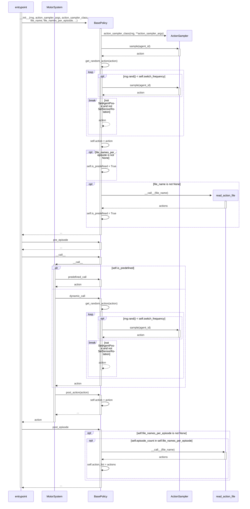

```mermaid
sequenceDiagram
    participant E as entrypoint
    participant MS as MotorSystem

    activate E

    create participant BP as BasePolicy
    E ->>+ BP : __init__(rng, action_sampler_args, action_sampler_class,<br/>file_name, file_names_per_episode, ...)

    create participant AS as ActionSampler
    BP ->> AS : action_sampler_class(rng, **action_sampler_args)
    BP ->>+ AS : sample(agent_id)
    AS -->>- BP : action
    BP ->> BP : get_random_action(action)
    activate BP
        loop
            opt rng.rand() < self.switch_frequency
                BP ->>+ AS: sample(agent_id)
                AS -->>- BP : action
            end
            break not SetAgentPose and not SetSensorRotation
                BP -->> BP : action
                deactivate BP
            end
        end
    BP ->> BP : self.action = action
    opt file_names_per_episode is not None
        BP ->> BP : self.is_predefined = True
    end
    opt file_name is not None
        create participant RAF as read_action_file
        BP ->>+ RAF : __call__(file_name)
        RAF -->>- BP : actions
        BP ->> BP : self.is_predefined = True
    end
    BP -->>- E : ...

    E ->>+ BP : pre_episode
    BP -->>- E : ...

    E ->>+ BP : __call__
    BP ->>+ MS : __call__
    deactivate BP
    alt self.is_predefined
        MS ->>+ BP : predefined_call
        BP -->>- MS : action
    else
        MS ->>+ BP : dynamic_call
        BP ->> BP : get_random_action(action)
        activate BP
            loop
                opt rng.rand() < self.switch_frequency
                    BP ->>+ AS: sample(agent_id)
                    AS -->>- BP : action
                end
                break not SetAgentPose and not SetSensorRotation
                    BP -->> BP : action
                    deactivate BP
                end
            end
        BP -->>- MS : action
    end
    MS ->>+ BP : post_action(action)
    BP ->> BP : self.action = action
    BP -->>- MS : ...
    MS -->>- E : action

    E ->>+ BP : post_episode
    opt self.file_names_per_episode is not None
        opt self.episode_count in self.file_names_per_episode
            BP ->>+ RAF : __call__(file_name)
            RAF -->>- BP : actions
            BP ->> BP : self.action_list = actions
        end
    end
    BP -->>- E : ...

    deactivate E
```