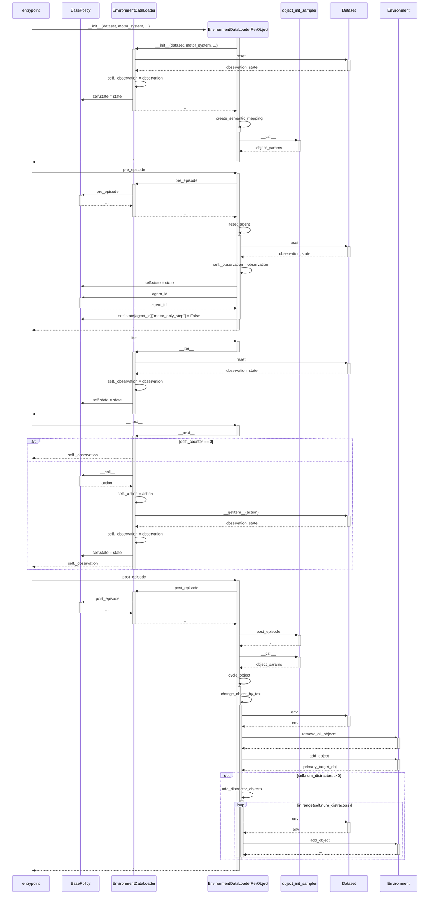

```mermaid
sequenceDiagram
    participant E as entrypoint
    participant BP as BasePolicy

    activate E

    participant EDL as EnvironmentDataLoader

    create participant EDLO as EnvironmentDataLoaderPerObject
    E ->>+ EDLO : __init__(dataset, motor_system, ...)
    EDLO ->>+ EDL : __init__(dataset, motor_system, ...)
    participant OIS as object_init_sampler
    participant DS as Dataset
    participant ENV as Environment
    EDL ->>+ DS : reset
    DS -->>- EDL : observation, state
    EDL ->> EDL : self._observation = observation
    EDL ->> BP : self.state = state
    EDL -->>- EDLO : ...
    EDLO ->>+ EDLO : create_semantic_mapping
    deactivate EDLO
    EDLO ->>+ OIS : __call__
    OIS -->>- EDLO : object_params
    EDLO -->>- E : ...

    E ->>+ EDLO : pre_episode
    EDLO ->>+ EDL : pre_episode
    EDL ->>+ BP : pre_episode
    BP -->>- EDL : ...
    EDL -->>- EDLO : ...
    EDLO ->>+ EDLO : reset_agent
    EDLO ->>+ DS : reset
    DS -->>- EDLO : observation, state
    EDLO ->> EDLO : self._observation = observation
    EDLO ->> BP : self.state = state
    EDLO ->>+ BP : agent_id
    BP -->>- EDLO : agent_id
    EDLO ->> BP : self.state[agent_id]["motor_only_step"] = False
    deactivate EDLO
    EDLO -->>- E : ...

    E ->>+ EDLO : __iter__
    EDLO ->>+ EDL : __iter__
    deactivate EDLO
    EDL ->>+ DS : reset
    DS -->>- EDL : observation, state
    EDL ->> EDL : self._observation = observation
    EDL ->> BP : self.state = state
    EDL -->>- E : ...

    E ->>+ EDLO : __next__
    EDLO ->>+ EDL : __next__
    deactivate EDLO
    alt self._counter == 0
        EDL -->> E : self._observation
    else
        EDL ->>+ BP : __call__
        BP -->>- EDL : action
        EDL ->> EDL : self._action = action
        EDL ->>+ DS : __getitem__(action)
        DS -->>- EDL : observation, state
        EDL ->> EDL : self._observation = observation
        EDL ->> BP : self.state = state
        EDL -->> E : self._observation
    end
    deactivate EDL

    E ->>+ EDLO : post_episode
    EDLO ->>+ EDL : post_episode
    EDL ->>+ BP : post_episode
    BP -->>- EDL : ...
    EDL -->>- EDLO : ...
    EDLO ->>+ OIS : post_episode
    OIS -->>- EDLO : ...
    EDLO ->>+ OIS : __call__
    OIS -->>- EDLO : object_params
    EDLO ->>+ EDLO : cycle_object
    EDLO ->>+ EDLO : change_object_by_idx
    EDLO ->>+ DS : env
    DS -->>- EDLO : env
    EDLO ->>+ ENV : remove_all_objects
    ENV -->>- EDLO : ...
    EDLO ->>+ ENV : add_object
    ENV -->>- EDLO : primary_target_obj
    opt self.num_distractors > 0
        EDLO ->>+ EDLO : add_distractor_objects
        loop in range(self.num_distractors)
            EDLO ->>+ DS : env
            DS -->>- EDLO : env
            EDLO ->>+ ENV : add_object
            ENV -->>- EDLO : ...
        end
        deactivate EDLO
    end
    deactivate EDLO
    deactivate EDLO
    EDLO -->>- E : ...
```