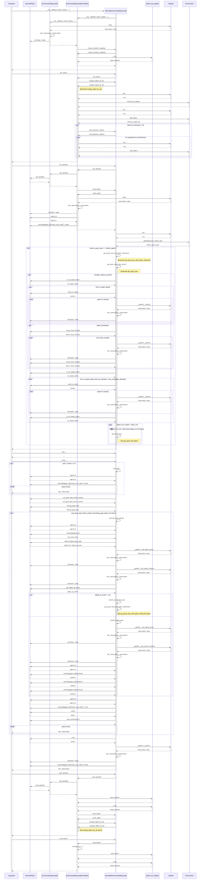

```mermaid
sequenceDiagram
    participant E as entrypoint
    participant IP as InformedPolicy

    activate E

    participant EDL as EnvironmentDataLoader
    participant EDLO as EnvironmentDataLoaderPerObject

    create participant IEDL as InformedEnvironmentDataLoader
    E ->>+ IEDL : __init__(dataset, motor_system, ...)
    IEDL ->>+ EDLO : __init__(dataset, motor_system, ...)
    EDLO ->>+ EDL : __init__(dataset, motor_system, ...)
    participant OIS as object_init_sampler
    participant DS as Dataset
    participant ENV as Environment
    EDL ->>+ DS : reset
    DS -->>- EDL : observation, state
    EDL ->> EDL : self._observation = observation
    EDL ->> IP : self.state = state
    EDL -->>- EDLO : ...
    EDLO ->>+ IEDL : create_semantic_mapping
    IEDL ->>+ EDLO : create_semantic_mapping
    deactivate IEDL
    deactivate EDLO
    EDLO ->>+ OIS : __call__
    OIS -->>- EDLO : object_params
    EDLO -->>- IEDL : ...
    IEDL -->>- E : ...

    E ->>+ IEDL : pre_epoch
    IEDL ->>+ EDLO : pre_epoch
    deactivate IEDL
    EDLO ->>+ IEDL : change_object_by_idx
    IEDL ->>+ EDLO : change_object_by_idx
    deactivate IEDL
    NOTE right of EDLO : Bookmark change_object_by_idx
    EDLO ->>+ DS : env
    DS -->>- EDLO : env
    EDLO ->>+ ENV : remove_all_objects
    ENV -->>- EDLO : ...
    EDLO ->>+ DS : env
    DS -->>- EDLO : env
    EDLO ->>+ ENV : add_object
    ENV -->>- EDLO : primary_target_obj
    opt self.num_distractors > 0
        EDLO ->>+ IEDL : add_distractor_objects
        IEDL ->>+ EDLO : add_distractor_objects
        deactivate IEDL
        loop in range(self.num_distractors)
            EDLO ->>+ DS : env
            DS -->>- EDLO : env
            EDLO ->>+ ENV : add_object
            ENV -->>- EDLO : ...
        end
        deactivate EDLO
    end
    deactivate EDLO
    EDLO -->>- E : ...

    E ->>+ IEDL : pre_episode
    IEDL ->>+ EDLO : pre_episode
    EDLO ->>+ EDL : pre_episode
    EDL ->>+ IP : pre_episode
    IP -->>- EDL : ...
    EDL -->>- EDLO : ...
    EDLO ->>+ IEDL : reset_agent
    IEDL ->>+ EDLO : reset_agent
    deactivate IEDL
    EDLO ->>+ DS : reset
    DS -->>- EDLO : observation, state
    EDLO ->> EDLO : self._observation = observation
    EDLO ->> IP : self.state = state
    EDLO ->>+ IP : agent_id
    IP -->>- EDLO : agent_id
    EDLO ->> IP : self.state[agent_id]["motor_only_step"] = False
    deactivate EDLO
    EDLO -->>- IEDL : ...
    IEDL ->>+ DS : env
    DS -->>- IEDL : env
    IEDL ->>+ ENV : _agents[0].action_space_type
    ENV -->>- IEDL : action_space_type
    opt action_space_type == "surface_agent"
        IEDL ->>+ IEDL : get_good_view_with_patch_refinement
        NOTE right of IEDL : Bookmark get_good_view_with_patch_refinement
            IEDL ->>+ IEDL : get_good_view("view_finder")
            NOTE right of IEDL : Bookmark get_good_view
                opt multiple_objects_present
                    IEDL ->>+ IP : is_on_target_object
                    IP -->>- IEDL : on_target_object
                    opt not on_target_object
                        IEDL ->>+ IP : orient_to_object
                        IP -->>- IEDL : actions
                        loop action in actions
                            IEDL ->>+ DS : __getitem__(action)
                            DS -->>- IEDL : observation, state
                            IEDL ->> IEDL : self._observation = observation
                            IEDL ->> IP : self.state = state
                        end
                    end
                end
                opt allow_translation
                    IEDL ->>+ IP : move_close_enough
                    IP -->>- IEDL : action, close_enough
                    loop not close_enough
                        IEDL ->>+ DS : __getitem__(action)
                        DS -->>- IEDL : observation, state
                        IEDL ->> IEDL : self._observation = observation
                        IEDL ->> IP : self.state = state
                        IEDL ->>+ IP : move_close_enough
                        IP -->>- IEDL : action, close_enough
                    end
                end
                IEDL ->>+ IP : is_on_target_object
                IP -->>- IEDL : on_target_object
                loop not on_target_object and num_attempts < max_orientation_attempts
                    IEDL ->>+ IP : orient_to_object
                    IP -->>- IEDL : actions
                    loop action in actions
                        IEDL ->>+ DS : __getitem__(action)
                        DS -->>- IEDL : observation, state
                        IEDL ->> IEDL : self._observation = observation
                        IEDL ->> IP : self.state = state
                    end
                    IEDL ->>+ IP : is_on_target_object
                    IP -->>- IEDL : on_target_object
                end
            deactivate IEDL
            loop patch_id in ("patch", "patch_0")
                opt patch_id in self._observation["agent_id_0"].keys()
                    IEDL ->>+ IEDL : get_good_view
                    NOTE right of IEDL : See get_good_view above
                    deactivate IEDL
                end
            end
        deactivate IEDL
    end
    IEDL -->>- E : ...

    E ->>+ IEDL : __iter__
    IEDL -->>- E : ...

    E ->>+ IEDL : __next__
    opt self._counter == 0
        IEDL ->>+ IEDL : first_step
            IEDL ->>+ IP : agent_id
            IP -->>- IEDL : agent_id
            IEDL ->> IP : self.state[agent_id]["motor_only_step"] = False
        deactivate IEDL
        break early return
            IEDL -->> E : self._observation
        end
    end
    IEDL ->>+ IP : use_goal_state_driven_actions
    IP -->>- IEDL : use_goal_state_driven_actions
    IEDL ->>+ IP : driving_goal_state
    IP -->>- IEDL : driving_goal_state
    opt use_goal_state_driven_actions and driving_goal_state is not None
        IEDL ->>+ IEDL : execute_jump_attempt
            IEDL ->>+ IP : agent_id
            IP -->>- IEDL : agent_id
            IEDL ->>+ IP : self.state[agend_id]
            IP -->>- IEDL : pre_jump_state
            IEDL ->>+ IP : derive_habitat_goal_state
            IP -->>- IEDL : target_loc, target_np_quat
            IEDL ->>+ DS : __getitem__(set_agent_pose)
            DS -->>- IEDL : observation, state
            IEDL ->> IEDL : self._observation = observation
            IEDL ->> IP : self.state = state
            IEDL ->>+ DS : __getitem__(set_agent_rotation)
            DS -->>- IEDL : observation, state
            IEDL ->> IEDL : self._observation = observation
            IEDL ->> IP : self.state = state
            IEDL ->>+ IP : get_depth_at_center
            IP -->>- IEDL : depth_at_center
            alt depth_at_center < 1.0
                IEDL ->>+ IEDL : handle_successful_jump
                    IEDL ->>+ IEDL : get_good_view_with_patch_refinement
                    NOTE right of IEDL : See get_good_view_with_patch_refinement above
                    deactivate IEDL
                deactivate IEDL
            else
                IEDL ->>+ IEDL : handle_failed_jump
                    IEDL ->>+ DS : __getitem__(set_agent_pose)
                    DS -->>- IEDL : observation, state
                    IEDL ->> IEDL : self._observation = observation
                    IEDL ->> IP : self.state = state
                    IEDL ->>+ DS : __getitem__(set_sensor_rotation)
                    DS -->>- IEDL : observation, state
                    IEDL ->> IEDL : self._observation = observation
                    IEDL ->> IP : self.state = state
                    IEDL ->>+ IP : agent_id
                    IP -->>- IEDL : agent_id
                    IEDL ->>+ IP : self.state[agent_id]["position"]
                    IP -->>- IEDL : position
                    IEDL ->>+ IP : self.state[agent_id]["rotation"]
                    IP -->>- IEDL : rotation
                    IEDL ->>+ IP : self.state[agent_id]["sensors"]
                    IP -->>- IEDL : sensors
                deactivate IEDL
            end
            IEDL ->>+ IP : agent_id
            IP -->>- IEDL : agent_id
            IEDL ->> IP : self.state[agent_id]["motor_only_step"] = True
            IEDL ->>+ IP : action
            IP -->>- IEDL : action
            IEDL ->>+ IP : post_action(action)
            IP -->>- IEDL : ...
        deactivate IEDL
        break early return
            IEDL -->> E : self._observation
        end
    end
    IEDL ->>+ IP : __call__
    IP -->>- IEDL : action
    IEDL ->>+ DS : __getitem__(action)
    DS -->>- IEDL : observation, state
    IEDL ->> IEDL : self._observation = observation
    IEDL ->> IP : self.state = state
    IEDL ->> IP : self.state[agent_id]["motor_only_step"] = False
    IEDL -->> E : self._observation
    deactivate IEDL

    E ->>+ IEDL : post_episode
    IEDL ->>+ EDLO : post_episode
    deactivate IEDL
    EDLO ->>+ EDL : post_episode
    EDL ->>+ IP : post_episode
    IP -->>- EDL : ...
    EDL -->>- EDLO : ...
    EDLO ->>+ OIS : post_episode
    OIS -->>- EDLO : ...
    EDLO ->>+ OIS : __call__
    OIS -->>- EDLO : object_params
    EDLO ->>+ IEDL : cycle_object
    IEDL ->>+ EDLO : cycle_object
    deactivate IEDL
    EDLO ->>+ IEDL : change_object_by_idx
    IEDL ->>+ EDLO : change_object_by_idx
    deactivate IEDL
    NOTE right of EDLO : See change_object_by_idx above
    deactivate EDLO
    deactivate EDLO
    EDLO -->>- E : ...

    E ->>+ IEDL : post_epoch
    IEDL ->>+ EDLO : post_epoch
    deactivate IEDL
    EDLO ->> EDLO : self.epochs += 1
    EDLO ->>+ OIS : post_epoch
    OIS -->>- EDLO : ...
    EDLO ->>+ OIS : __call__
    OIS -->>- EDLO : object_params
    EDLO -->>- E : ...

    deactivate E
```
