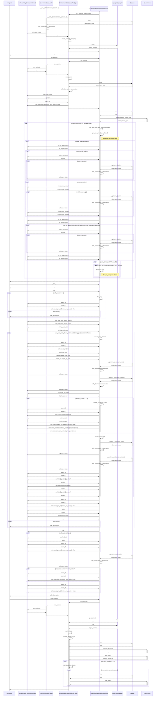

```mermaid
sequenceDiagram
    participant E as entrypoint
    participant SPCI as SurfacePolicyCurvatureInformed

    activate E

    participant EDL as EnvironmentDataLoader
    participant EDLO as EnvironmentDataLoaderPerObject

    create participant IEDL as InformedEnvironmentDataLoader
    E ->>+ IEDL : __init__(dataset, motor_system, ...)
    IEDL ->>+ EDLO : __init__(dataset, motor_system, ...)
    EDLO ->>+ EDL : __init__(dataset, motor_system, ...)
    participant OIS as object_init_sampler
    participant DS as Dataset
    participant ENV as Environment
    EDL ->>+ DS : reset
    DS -->>- EDL : observation, state
    EDL ->> EDL : self._observation = observation
    EDL ->> SPCI : self.state = state
    EDL -->>- EDLO : ...
    EDLO ->>+ EDLO : create_semantic_mapping
    deactivate EDLO
    EDLO ->>+ OIS : __call__
    OIS -->>- EDLO : object_params
    EDLO -->>- IEDL : ...
    IEDL -->>- E : ...

    E ->>+ IEDL : pre_episode
    IEDL ->>+ EDLO : pre_episode
    EDLO ->>+ EDL : pre_episode
    EDL ->>+ SPCI : pre_episode
    SPCI -->>- EDL : ...
    EDL -->>- EDLO : ...
    EDLO ->>+ EDLO : reset_agent
    EDLO ->>+ DS : reset
    DS -->>- EDLO : observation, state
    EDLO ->> EDLO : self._observation = observation
    EDLO ->> SPCI : self.state = state
    EDLO ->>+ SPCI : agent_id
    SPCI -->>- EDLO : agent_id
    EDLO ->> SPCI : self.state[agent_id]["motor_only_step"] = False
    deactivate EDLO
    EDLO -->>- IEDL : ...
    IEDL ->>+ DS : env
    DS -->>- IEDL : env
    IEDL ->>+ ENV : _agents[0].action_space_type
    ENV -->>- IEDL : action_space_type
    opt action_space_type == "surface_agent"
        IEDL ->>+ IEDL : get_good_view_with_patch_refinement
            IEDL ->>+ IEDL : get_good_view("view_finder")
            NOTE right of IEDL : Bookmark get_good_view
                opt multiple_objects_present
                    IEDL ->>+ SPCI : is_on_target_object
                    SPCI -->>- IEDL : on_target_object
                    opt not on_target_object
                        IEDL ->>+ SPCI : orient_to_object
                        SPCI -->>- IEDL : actions
                        loop action in actions
                            IEDL ->>+ DS : __getitem__(action)
                            DS -->>- IEDL : observation, state
                            IEDL ->> IEDL : self._observation = observation
                            IEDL ->> SPCI : self.state = state
                        end
                    end
                end
                opt allow_translation
                    IEDL ->>+ SPCI : move_close_enough
                    SPCI -->>- IEDL : action, close_enough
                    loop not close_enough
                        IEDL ->>+ DS : __getitem__(action)
                        DS -->>- IEDL : observation, state
                        IEDL ->> IEDL : self._observation = observation
                        IEDL ->> SPCI : self.state = state
                        IEDL ->>+ SPCI : move_close_enough
                        SPCI -->>- IEDL : action, close_enough
                    end
                end
                IEDL ->>+ SPCI : is_on_target_object
                SPCI -->>- IEDL : on_target_object
                loop not on_target_object and num_attempts < max_orientation_attempts
                    IEDL ->>+ SPCI : orient_to_object
                    SPCI -->>- IEDL : actions
                    loop action in actions
                        IEDL ->>+ DS : __getitem__(action)
                        DS -->>- IEDL : observation, state
                        IEDL ->> IEDL : self._observation = observation
                        IEDL ->> SPCI : self.state = state
                    end
                    IEDL ->>+ SPCI : is_on_target_object
                    SPCI -->>- IEDL : on_target_object
                end
            deactivate IEDL
            loop patch_id in ("patch", "patch_0")
                opt patch_id in self._observation["agent_id_0"].keys()
                    IEDL ->>+ IEDL : get_good_view
                    NOTE right of IEDL : See get_good_view above
                    deactivate IEDL
                end
            end
        deactivate IEDL
    end
    IEDL -->>- E : ...

    E ->>+ IEDL : __iter__
    IEDL -->>- E : ...

    E ->>+ IEDL : __next__
    opt self._counter == 0
        IEDL ->>+ IEDL : first_step
            IEDL ->>+ SPCI : agent_id
            SPCI -->>- IEDL : agent_id
            IEDL ->> SPCI : self.state[agent_id]["motor_only_step"] = True
        deactivate IEDL
        break early return
            IEDL -->> E : self._observation
        end
    end
    IEDL ->>+ SPCI : use_goal_state_driven_actions
    SPCI -->>- IEDL : use_goal_state_driven_actions
    IEDL ->>+ SPCI : driving_goal_state
    SPCI -->>- IEDL : driving_goal_state
    opt use_goal_state_driven_actions and driving_goal_state is not None
        IEDL ->>+ IEDL : execute_jump_attempt
            IEDL ->>+ SPCI : agent_id
            SPCI -->>- IEDL : agent_id
            IEDL ->>+ SPCI : self.state[agend_id]
            SPCI -->>- IEDL : pre_jump_state
            IEDL ->>+ SPCI : derive_habitat_goal_state
            SPCI -->>- IEDL : target_loc, target_np_quat
            IEDL ->>+ DS : __getitem__(set_agent_pose)
            DS -->>- IEDL : observation, state
            IEDL ->> IEDL : self._observation = observation
            IEDL ->> SPCI : self.state = state
            IEDL ->>+ DS : __getitem__(set_agent_rotation)
            DS -->>- IEDL : observation, state
            IEDL ->> IEDL : self._observation = observation
            IEDL ->> SPCI : self.state = state
            IEDL ->>+ SPCI : get_depth_at_center
            SPCI -->>- IEDL : depth_at_center
            alt depth_at_center < 1.0
                IEDL ->>+ IEDL : handle_successful_jump
                    IEDL ->>+ SPCI : agent_id
                    SPCI -->>- IEDL : agent_id
                    IEDL ->> SPCI : self.action = MoveTangentially
                    IEDL ->>+ SPCI : action_details
                    SPCI -->>- IEDL : action_details
                    IEDL ->> SPCI : self.action_details["pc_heading"].append("jump")
                    IEDL ->> SPCI : self.action_details["avoidance_heading"].append(False)
                    IEDL ->> SPCI : self.action_details["z_defined_pc"].append(None)
                deactivate IEDL
            else
                IEDL ->>+ IEDL : handle_failed_jump
                    IEDL ->>+ DS : __getitem__(set_agent_pose)
                    DS -->>- IEDL : observation, state
                    IEDL ->> IEDL : self._observation = observation
                    IEDL ->> SPCI : self.state = state
                    IEDL ->>+ DS : __getitem__(set_sensor_rotation)
                    DS -->>- IEDL : observation, state
                    IEDL ->> IEDL : self._observation = observation
                    IEDL ->> SPCI : self.state = state
                    IEDL ->>+ SPCI : agent_id
                    SPCI -->>- IEDL : agent_id
                    IEDL ->>+ SPCI : self.state[agent_id]["position"]
                    SPCI -->>- IEDL : position
                    IEDL ->>+ SPCI : self.state[agent_id]["rotation"]
                    SPCI -->>- IEDL : rotation
                    IEDL ->>+ SPCI : self.state[agent_id]["sensors"]
                    SPCI -->>- IEDL : sensors
                deactivate IEDL
            end
            IEDL ->>+ SPCI : agent_id
            SPCI -->>- IEDL : agent_id
            IEDL ->> SPCI : self.state[agent_id]["motor_only_step"] = True
            IEDL ->>+ SPCI : action
            SPCI -->>- IEDL : action
            IEDL ->>+ SPCI : post_action(action)
            SPCI -->>- IEDL : ...
        deactivate IEDL
        break early return
            IEDL -->> E : self._observation
        end
    end
    IEDL ->>+ SPCI : __call__
    opt self._action is None
        IEDL ->>+ SPCI : touch_object
        SPCI -->>- IEDL : action
        IEDL ->>+ SPCI : agent_id
        SPCI -->>- IEDL : agent_id
        IEDL ->> SPCI : self.state[agent_id]["motor_only_step"] = True
    end
    IEDL ->>+ DS : __getitem__(self._action)
    DS -->>- IEDL : observation, state
    IEDL ->> IEDL : self._observation = observation
    IEDL ->> SPCI : self.state = state
    alt self._action.name != "orient_vertical"
        IEDL ->>+ SPCI : agent_id
        SPCI -->>- IEDL : agent_id
        IEDL ->> SPCI : self.state[agent_id]["motor_only_step"] = True
    else
        IEDL ->>+ SPCI : agent_id
        SPCI -->>- IEDL : agent_id
        IEDL ->> SPCI : self.state[agent_id]["motor_only_step"] = False
    end
    IEDL -->> E : self._observation
    deactivate IEDL

    E ->>+ IEDL : post_episode
    IEDL ->>+ EDLO : post_episode
    deactivate IEDL
    EDLO ->>+ EDL : post_episode
    EDL ->>+ SPCI : post_episode
    SPCI -->>- EDL : ...
    EDL -->>- EDLO : ...
    EDLO ->>+ OIS : post_episode
    OIS -->>- EDLO : ...
    EDLO ->>+ OIS : __call__
    OIS -->>- EDLO : object_params
    EDLO ->>+ EDLO : cycle_object
    EDLO ->>+ EDLO : change_object_by_idx
    EDLO ->>+ DS : env
    DS -->>- EDLO : env
    EDLO ->>+ ENV : remove_all_objects
    ENV -->>- EDLO : ...
    EDLO ->>+ ENV : add_object
    ENV -->>- EDLO : primary_target_obj
    opt self.num_distractors > 0
        EDLO ->>+ EDLO : add_distractor_objects
        loop in range(self.num_distractors)
            EDLO ->>+ DS : env
            DS -->>- EDLO : env
            EDLO ->>+ ENV : add_object
            ENV -->>- EDLO : ...
        end
        deactivate EDLO
    end
    deactivate EDLO
    deactivate EDLO
    EDLO -->>- E : ...

    deactivate E
```