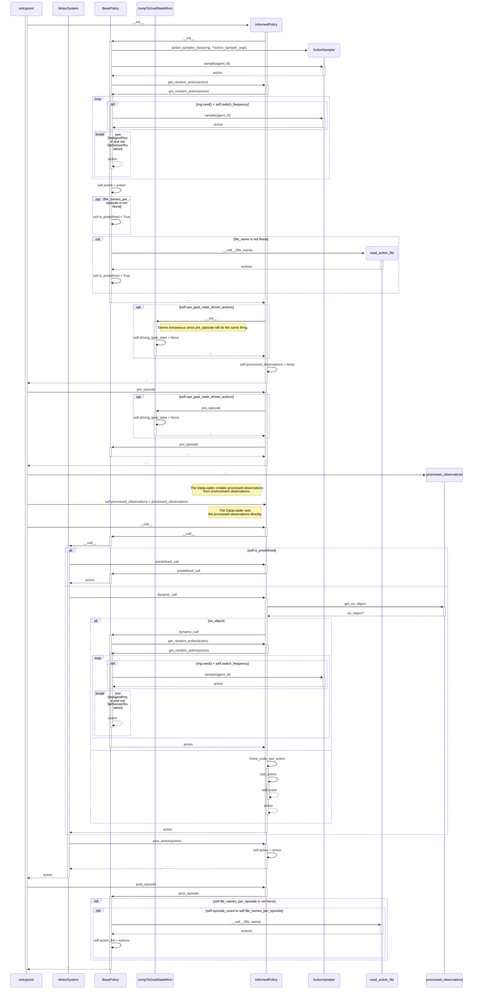

```mermaid
sequenceDiagram
    participant E as entrypoint
    participant MS as MotorSystem
    participant BP as BasePolicy
    participant JTGS as JumpToGoalStateMixin

    activate E

    create participant IP as InformedPolicy
    E ->>+ IP : __init__
    IP ->>+ BP : __init__
    create participant AS as ActionSampler
    BP ->> AS : action_sampler_class(rng, **action_sampler_args)
    BP ->>+ AS : sample(agent_id)
    AS -->>- BP : action
    BP ->>+ IP : get_random_action(action)
    IP ->> BP : get_random_action(action)
    deactivate IP
    activate BP
        loop
            opt rng.rand() < self.switch_frequency
                BP ->>+ AS: sample(agent_id)
                AS -->>- BP : action
            end
            break not SetAgentPose and not SetSensorRotation
                BP -->> BP : action
                deactivate BP
            end
        end
    BP ->> BP : self.action = action
    opt file_names_per_episode is not None
        BP ->> BP : self.is_predefined = True
    end
    opt file_name is not None
        create participant RAF as read_action_file
        BP ->>+ RAF : __call__(file_name)
        RAF -->>- BP : actions
        BP ->> BP : self.is_predefined = True
    end
    BP -->>- IP : ...
    opt self.use_goal_state_driven_actions
        IP ->>+ JTGS : __init__
        Note right of JTGS : Seems extraneous since pre_episode will do the same thing.
        JTGS ->> JTGS : self.driving_goal_state = None
        JTGS -->>- IP : ...
    end
    IP ->> IP : self.processed_observations = None
    IP -->>- E : ...

    E ->>+ IP : pre_episode
    opt self.use_goal_state_driven_actions
        IP ->>+ JTGS : pre_episode
        JTGS ->> JTGS : self.driving_goal_state = None
        JTGS -->>- IP : ...
    end
    IP ->>+ BP : pre_episode
    BP -->>- IP : ...
    IP -->>- E : ...


    create participant PO as processed_observations
    E ->> PO : ...
    Note left of IP : The DataLoader creates processed observations <br/>from environment observations.

    E ->> IP : self.processed_observations = processed_observations
    Note left of IP : The DataLoader sets<br/>the processed observations directly.

    E ->>+ IP : __call__
    IP ->>+ BP : __call__
    deactivate IP
    BP ->>+ MS : __call__
    deactivate BP
    alt self.is_predefined
        MS ->>+ IP : predefined_call
        IP ->>+ BP : predefined_call
        deactivate IP
        BP -->>- MS : action
    else
        MS ->>+ IP : dynamic_call
        IP ->>+ PO : get_on_object
        PO -->>- IP : on_object?
        alt on_object
            IP ->>+ BP : dynamic_call
            BP ->>+ IP : get_random_action(action)
            IP ->> BP : get_random_action(action)
            deactivate IP
            activate BP
                loop
                    opt rng.rand() < self.switch_frequency
                        BP ->>+ AS: sample(agent_id)
                        AS -->>- BP : action
                    end
                    break not SetAgentPose and not SetSensorRotation
                        BP -->> BP : action
                        deactivate BP
                    end
                end
            BP -->>- IP : action
        else
            IP ->>+ IP : fixme_undo_last_action
            IP ->>+ IP : last_action
            IP -->>- IP : self.action
            IP -->>- IP : action
        end
        IP -->>- MS : action
    end
    MS ->>+ IP : post_action(action)
    IP ->> IP : self.action = action
    IP -->>- MS : ...
    MS -->>- E : action

    E ->>+ IP : post_episode
    IP ->>+ BP : post_episode
    deactivate IP
    opt self.file_names_per_episode is not None
        opt self.episode_count in self.file_names_per_episode
            BP ->>+ RAF : __call__(file_name)
            RAF -->>- BP : actions
            BP ->> BP : self.action_list = actions
        end
    end
    BP -->>- E : ...

    deactivate E
```
