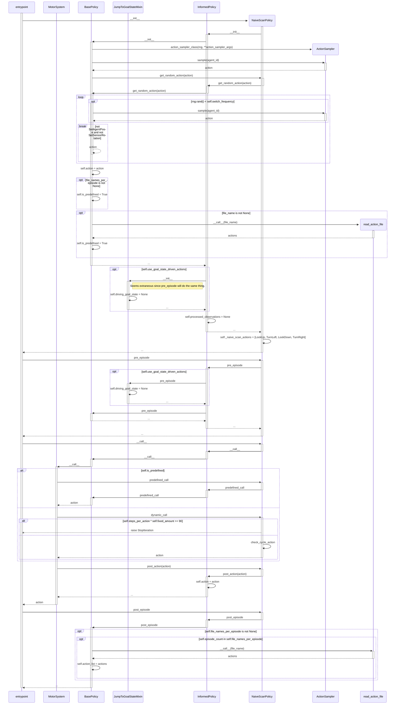

```mermaid
sequenceDiagram
    participant E as entrypoint
    participant MS as MotorSystem
    participant BP as BasePolicy
    participant JTGS as JumpToGoalStateMixin
    participant IP as InformedPolicy

    activate E

    create participant NSP as NaiveScanPolicy
    E ->>+ NSP : __init__
    NSP ->>+ IP : __init__
    IP ->>+ BP : __init__
    create participant AS as ActionSampler
    BP ->> AS : action_sampler_class(rng, **action_sampler_args)
    BP ->>+ AS : sample(agent_id)
    AS -->>- BP : action
    BP ->>+ NSP : get_random_action(action)
    NSP ->>+ IP : get_random_action(action)
    deactivate NSP
    IP ->> BP : get_random_action(action)
    deactivate IP
    activate BP
        loop
            opt rng.rand() < self.switch_frequency
                BP ->>+ AS: sample(agent_id)
                AS -->>- BP : action
            end
            break not SetAgentPose and not SetSensorRotation
                BP -->> BP : action
                deactivate BP
            end
        end
    BP ->> BP : self.action = action
    opt file_names_per_episode is not None
        BP ->> BP : self.is_predefined = True
    end
    opt file_name is not None
        create participant RAF as read_action_file
        BP ->>+ RAF : __call__(file_name)
        RAF -->>- BP : actions
        BP ->> BP : self.is_predefined = True
    end
    BP -->>- IP : ...
    opt self.use_goal_state_driven_actions
        IP ->>+ JTGS : __init__
        Note right of JTGS : Seems extraneous since pre_episode will do the same thing.
        JTGS ->> JTGS : self.driving_goal_state = None
        JTGS -->>- IP : ...
    end
    IP ->> IP : self.processed_observations = None
    IP -->>- NSP : ...
    NSP ->> NSP : self._naive_scan_actions = [LookUp, TurnLeft, LookDown, TurnRight]
    NSP -->>-E : ...

    E ->>+ NSP : pre_episode
    NSP ->>+ IP : pre_episode
    opt self.use_goal_state_driven_actions
        IP ->>+ JTGS : pre_episode
        JTGS ->> JTGS : self.driving_goal_state = None
        JTGS -->>- IP : ...
    end
    IP ->>+ BP : pre_episode
    BP -->>- IP : ...
    IP -->>- NSP : ...
    NSP -->>- E : ...

    E ->>+ NSP : __call__
    NSP ->>+ IP : __call__
    deactivate NSP
    IP ->>+ BP : __call__
    deactivate IP
    BP ->>+ MS : __call__
    deactivate BP
    alt self.is_predefined
        MS ->>+ NSP : predefined_call
        NSP ->>+ IP : predefined_call
        deactivate NSP
        IP ->>+ BP : predefined_call
        deactivate IP
        BP -->>- MS : action
    else
        MS ->>+ NSP : dynamic_call
        alt self.steps_per_action * self.fixed_amount >= 90
            NSP --x E : raise StopIteration
        else
            NSP ->> NSP : check_cycle_action
            NSP -->>- MS: action
        end
    end
    MS ->>+ NSP : post_action(action)
    NSP ->>+ IP : post_action(action)
    deactivate NSP
    IP ->> IP : self.action = action
    IP -->>- MS : ...
    MS -->>- E : action

    E ->>+ NSP : post_episode
    NSP ->>+ IP : post_episode
    deactivate NSP
    IP ->>+ BP : post_episode
    deactivate IP
    opt self.file_names_per_episode is not None
        opt self.episode_count in self.file_names_per_episode
            BP ->>+ RAF : __call__(file_name)
            RAF -->>- BP : actions
            BP ->> BP : self.action_list = actions
        end
    end
    BP -->>- E : ...

    deactivate E
```
