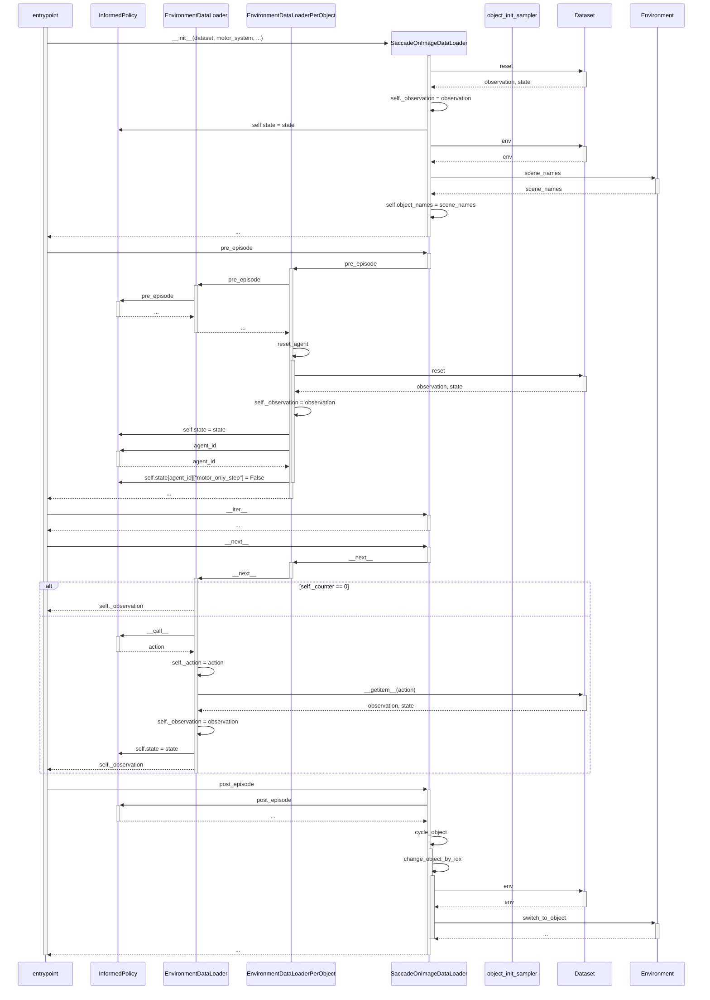

```mermaid
sequenceDiagram
    participant E as entrypoint
    participant IP as InformedPolicy

    activate E

    participant EDL as EnvironmentDataLoader
    participant EDLO as EnvironmentDataLoaderPerObject

    create participant SIDL as SaccadeOnImageDataLoader
    E ->>+ SIDL : __init__(dataset, motor_system, ...)
    participant OIS as object_init_sampler
    participant DS as Dataset
    participant ENV as Environment
    SIDL ->>+ DS : reset
    DS -->>- SIDL : observation, state
    SIDL ->> SIDL : self._observation = observation
    SIDL ->> IP : self.state = state
    SIDL ->>+ DS : env
    DS -->>- SIDL : env
    SIDL ->>+ ENV : scene_names
    ENV -->>- SIDL : scene_names
    SIDL ->> SIDL : self.object_names = scene_names
    SIDL -->>- E : ...

    E ->>+ SIDL : pre_episode
    SIDL ->>+ EDLO : pre_episode
    deactivate SIDL
    EDLO ->>+ EDL : pre_episode
    EDL ->>+ IP : pre_episode
    IP -->>- EDL : ...
    EDL -->>- EDLO : ...
    EDLO ->>+ EDLO : reset_agent
    EDLO ->>+ DS : reset
    DS -->>- EDLO : observation, state
    EDLO ->> EDLO : self._observation = observation
    EDLO ->> IP : self.state = state
    EDLO ->>+ IP : agent_id
    IP -->>- EDLO : agent_id
    EDLO ->> IP : self.state[agent_id]["motor_only_step"] = False
    deactivate EDLO
    EDLO -->>- E : ...

    E ->>+ SIDL : __iter__
    SIDL -->>- E : ...

    E ->>+ SIDL : __next__
    SIDL ->>+ EDLO : __next__
    deactivate SIDL
    EDLO ->>+ EDL : __next__
    deactivate EDLO
    alt self._counter == 0
        EDL -->> E : self._observation
    else
        EDL ->>+ IP : __call__
        IP -->>- EDL : action
        EDL ->> EDL : self._action = action
        EDL ->>+ DS : __getitem__(action)
        DS -->>- EDL : observation, state
        EDL ->> EDL : self._observation = observation
        EDL ->> IP : self.state = state
        EDL -->> E : self._observation
    end
    deactivate EDL

    E ->>+ SIDL : post_episode
    SIDL ->>+ IP : post_episode
    IP -->>- SIDL : ...
    SIDL ->>+ SIDL : cycle_object
        SIDL ->>+ SIDL : change_object_by_idx
            SIDL ->>+ DS : env
            DS -->>- SIDL : env
            SIDL ->>+ ENV : switch_to_object
            ENV -->>- SIDL : ...
        deactivate SIDL
    deactivate SIDL
    SIDL -->>- E : ...

    deactivate E
```