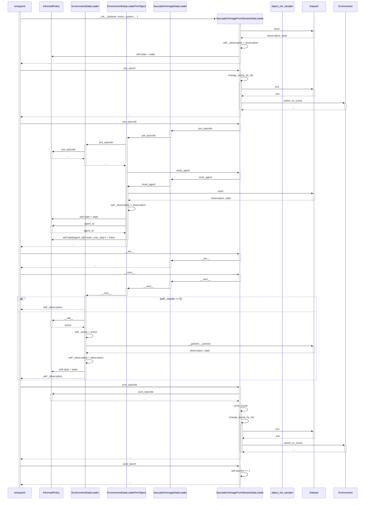

```mermaid
sequenceDiagram
    participant E as entrypoint
    participant IP as InformedPolicy

    activate E

    participant EDL as EnvironmentDataLoader
    participant EDLO as EnvironmentDataLoaderPerObject
    participant SIDL as SaccadeOnImageDataLoader

    create participant SISDL as SaccadeOnImageFromStreamDataLoader
    E ->>+ SISDL : __init__(dataset, motor_system, ...)
    participant OIS as object_init_sampler
    participant DS as Dataset
    participant ENV as Environment
    SISDL ->>+ DS : reset
    DS -->>- SISDL : observation, state
    SISDL ->> SISDL : self._observation = observation
    SISDL ->> IP : self.state = state
    SISDL -->>- E : ...

    E ->>+ SISDL : pre_epoch
    SISDL ->>+ SISDL : change_scene_by_idx
        SISDL ->>+ DS : env
        DS -->>- SISDL : env
        SISDL ->>+ ENV : switch_to_scene
        ENV -->>- SISDL : ...
    deactivate SISDL
    SISDL -->>- E : ...

    E ->>+ SISDL : pre_episode
    SISDL ->>+ SIDL : pre_episode
    deactivate SISDL
    SIDL ->>+ EDLO : pre_episode
    deactivate SIDL
    EDLO ->>+ EDL : pre_episode
    EDL ->>+ IP : pre_episode
    IP -->>- EDL : ...
    EDL -->>- EDLO : ...
    EDLO ->>+ SISDL : reset_agent
    SISDL ->>+ SIDL : reset_agent
    deactivate SISDL
    SIDL ->>+ EDLO : reset_agent
    deactivate SIDL
    EDLO ->>+ DS : reset
    DS -->>- EDLO : observation, state
    EDLO ->> EDLO : self._observation = observation
    EDLO ->> IP : self.state = state
    EDLO ->>+ IP : agent_id
    IP -->>- EDLO : agent_id
    EDLO ->> IP : self.state[agent_id]["motor_only_step"] = False
    deactivate EDLO
    EDLO -->>- E : ...

    E ->>+ SISDL : __iter__
    SISDL ->>+ SIDL : __iter__
    deactivate SISDL
    SIDL -->>- E : ...

    E ->>+ SISDL : __next__
    SISDL ->>+ SIDL : __next__
    deactivate SISDL
    SIDL ->>+ EDLO : __next__
    deactivate SIDL
    EDLO ->>+ EDL : __next__
    deactivate EDLO
    alt self._counter == 0
        EDL -->> E : self._observation
    else
        EDL ->>+ IP : __call__
        IP -->>- EDL : action
        EDL ->> EDL : self._action = action
        EDL ->>+ DS : __getitem__(action)
        DS -->>- EDL : observation, state
        EDL ->> EDL : self._observation = observation
        EDL ->> IP : self.state = state
        EDL -->> E : self._observation
    end
    deactivate EDL

    E ->>+ SISDL : post_episode
    SISDL ->>+ IP : post_episode
    IP -->>- SISDL : ...
    SISDL ->>+ SISDL : cycle_scene
        SISDL ->>+ SISDL : change_scene_by_idx
            SISDL ->>+ DS : env
            DS -->>- SISDL : env
            SISDL ->>+ ENV : switch_to_scene
            ENV -->>- SISDL : ...
        deactivate SISDL
    deactivate SISDL
    SISDL -->>- E : ...

    E ->>+ SISDL : post_epoch
    SISDL ->> SISDL : self.epochs += 1
    SISDL -->>- E : ...

    deactivate E
```
