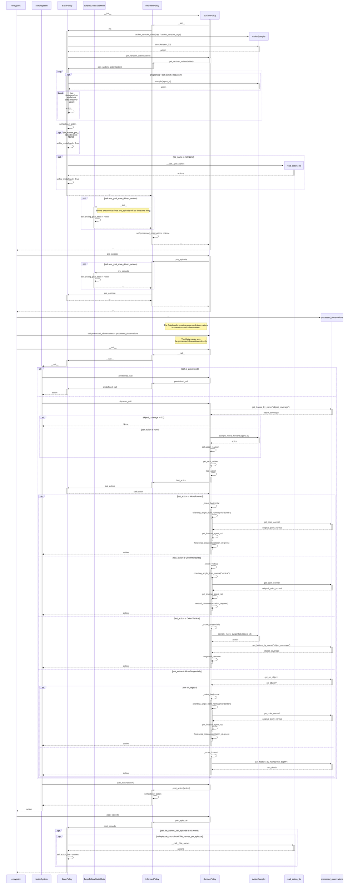

```mermaid
sequenceDiagram
    participant E as entrypoint
    participant MS as MotorSystem
    participant BP as BasePolicy
    participant JTGS as JumpToGoalStateMixin
    participant IP as InformedPolicy

    activate E

    create participant SP as SurfacePolicy
    E ->>+ SP : __init__
    SP ->>+ IP : __init__
    IP ->>+ BP : __init__
    create participant AS as ActionSampler
    BP ->> AS : action_sampler_class(rng, **action_sampler_args)
    BP ->>+ AS : sample(agent_id)
    AS -->>- BP : action
    BP ->>+ SP : get_random_action(action)
    SP ->>+ IP : get_random_action(action)
    deactivate SP
    IP ->> BP : get_random_action(action)
    deactivate IP
    activate BP
        loop
            opt rng.rand() < self.switch_frequency
                BP ->>+ AS: sample(agent_id)
                AS -->>- BP : action
            end
            break not SetAgentPose and not SetSensorRotation
                BP -->> BP : action
                deactivate BP
            end
        end
    BP ->> BP : self.action = action
    opt file_names_per_episode is not None
        BP ->> BP : self.is_predefined = True
    end
    opt file_name is not None
        create participant RAF as read_action_file
        BP ->>+ RAF : __call__(file_name)
        RAF -->>- BP : actions
        BP ->> BP : self.is_predefined = True
    end
    BP -->>- IP : ...
    opt self.use_goal_state_driven_actions
        IP ->>+ JTGS : __init__
        Note right of JTGS : Seems extraneous since pre_episode will do the same thing.
        JTGS ->> JTGS : self.driving_goal_state = None
        JTGS -->>- IP : ...
    end
    IP ->> IP : self.processed_observations = None
    IP -->>- SP : ...
    SP -->>- E : ...

    E ->>+ SP : pre_episode
    SP ->>+ IP : pre_episode
    opt self.use_goal_state_driven_actions
        IP ->>+ JTGS : pre_episode
        JTGS ->> JTGS : self.driving_goal_state = None
        JTGS -->>- IP : ...
    end
    IP ->>+ BP : pre_episode
    BP -->>- IP : ...
    IP -->>- SP : ...
    SP -->>- E : ...

    create participant PO as processed_observations
    E ->> PO : ...
    Note left of SP : The DataLoader creates processed observations <br/>from environment observations.

    E ->> SP : self.processed_observations = processed_observations
    Note left of SP : The DataLoader sets<br/>the processed observations directly.

    E ->>+ SP : __call__
    SP ->>+ IP : __call__
    deactivate SP
    IP ->>+ BP : __call__
    deactivate IP
    BP ->>+ MS : __call__
    deactivate BP
    alt self.is_predefined
        MS ->>+ SP : predefined_call
        SP ->>+ IP : predefined_call
        deactivate SP
        IP ->>+ BP : predefined_call
        deactivate IP
        BP -->>- MS : action
    else
        MS ->>+ SP : dynamic_call
        SP ->>+ PO : get_feature_by_name("object_coverage")
        PO -->>- SP : object_coverage
        alt object_coverage < 0.1
            SP -->> MS : None
        else self.action is None
            SP ->>+ AS : sample_move_forward(agent_id)
            AS -->>- SP : action
            SP ->> SP : self.action = action
        end
        SP ->>+ SP : get_next_action
        SP ->>+ SP : last_action
        SP ->>+ IP : last_action
        deactivate SP
        IP ->>+ BP : last_action
        deactivate IP
        BP -->>- SP : self.action
        alt last_action is MoveForward
            SP ->>+ SP : _orient_horizontal
            SP ->>+ SP : orienting_angle_from_normal("horizontal")
            SP ->>+ PO : get_point_normal
            PO -->>- SP : original_point_normal
            SP ->>+ SP : get_inverse_agent_rot
            deactivate SP
            deactivate SP
            SP ->>+ SP : horizontal_distances(rotation_degrees)
            deactivate SP
            SP -->>- MS : action
        else last_action is OrientHorizontal
            SP ->>+ SP : _orient_vertical
            SP ->>+ SP : orienting_angle_from_normal("vertical")
            SP ->>+ PO : get_point_normal
            PO -->>- SP : original_point_normal
            SP ->>+ SP : get_inverse_agent_rot
            deactivate SP
            deactivate SP
            SP ->>+ SP : vertical_distances(rotation_degrees)
            deactivate SP
            SP -->>- MS : action
        else last_action is OrientVertical
            SP ->>+ SP : _move_tangentially
            SP ->>+ AS : sample_move_tangentially(agent_id)
            AS -->>- SP : action
            SP ->>+ PO : get_feature_by_name("object_coverage")
            PO -->>- SP : object_coverage
            SP ->>+ SP : tangential_direction
            deactivate SP
            SP -->>- MS : action
        else last_action is MoveTangentially
            SP ->>+ PO : get_on_object
            PO -->>- SP : on_object?
            alt not on_object?
                SP ->>+ SP : _orient_horizontal
                SP ->>+ SP : orienting_angle_from_normal("horizontal")
                SP ->>+ PO : get_point_normal
                PO -->>- SP : original_point_normal
                SP ->>+ SP : get_inverse_agent_rot
                deactivate SP
                deactivate SP
                SP ->>+ SP : horizontal_distances(rotation_degrees)
                deactivate SP
                SP -->>- MS : action
            else
                SP ->>+ SP : _move_forward
                SP ->>+ PO : get_feature_by_name("min_depth")
                PO -->>- SP : min_depth
                SP -->>- MS : action
            end
        end
        deactivate SP
        deactivate SP
    end
    MS ->>+ SP : post_action(action)
    SP ->>+ IP : post_action(action)
    deactivate SP
    IP ->> IP : self.action = action
    IP -->>- MS : ...
    MS -->>- E : action

    E ->>+ SP : post_episode
    SP ->>+ IP : post_episode
    deactivate SP
    IP ->>+ BP : post_episode
    deactivate IP
    opt self.file_names_per_episode is not None
        opt self.episode_count in self.file_names_per_episode
            BP ->>+ RAF : __call__(file_name)
            RAF -->>- BP : actions
            BP ->> BP : self.action_list = actions
        end
    end
    BP -->>- E : ...

```
