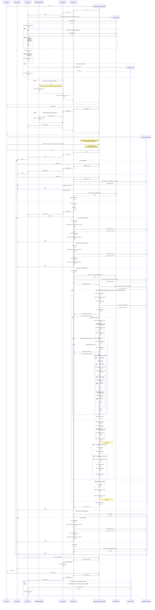

```mermaid
sequenceDiagram
    participant E as entrypoint
    participant MS as MotorSystem
    participant BP as BasePolicy
    participant JTGS as JumpToGoalStateMixin
    participant IP as InformedPolicy
    participant SP as SurfacePolicy

    activate E

    create participant SPCI as SurfacePolicyCurvatureInformed
    E ->>+ SPCI : __init__
    SPCI ->>+ SP : __init__
    SP ->>+ IP : __init__
    IP ->>+ BP : __init__
    create participant AS as ActionSampler
    BP ->> AS : action_sampler_class(rng, **action_sampler_args)
    BP ->>+ AS : sample(agent_id)
    AS -->>- BP : action
    BP ->> BP : get_random_action(action)
    activate BP
        loop
            opt rng.rand() < self.switch_frequency
                BP ->>+ AS: sample(agent_id)
                AS -->>- BP : action
            end
            break not SetAgentPose and not SetSensorRotation
                BP -->> BP : action
                deactivate BP
            end
        end
    BP ->> BP : self.action = action
    opt file_names_per_episode is not None
        BP ->> BP : self.is_predefined = True
    end
    opt file_name is not None
        create participant RAF as read_action_file
        BP ->>+ RAF : __call__(file_name)
        RAF -->>- BP : actions
        BP ->> BP : self.is_predefined = True
    end
    BP -->>- IP : ...
    opt self.use_goal_state_driven_actions
        IP ->>+ JTGS : __init__
        Note right of JTGS : Seems extraneous since pre_episode will do the same thing.
        JTGS ->> JTGS : self.driving_goal_state = None
        JTGS -->>- IP : ...
    end
    IP ->> IP : self.processed_observations = None
    IP -->>- SP : ...
    SP -->>- SPCI : ...
    SPCI -->>- E : ...

    E ->>+ SPCI : pre_episode
    SPCI ->>+ SP : pre_episode
    SP ->>+ IP : pre_episode
    opt self.use_goal_state_driven_actions
        IP ->>+ JTGS : pre_episode
        JTGS ->> JTGS : self.driving_goal_state = None
        JTGS -->>- IP : ...
    end
    IP ->>+ BP : pre_episode
    BP -->>- IP : ...
    IP -->>- SP : ...
    SP -->>- SPCI : ...
    SPCI -->>- E : ...

    create participant PO as processed_observations
    E ->> PO : ...
    Note left of SPCI : The DataLoader creates processed observations <br/>from environment observations.

    E ->> SPCI : self.processed_observations = processed_observations
    Note left of SPCI : The DataLoader sets<br/>the processed observations directly.

    E ->>+ SPCI : __call__
    SPCI ->>+ SP : __call__
    deactivate SPCI
    SP ->>+ IP : __call__
    deactivate SP
    IP ->>+ BP : __call__
    deactivate IP
    BP ->>+ MS : __call__
    deactivate BP
    alt self.is_predefined
        MS ->>+ SPCI : predefined_call
        SPCI ->>+ SP : predefined_call
        deactivate SPCI
        SP ->>+ IP : predefined_call
        deactivate SP
        IP ->>+ BP : predefined_call
        deactivate IP
        BP -->>- MS : action
    else
        MS ->>+ SPCI : dynamic_call
        SPCI ->>+ SP : dynamic_call
        deactivate SPCI
        SP ->>+ PO : get_feature_by_name("object_coverage")
        PO -->>- SP : object_coverage
        alt object_coverage < 0.1
            SP -->> MS : None
        else self.action is None
            SP ->>+ AS : sample_move_forward(agent_id)
            AS -->>- SP : action
            SP ->> SP : self.action = action
        end
        SP ->>+ SP : get_next_action
        SP ->>+ SP : last_action
        SP ->>+ IP : last_action
        deactivate SP
        IP ->>+ BP : last_action
        deactivate IP
        BP -->>- SP : self.action
        alt last_action is MoveForward
            SP ->>+ SP : _orient_horizontal
            SP ->>+ SP : orienting_angle_from_normal("horizontal")
            SP ->>+ PO : get_point_normal
            PO -->>- SP : original_point_normal
            SP ->>+ SP : get_inverse_agent_rot
            deactivate SP
            deactivate SP
            SP ->>+ SP : horizontal_distances(rotation_degrees)
            deactivate SP
            SP -->>- MS : action
        else last_action is OrientHorizontal
            SP ->>+ SP : _orient_vertical
            SP ->>+ SP : orienting_angle_from_normal("vertical")
            SP ->>+ PO : get_point_normal
            PO -->>- SP : original_point_normal
            SP ->>+ SP : get_inverse_agent_rot
            deactivate SP
            deactivate SP
            SP ->>+ SP : vertical_distances(rotation_degrees)
            deactivate SP
            SP -->>- MS : action
        else last_action is OrientVertical
            SP ->>+ SP : _move_tangentially
            SP ->>+ AS : sample_move_tangentially(agent_id)
            AS -->>- SP : action
            SP ->>+ PO : get_feature_by_name("object_coverage")
            PO -->>- SP : object_coverage
            SP ->>+ SPCI : tangential_direction
                SPCI ->>+ PO : get_feature_by_name("pose_fully_defined")
                PO -->>- SPCI : pose_fully_defined?
                alt pose_fully_defined and self.ignoring_pc_counter >= self.min_general_steps
                    SPCI ->>+ SPCI : perform_pc_guided_step
                        SPCI ->>+ SPCI : check_for_preference_change
                        deactivate SPCI
                        SPCI ->>+ SPCI : determine_pc_for_use
                        deactivate SPCI
                        SPCI ->>+ PO : get_curvature_directions
                        PO -->>- SPCI : curvature_directions
                        SPCI ->>+ SPCI : get_inverse_agent_rot
                        SPCI ->>+ SP : get_inverse_agent_rot
                        deactivate SPCI
                        SP -->>- SPCI : inverse_quaternion_rotation
                        alt is movement in z-axis
                            SPCI ->>+ SPCI : perform_standard_tang_step
                                alt self.tangential_angle is not None
                                    SPCI ->>+ SPCI : update_tangential_reps
                                    deactivate SPCI
                                else
                                    SPCI ->>+ SPCI : update_tangential_reps
                                    deactivate SPCI
                                end
                                opt self.following_heading_counter >= self.min_heading_steps
                                    SPCI ->>+ SPCI : avoid_revisiting_locations
                                        opt len(self.tangent_locs) > 0
                                            SPCI ->>+ SPCI : get_inverse_agent_rot
                                            SPCI ->>+ SP : get_inverset_agent_rot
                                            deactivate SPCI
                                            SP -->>- SPCI : inverse_quaternion_rotation
                                            loop searching_for_heading
                                                loop ii in range
                                                    SPCI ->>+ SPCI : conflict_check
                                                    deactivate SPCI
                                                    opt on_conflict
                                                        SPCI ->>+ SPCI : attempt_conflict_resolution
                                                            SPCI ->>+ SPCI : update_tangential_reps
                                                            deactivate SPCI
                                                        deactivate SPCI
                                                    end
                                                end
                                                alt not conflicts
                                                    SPCI ->>+ SPCI : update_tangential_reps
                                                    deactivate SPCI
                                                    break return
                                                        SPCI -->> SPCI : ...
                                                    end
                                                else self.search_counter >= self.max_steps
                                                    SPCI ->>+ SPCI : update_tangential_reps
                                                    deactivate SPCI
                                                    break return
                                                        SPCI -->> SPCI : None
                                                    end
                                                else
                                                    SPCI -->> SPCI : continue
                                                end
                                            end
                                        end
                                    deactivate SPCI
                                end
                            deactivate SPCI
                            SPCI -->> SPCI : alternative_movement
                        else
                            SPCI ->>+ SPCI : update_tangential_reps
                            deactivate SPCI
                            SPCI ->>+ SPCI : check_for_flipped_pc
                                opt self.prev_angle is not None
                                    SPCI ->>+ SPCI : update_tangential_reps
                                    deactivate SPCI
                                end
                            deactivate SPCI
                            SPCI ->>+ SPCI : avoid_revisiting_locations
                            NOTE right of SPCI : See above
                            deactivate SPCI
                            alt self.setting_new_heading
                                SPCI ->>+ SPCI : reset_pc_buffers
                                deactivate SPCI
                                SPCI -->> SPCI : rotated_tangential_vec
                            else
                                alt self.prev_ange is None
                                    SPCI ->> SPCI : self.prev_angle = self.tangential_angle
                                else
                                    SPCI ->>+ SPCI : pc_moving_average
                                        SPCI ->>+ SPCI : update_tangential_reps
                                        deactivate SPCI
                                    deactivate SPCI
                                end
                                SPCI -->> SPCI : rotated_tangential_vec
                            end
                        end
                    deactivate SPCI
                else
                    alt self.using_pc_guide
                        SPCI ->>+ SPCI : reset_pc_buffers
                        deactivate SPCI
                    else
                        SPCI ->> SPCI : self.using_pc_guide = False
                    end
                    SPCI ->>+ SPCI : perform_standard_tang_step
                    NOTE right of SPCI : See above
                    deactivate SPCI
                end
                SPCI ->>+ SPCI : update_action_details
                deactivate SPCI
                SPCI -->>- SP : tang_movement
            SP -->>- MS : action
        else last_action is MoveTangentially
            SP ->>+ PO : get_on_object
            PO -->>- SP : on_object?
            alt not on_object?
                SP ->>+ SP : _orient_horizontal
                SP ->>+ SP : orienting_angle_from_normal("horizontal")
                SP ->>+ PO : get_point_normal
                PO -->>- SP : original_point_normal
                SP ->>+ SP : get_inverse_agent_rot
                deactivate SP
                deactivate SP
                SP ->>+ SP : horizontal_distances(rotation_degrees)
                deactivate SP
                SP -->>- MS : action
            else
                SP ->>+ SP : _move_forward
                SP ->>+ PO : get_feature_by_name("min_depth")
                PO -->>- SP : min_depth
                SP -->>- MS : action
            end
        end
        deactivate SP
        deactivate SP
    end
    MS ->>+ SPCI : post_action(action)
    SPCI ->>+ SP : post_action(action)
    deactivate SPCI
    SP ->>+ IP : post_action(action)
    deactivate SP
    IP ->> IP : self.action = action
    IP -->>- MS : ...
    MS -->>- E : action

    E ->>+ SPCI : post_episode
    SPCI ->>+ SP : post_episode
    deactivate SPCI
    SP ->>+ IP : post_episode
    deactivate SP
    IP ->>+ BP : post_episode
    deactivate IP
    opt self.file_names_per_episode is not None
        opt self.episode_count in self.file_names_per_episode
            BP ->>+ RAF : __call__(file_name)
            RAF -->>- BP : actions
            BP ->> BP : self.action_list = actions
        end
    end
    BP -->>- E : ...
```