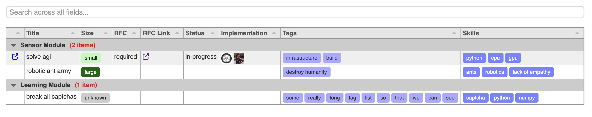
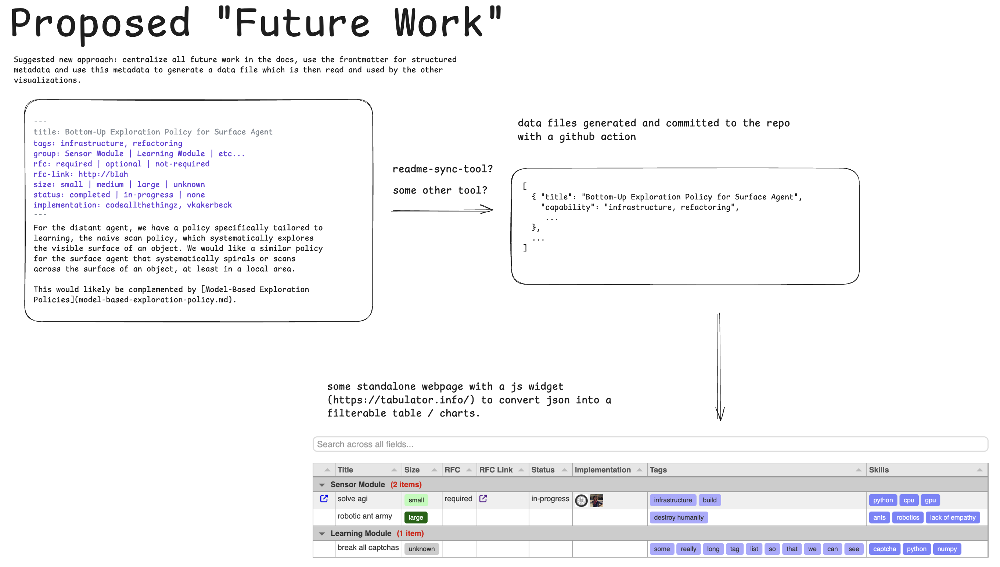

- Start Date: 2025-08-14
- RFC PR: (leave this empty, it will be filled in after RFC is merged)


# Summary

This RFC proposes to create a centralized process to update the future work artifacts.

# Motivation

Currently, there are three places to update the future work. 
- The markdown files in `docs/future-work` which holds the detailed descriptions of the work being suggested.
- The Google sheet where tasks are broken up by tag and type, as well as indicating who is currently working on a task.
- Our internal task tracking system, Shortcut.

There are some downsides to this:
- Updating 3 places when work is started, and maintaining those places as the work progresses.
- There is currently no way to move from viewing the spreadsheet back to the detailed descriptions of that work.
- It's cumbersome to add new structured data and have it be useful to the community.

There are some upsides to the proposed approach:

- We would like the community to more easily find work to contribute to based on their skills, desire and available time. The skills and scope data doesn't currently exist and adding it to a single place would be preferable.

- Having a central place to create and manage the future work should reduce the friction of adding new types of work or enriching existing documents.

Please note: there is manual maintenance work to keep these three places in sync, and there is also work to keep track of who is working on what and which work is complete - this RFC will not remove all of that manual work but does intend to reduce and centralize two of those places.

# Guide-level explanation

New types of front-matter are suggested along side the existing `title` key.
Specifically targeted for the future work section.

## New Front-Matter Values


|        key|values|
|----------:|:-----|
| group     | Sensor Module &#124; Learning Module &#124; etc...|
| tags      | infrastructure, refactoring|
| size      | small &#124; medium &#124; large &#124; unknown|
| rfc       | required &#124; optional &#124; not-required|

And these values after that work has begun:

|              key|values|
|----------------:|:-----|
| status          | completed &#124; in-progress &#124; none|
| rfc-link        | http://github.com/thousandbrainsproject/tbp.monty/pull/123|
| implementation  | codeallthethingz, vkakerbeck|


These structured pieces of data are extracted to a central file for downstream visualizations and consumers.

Of note, a tabular representation of this data so that the community can interact with the future work data and find items that might be suitable for their skills / desires / time appetite.

The widget will read in the structured file mentioned above, and give the user an interface to allow them to sort and filter the future work.

A mockup of what that table may look like:



# Reference-level explanation

As mentioned above, the front-matter of all the docs in the in the `/docs` folder will be extracted and put into a `/docs/index.json`.

```json
[
  {
    "title": "Extract Sensor Modules",
    "group": "Sensor Module",
    "tags": ["infrastructure", "build"],
    "skills": ["python","gpu architecture"],
    "size": "small",
    "status": "in-progress",
    "implementation": ["codeallthethingz","vkakerbeck"],
    // Generated values
    "slug": "extract-sensor-modules", // for linking back to the docs
    "path1": "future-work", // will be used for filtering to a subset of the docs
    "path2": "motor-system-improvements" 
    // "pathN"...
  }
]
```

A GitHub action will process the documentation markdown files to build the central data file.  A good potential fit is the current documentation parser `github-readme-sync` tool.

Some of the fields will be checked for validity and fail the build if they are incorrect.  Notably, `status`, `size` and `rfc` must have the correct values.
All values are optional and the downstream consumers should be able to function even if data is missing.

It is possible that we should have a list of allowed tags and groups as well.

We could also check the implementation GitHub username but this could slow the process and could break if someone deletes / renames their GitHub username.

This generated index file can then be loaded by the various downstream consumers.


The file will need to be commit to the repo as part of a running GitHub action and that commit flagged with commit message that prevents further build triggers - `[skip ci]`


In the scope of this RFC is the future work filterable widget, that will allow community members to find work that matches their skills and time.


Requirements
- Global filter by the text of any cell in the table.
- Group by the large sections of work.
- Sort by any column
- Initially order the table by `group` and then within the group, by `title`
- Show who is working on this current work item using their GitHub username as the badge.

Not requirements (but feel free to tell me if you think these are required)
- Persisting the state of the table, collapsing a group won't be remembered through page reloads.
- Structured filtering. Filtering will work with simple text matches, so a search for 'large' will find both the rows with the size tag 'large' and titles with 'large in them'.
- the full text of the future work document will not be included, and therefore not available for search or display.


General overview:




## Chaos Mitigation

Some strategies to mitigate the chaos of unstructured text fields
- Create documentation that describes the allowed values and what they're used for.
- Automatically generate part of that documentation page from the values found in the future work front matter sections.
- Have the tool that generates the central data file, also do sanity checking on the data and fail the build for invalid values.
- Cap the number of tags / skills a document can contain and fail the build if it goes over that max. Ten skill and ten tags should be enough.

# Drawbacks

Having free form text powering downstream applications that require structured information is has some downsides.
- It requires human oversight to make sure the values are uniform and don't become chaotic.
- Getting humans to adopt a structured process requires training and cognitive load.

# Rationale and alternatives

We could tie into a structured SaaS platform.  Our internal Shortcut tool might be a good possibility here as it could potentially give the more structured tags that we require, and centralize all work into a single place.  However, we would then have to push the details into our docs, and have GitHub action integration with a new tool.  I have not looked into this in earnest.


# Unresolved questions

Where should we host the widget?  Its a simple HTML page that makes a fetch to the raw data file on GitHub. It could be added to our website, thousandbrains.org as a custom HTML page. It could be stored and served from a S3 bucket.

We could cerate a GitHub action to deploy the tabular visualization tool to its destination. However, it will be pretty rare to deploy this once the initial development is complete. Should we automate this manual step away or just have a deployment script that we can run manually?


