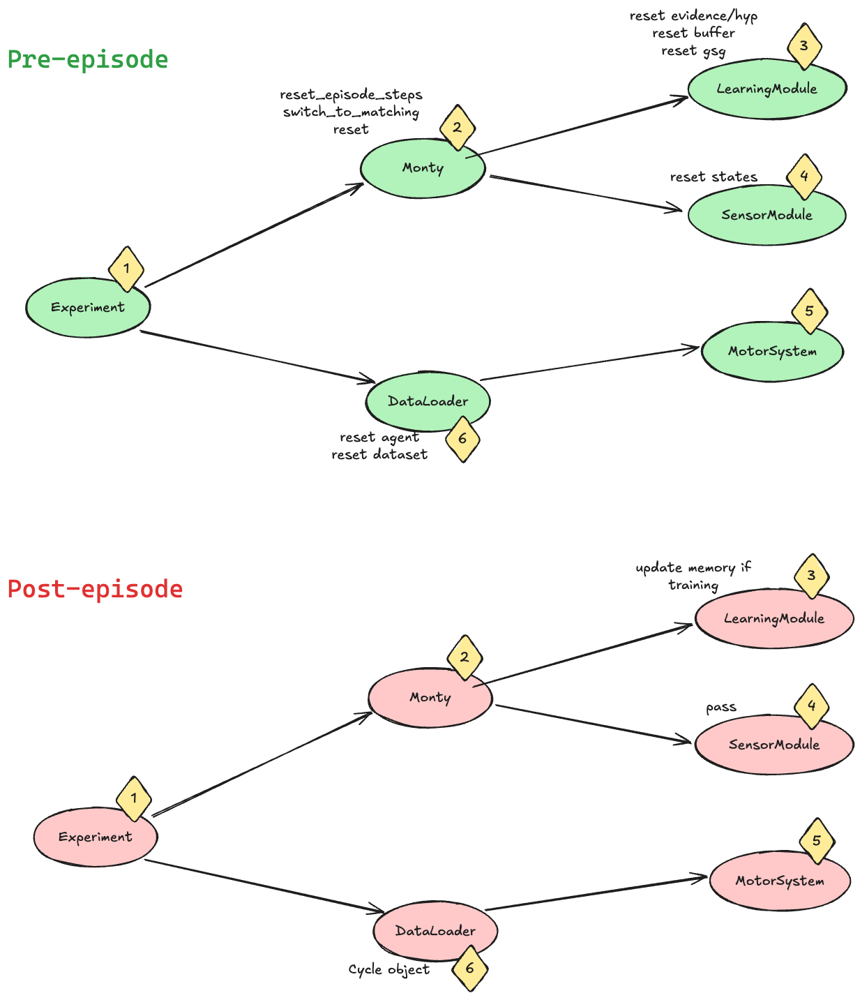
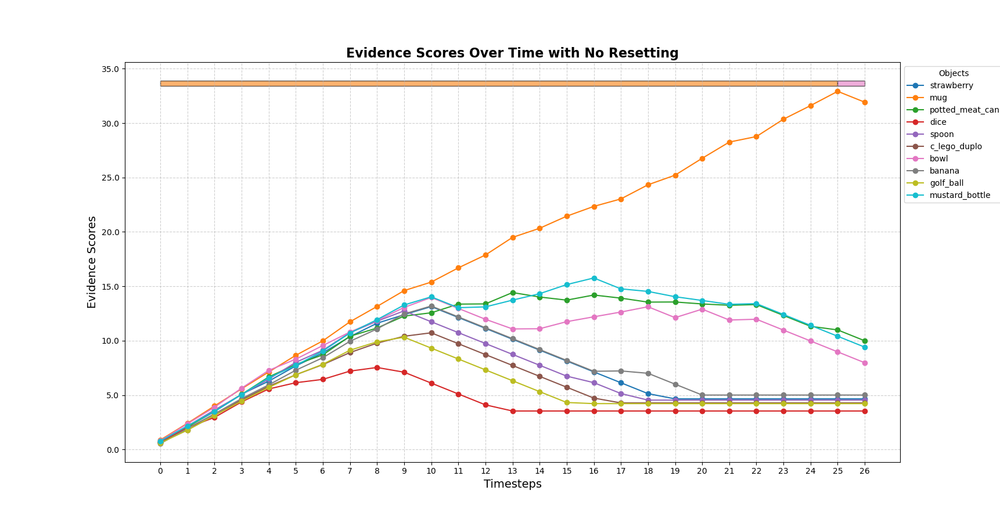
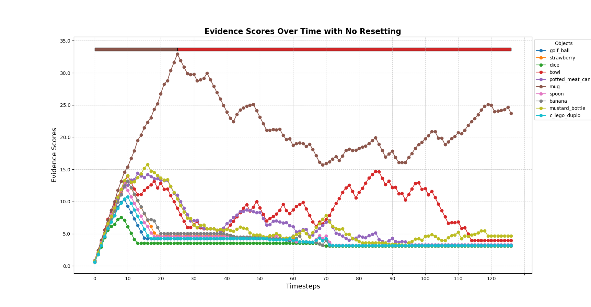
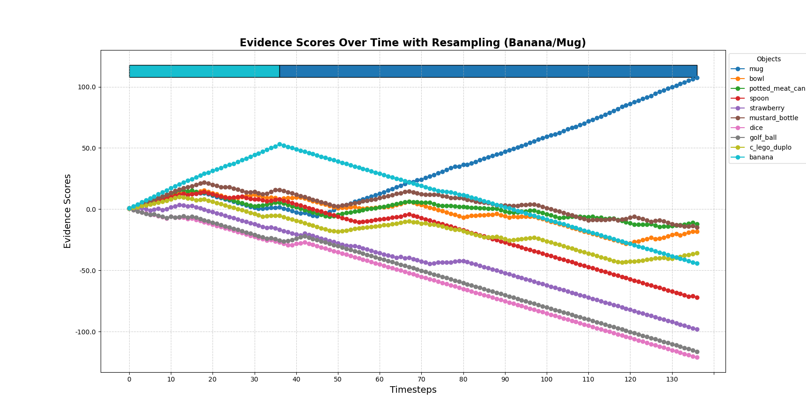

- Start Date: 2025-02-27
- RFC PR: (leave this empty, it will be filled in after RFC is merged)

# Summary

Resample hypotheses at every step in a manner inspired by particle-filters. This is the first step for Monty to interact with multiple objects and recognize compositional objects.

# High-Level Motivation

In an unsupervised learning experiment setup, Monty may be presented with multiple objects in a single episode. Ideally, we would like to move away from the traditional data loading setup of machine learning where there is a strict definition of an epoch, episode and step. As Monty starts to interact with the real world, the definition of epoch and episode will start to fade away and we'll be left with simple time discretization (i.e., step). The current definitions are:
* Epoch: Used by the experiment class to denote one full pass through all the objects
* Episode: Denotes a change in object
* Step:  Denotes a single sensation and action in the sensorimotor framework.

Real world interactions do not have epochs or episodes (these are only used for performance benchmarks), instead we could imagine the agent wondering around in a multi-object dynamic environment. The objects can be occluded, moving, or even disappearing behind new objects. 

**We want Monty to handle dynamic environments by seamlessly switching from one object to another as it's sensors move around on the different objects.**

# The Problem
Monty is designed to receive a weak supervision signal when the episode ends and a new episode begins (change of object). This signal performs a full reset of all states within Monty. This reset includes counters, buffer, goal state generators, learning modules and sensory modules. Additionally, this reset sets Monty back into Matching mode. The below figure shows where this resetting is done. Most resetting happens in the `pre_episode` functions of the Monty and SMs and LMs classes.

If we simply disable this resetting signal for the Monty class (and by extension SMs and LMs) between episodes, there will not be enough evidence update in the first step of a new object to get out of a terminal state. Monty will still think it is seeing the old object after getting a single observation of the new object. See the plot below.

To overcome this, I manually `reset_episode_steps()` such that the `matching_steps` would still be under the `min_eval_steps` and allow Monty time to gather enough evidence on the new object. Additionally, I manually `switch_to_matching_step()` between episodes since the `_compute_possible_matches` function that accumulates evidence is only called during matching, not exploration. This results in the following plot.

This reveals the main problem. Monty is still unable to accumulate evidence on the existing hypotheses. The current implementation of Monty uses `_get_all_informed_possible_poses()` to initialize hypotheses after seeing a single pose of the object. This is a smart way to reduce the number of initial hypotheses based on the principal curvature but it assumes that the object doesn't change and that these hypotheses will always be valid. However, when we change the object we would need to update these initial hypotheses based on a new pose observation of the new object. A simple test of sampling additional hypotheses (with informed poses) on the second object pose shows that we are able to accumulate evidence on these new hypotheses. See figure below.

# The Proposed Solution

Monty doesn't know when the object will be swapped, or if the next observation will move onto a different object. We have to resample hypotheses every step in a systematic manner, because an object change could happen in any step. Inspired by particle filters, we could come up with a modified resampling procedure.

## A New Metric

We currently use the total evidence score to decide which hypotheses are more promising. This is true if the object doesn't change, because these accumulated evidence scores are tied to a specific object. I propose to use the mean slope (over the last S steps) of evidence to decide on the goodness of a hypothesis. After swapping the object, the most promising hypotheses are the ones with higher positive slope not the ones with high accumulated evidence.

Why:
* **Faster**: we don't have to wait for high unbounded evidence to decay enough to realize that a new hypothesis is more likely. We also may not need to worry about initializing new hypotheses with mean evidence, giving them fighting chance against other old hypotheses. Average slope is more fair in this sense.
* **Accurate resampling**:  If we sample new hypotheses close to the hypotheses with high total accumulated evidence (e.g., particle filter), we could be sampling from the incorrect hypotheses (if we had just switched objects). If we sample close to the hypotheses with high evidence slope, we may converge faster.
* **Practical**: The total evidence can still be unbounded, it doesn't matter because we only consider the slope. This metric does not care about how much evidence we've accumulated already. It other words, a hypothesis with a high evidence, can be removed if it hasn't accumulated evidence in a while, while a consistently growing hypothesis is less likely to be removed even if it was just added.

## Assumptions and constraints:
* Number of hypotheses should not scale up with steps, if anything they should decrease. For now, any sampled hypothesis must replace an old "unlikely" hypothesis.
* Sampling of likely and unlikely hypotheses is based on evidence change instead of absolute evidence.
* Terminal state calculation is still based on accumulated evidence and `x_percent_threshold`.
* The resampling procedure only occurs if principal curvature is defined.

## The Resampling Procedure

1) For every object, at every new step, get initial hypotheses based on the observed pose.
2) If principal curvature is not defined, skip
3) Uniformly sample M percent from these new hypotheses (e.g., M = 20% = 1000 hyp)
4) Sample N percent from the existing hypotheses distribution of highest evidence slope (e.g., N = 10% = 500 hyp). These sampled hypotheses should be "close" to the most likely hypotheses.
5) Replace unlikely M+N percent of existing hypotheses (e.g., 30% = 1500 hyp) with these newly sampled hypotheses. The unlikely hypotheses are chosen based on evidence change.

# Alternatives Considered:
* Detect change with evidence decay and hard reset?
	* Here we would focus on detecting the change that triggers full reset of Monty states. 
	* Detecting the object change will likely be based on evidence decay and can be problematic. If an object was added and quickly changed before accumulating enough evidence, it will be difficult to detect change based on evidence decay. This will still result in incorrect initial hypotheses. Resampling without a hard reset is more general.

# Future possibilities
* This only works in inference assuming that we have good object models learned in isolation. It likely breaks learning from scratch experiments.
* I manually force Monty back into the matching phase and reset it's counters between episodes. 
	* Maybe we should brainstorm about what a terminal state should be in a multi-object environment.
	* Maybe also brainstorm about ways to more seamlessly switch between matching and exploration? I don't like forcing Monty to always be in matching mode, by doing this it feels that we are making the gap between learning and inference wider.
* Start designing environments with multiple objects aiming towards compositional models.
	* Will require motor policy change to allow for moving between objects
