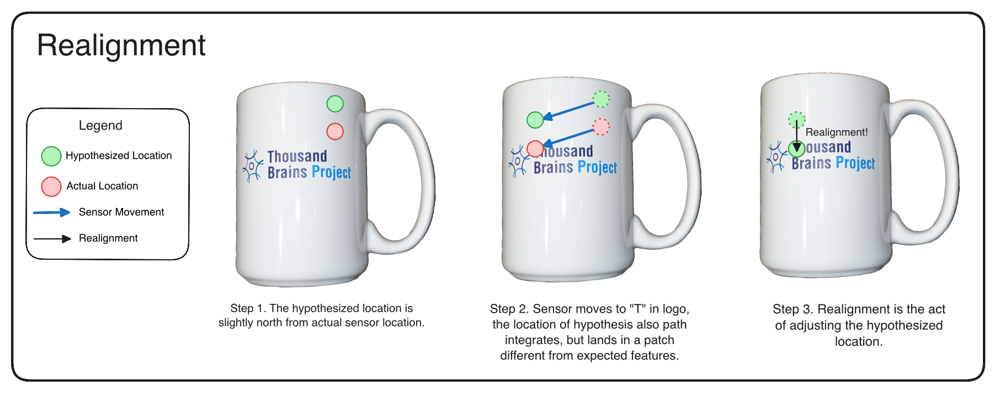
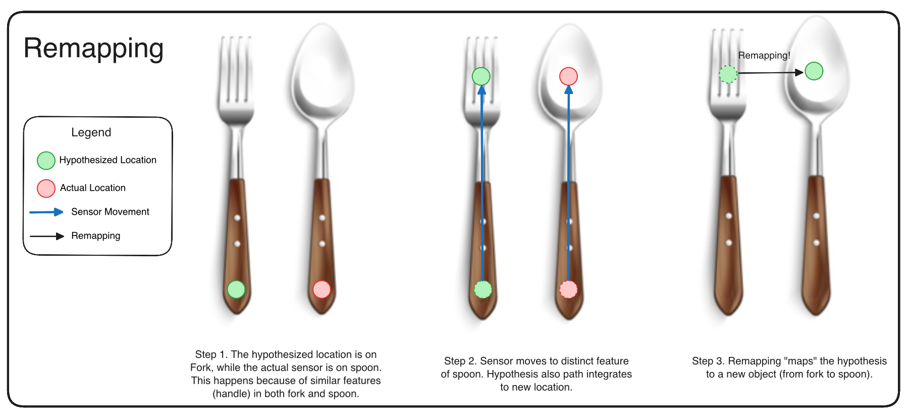
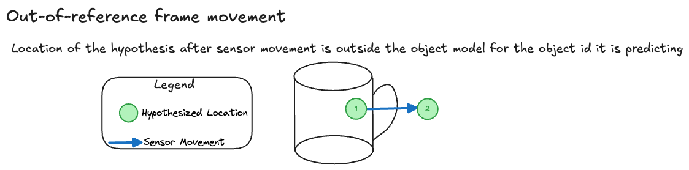
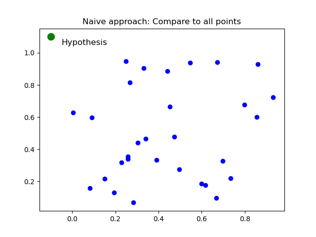
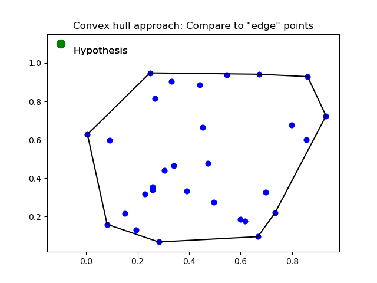
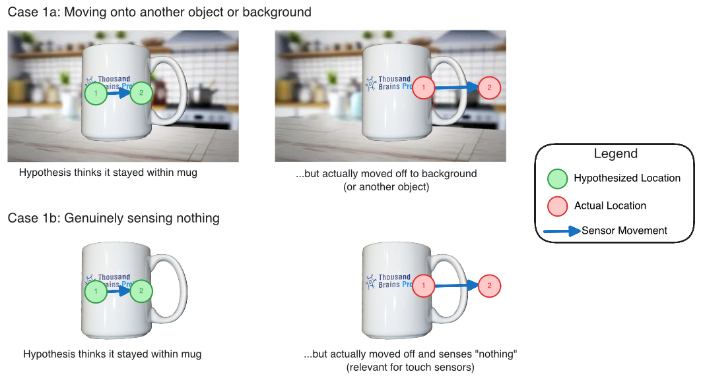
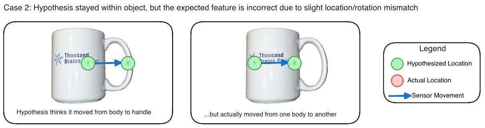

- Start Date: 2025-07-08
- RFC PR: (leave this empty, it will be filled in after RFC is merged)

# Intelligent Resampling in Monty

This is a high-level RFC on intelligence resampling in Monty, considering the below three questions:

1. How can we realign hypotheses to model points for robustness to noise and distortions?
2. How can we use out-of-reference-frame movement to efficiently eliminate hypotheses?
3. How can we use prediction errors to eliminate hypotheses? 

We address these questions together because they share a common theme: dynamically adjusting hypotheses based on sensorimotor predictions and observations. By examining them jointly, we can better understand their relationships and avoid redundant future work. While these questions would be implemented as separate features, this RFC focuses on the conceptual framework rather than implementation details.

Question 1 addresses the most complex challenge, while Questions 2 and 3 are related but explore subtly different mechanisms for hypothesis elimination. Throughout this RFC, we will also consider how these resampling strategies might interact with unsupervised learning, examining both potential benefits and challenges.

## 1. How can we realign hypotheses to model points for robustness to noise and distortions?

Realigning means updating the `locations` or `poses` of the `Hypotheses` object to an existing point in the object model. This mechanism is informed by feature observations.

### Note on Terminology

In neuroscience, the term "re-anchoring" may be used broadly. In this RFC, we divide re-anchoring into either:
1. **Remapping** - when we re-anchor to a new object, i.e. a different reference frame
2. **Realignment** - when we re-anchor to correct for location (_phase_ in biology) and orientation within a reference frame

This part of the RFC focuses on how we can benefit from realignment of hypotheses.

 


_Figure 1_. **Left (Realignment)**: Correcting hypothesis location and orientation within the same object's reference frame. The hypothesis location adjusts on the coffee mug to align with the actual sensor position. **Right (Remapping)**: Switching hypothesis to a completely different object's reference frame. The hypothesis jumps from a fork to a spoon, representing a change in object identity.

### Problem Statement and Proposed Solution

**Distortion** refers to cases where features, object parts, or morphologies appear at different locations and rotations than expected in the original model (e.g., a bent TBP logo vs. the standard TBP logo). We want Monty to recognize a distorted object as related to the original object in its memory, rather than always treating it as an entirely new object. 

**Noise** refers to errors in location estimates from imperfect path integration, such as inaccuracies in optic flow, proprioception, or inertial measurement units that lead to imperfect estimates of movement displacement and direction. Naturally, we want hypotheses to be robust to such noise. 

The `Hypotheses` class in `tbp.monty==0.8.0` is defined as follows:

```python
@dataclass
class Hypotheses:
    """Set of hypotheses consisting of evidence, locations, and poses.

    The three arrays are expected to have the same shape. Each index corresponds to a
    hypothesis.
    """

    evidence: np.ndarray # numpy array of confidence scores
    locations: np.ndarray # numpy array of 3D positions in the object's reference frame
    poses: np.ndarray # numpy array of 3x3 rotation matrices, shape
```

**Current limitation:** When a hypothesis is initialized, its `poses` attribute remains fixed. While we can create new hypotheses with different poses, these start from zero evidence and require time to accumulate confidence.

**Objective:** Implement a mechanism to update the location or pose of existing hypotheses without resetting their accumulated evidence values.

### Feature Matching for Hypothesis Realignment

At a high level, realigning a hypothesis involves matching **observed features** to **stored features** in object models. If a unique match is found, we can update the hypothesis location and pose to match the stored object model.

Below we work through some key questions and implications:

#### What constitutes a valid match?

A match involves comparisons between features. The `_calculate_evidence_for_new_locations()` in `hypotheses_displacer.py` already computes the error between stored pose features and observed pose features, as well as non-morphological features (also see `class DefaultFeatureEvidenceCalculator` in `calculator.py`), weighted by distance to nearest nodes. This RFC and initial implementation will not be concerned with changing how we compute feature similarity/error.

For a valid "match", all $N$ features must be similar within specified thresholds. _Why all?_ This requirement is necessary because partial matches can be uninformative, e.g., if `rgba` matches but `pose_vectors` do not, this provides little information for objects with uniform color (e.g., a red mug).

#### What if there are multiple matches?

Multiple matches indicate that the observed feature set exists at multiple locations in the object model, i.e. the observed features are not sufficiently distinct. Increasing the number of measured features (larger $N$) reduces the likelihood of such "collisions." It is also not necessary to realign at every step - we may choose not to realign if there are multiple matches, and only realign if there is a unique match.

**Note**: We may want to "mark" nodes in the graph object model when unique matches occur, indicating they contain distinctive features. These landmark nodes could be valuable for learning sparse object models and may improve computational efficiency (see below).

#### Computational Complexity

Re-anchoring can be computationally expensive due to three factors: (1) the number of observed features (more features require more distance calculations), (2) the number of nodes in the object model (more nodes require more comparisons), and (3) the number of hypotheses we want to re-anchor. 

Currently, case 1 is not a major concern since we only have "few" features (e.g. `rgba` and `pose_vectors`). However, future implementations should consider efficient distance calculations and prioritizing feature subsets. For example, comparing `rgba` for a uniformly colored object (like a red mug) provides little discriminative value.

Case 2 is more concerning until we develop sparser models. We should benchmark comparison times against ~2,000 points in an object model. Potential optimizations include:

- **Local search**: Compare only points within an $\epsilon$-radius of the current location, assuming realignment targets nearby points. This is valid if we realign frequently to prevent large error accumulation. Note that we may need to dynamically adjust $\epsilon$ to increase search area in case of large distortions. 
- **Landmark prioritization**: Prioritize comparisons with nodes previously "marked" as containing unique features. This approach directly relates to hypothesis-testing policy target points, where we identify and reuse distinctive landmark features that rapidly disambiguate between similar objects or poses. For more details on this future work direction, see [Reuse Hypothesis-Testing Policy Target Points](https://thousandbrainsproject.readme.io/docs/reuse-hypothesis-testing-policy-target-points). 

For Case 3, we can apply:
- **Selective re-anchoring**: Apply re-anchoring only to hypotheses exhibiting both high confidence and large prediction error, as described by the "surprise" metric in [Ramy's RFC](https://github.com/thousandbrainsproject/tbp.monty/pull/390). This approach reduces computational overhead by avoiding unnecessary comparisons for low-confidence hypotheses or cases with low prediction error.

Of the above three options, I think **selective re-anchoring** should be prioritized first, then **landmark prioritization**. Note that **landmark prioritization** will require us to update our object model's nodes to store "important" attributes first. 

#### How can sparse models affect location accuracy?

The impact of sparse models on location accuracy depends on both **sparsity** and **distinctiveness**. Here, sparsity refers to the density of stored points in the object model, while distinctiveness refers to how unique or identifying the features at those points are. 

1. Sparse models with distinctive features represent the ideal case for realignment. When distinctive features are sparsely distributed throughout an object model, each stored point acts as a reliable landmark. Successful feature matching at these locations provides strong evidence for accurate realignment because distinctive features, by definition, are unlikely to be confused with features from other locations. In this scenario, realigning to the exact stored location is typically appropriate and beneficial.
2. Sparse models with non-distinctive features present significant challenges. For example, consider a large, uniformly colored ball where we have sparsely sampled points across its surface. The features at any stored point (e.g., similar curvature, identical color) could match observations from many other locations on the sphere. Even if we achieve a "successful" feature match, realigning to that specific stored point may introduce substantial location error if the true location is far from the stored point. 

Several additional techniques to consider when re-anchoring in sparse models: 

1. **Constrained re-anchoring**: Limit re-anchoring to points within an $\epsilon$-radius to prevent large positional jumps, particularly important for non-distinctive sparse models.
2. **Interpolation**: Instead of snapping to existing model points, re-anchor to an intermediate position between the hypothesis location and the model location. The interpolation weight could be based on feature matching confidence, which can be proportional to distance error when comparison features. This may create a "virtual anchor point", i.e. a point not necessarily stored in the model (to preserve sparsity) while still benefiting from re-anchoring.
3. **Confidence-based realignment**: Only perform realignment when feature matches indicate high distinctiveness, which can be estimated by the uniqueness of the feature combination within the object model.

### Example: Re-anchoring a Specific Hypothesis

Here we go through a specific case of re-anchoring the pose of a particular hypothesis. In particular, if we have decided to re-align to a point, how can we adjust our hypothesis of the object rotation to ensure it aligns with this new point?

Recall that in an object model, at each node in the graph, we store `pose_vectors` which are 3x3 matrix of surface normal and principal curvature directions at that point. In a hypothesis, the `poses` attribute is a 3x3 rotation matrix that represents the object's orientation in the world. 

In `_get_all_informed_possible_poses()` in `hypotheses_updater.py`, it calls `align_multiple_orthonormal_vectors()` which calculates the rotation that would transform the current sensor orientation to match the stored orientation at that node. 

**Proposed implementation**:

When we decide to realign a hypothesis to a new point in the object model (after feature matching), we need to update the hypothesis's pose. The `stored_pose_vectors` parameter comes from this new target point in the object model that we're realigning to:

```python
def realign_pose(hypothesis_k, observed_pose_vectors, stored_pose_vectors):
    """Find minimal rotation correction to align pose vectors.
    
    Args:
        hypothesis_k: The hypothesis being realigned
        observed_pose_vectors: The pose vectors from current sensor observation
        stored_pose_vectors: The pose vectors from the NEW point in the object model 
                           that we are realigning to (after feature matching identified
                           this as the best match)
    
    Solves the problem of:
    R_correction x R_current x stored_pose_vectors = observed_pose_vectors

    We want to calculate R_correction based on stored, observed, and current hypothesis' pose, 
    then update the hypothesis' pose with R_correction x R_current. 
    """
    # Current pose from hypothesis
    R_current = hypothesis_k.poses[k]
    
    # Compute pose vectors in object reference frame
    current_pose_vectors = R_current @ stored_pose_vectors.T 
    current_pose_vectors = current_pose_vectors.T # to transform back into row vectors of surface normal, principal curvature direction 1 and 2
    
    # Find rotation that best aligns current to observed_pose_vectors (use existing method)
    R_correction = align_multiple_orthonormal_vectors(current_pose_vectors.reshape(1, 3, 3), observed_pose_vectors)
    
    # Update hypothesis pose
    hypothesis_k.poses[k] = R_correction @ R_current
```

Note that we could also use `R_correction` to see if we should reject re-anchoring, e.g. if the angle associatd with `R_correction` is larger than some threshold then it might mean we had a false match. 

This approach extends the current hypothesis initialization logic (which determines initial poses based on sensor observations) to allow pose updates during realignment. 

#### What are the implications for unsupervised learning?

The benefits of re-alignment extend beyond immediate hypothesis correction to fundamental improvements in learning. In biology, path integration is inherently noisy due to imperfect sensors and movement estimates. Re-alignment using distinctive features acts as a corrective mechanism, similar to how landmarks are used in Simultaneous Localization and Mapping (SLAM) algorithms.

A crucial aspect of SLAM is its bootstrapping nature, which creates a positive feedback loop:

- **Models inform path integration**: As object models become more complete and accurate, they provide better landmarks for re-alignment, correcting drift in path integration
- **Path integration informs models**: Corrected position estimates (via re-alignment) lead to more accurate placement of new features in the model, improving model quality

The bidirectional relationship enables unsupervised learning where both localization and mapping improve together over time.

In lifelong SLAM and multi-session SLAM, robots continuously operate in varied and changing environments without prior knowledge of what environment they are in. In these cases, a robot must detect whether it has moved into a new environment (e.g. indoor to outdoor) or is revisiting the same environment under different conditions (e.g. day vs. night). This is achieved through _continuous loop closure detection_, where robots monitor and detect previously visited places by comparing features from the current scene to all previously encountered locations. Like in our hypotheses realignment problem, robots need to prevent false positives in matching, as re-anchoring changes where we think we are, which could lead to missing parts or distorted object models. 

There are several techniques to mitigate false positives: 

1. Extract more and distinctive features.
2. Require matches across multiple features simultaneously (i.e. multi-modal matching across vision and touch).
3. Temporal consistency across multiple timesteps. To increase confidence in re-anchoring decisions, we could **delay** re-anchoring until multiple consistent feature matches are observed across several steps. This approach may also better reflect real-world experiences, where we may accumulate/experience features at several locations (or across time in case of looking at objects through straws) - the relative positions of multiple features and experiential history provide stronger localization cues than a single distinctive feature match. 
4. Frequency control: The re-anchoring frequency should be a configurable parameter. We may need to disable re-anchoring during early exploration phases until sufficient steps have been taken, or adjust frequency of re-anchoring inversely proportional to number of steps.

## 2. How can we use out-of-reference-frame movement to efficiently eliminate hypotheses?

The aim of this question is to eliminate hypotheses when they have moved outside the object's reference frame. When path integration indicates a hypothesis has moved beyond the object's boundaries, we can confidently eliminate that hypothesis without waiting for feature mismatches. This allows us to quickly remove irrelevant hypotheses and resample better ones, and relates to [rfc: dynamic adjustment for hypotheses resampling](https://github.com/thousandbrainsproject/tbp.monty/pull/390). 

Figure 2 illustrates out-of-reference-frame movement. 



_Figure 2_. Case where hypothesis has moved out of object's reference frame. 

### Implementation Strategy

We propose eliminating hypotheses that are more than 10% away from the object's boundary. This percentage threshold is arbitrary but was chosen as a relative distance (rather than a fixed distance like 3 cm) to accommodate objects of different sizes. This elimination step should occur after updating hypotheses but before the next sensing step. 

### Computational Complexity

A naive approach would find the nearest point and determine if it exceeds the distance threshold. To minimize the computational cost of nearest-point searches, we propose approximating the object model with a convex hull and comparing only against the points that constitute this hull.

Figure 3 demonstrates this concept using a 2D example. While object model points exist in 3D space, the convex hull optimization principle remains applicable.

 

_Figure 3_. **Left**: Naive approach requires comparing distances to all ~2,000 points in the object model to determine if a hypothesis is out of reference frame. **Right**: Convex hull approach pre-computes a convex hull (after training or during pre-epoch in inference) and reduces comparisons to only the hull's points.

While sparse models may reduce this computational burden, the convex hull approach should still provide significant performance improvements. 

### Implications for Unsupervised Learning and Incomplete Models

When dealing with unsupervised learning and incomplete models, the out-of-reference-frame elimination strategy requires careful consideration:

**Model familiarity bias**: For familiar objects (those with high observation counts), we might be more aggressive in eliminating hypotheses that move out of the reference frame. This is generally beneficial as it allows faster convergence for well-known objects.

**Adaptive thresholds**: For objects still being learned (low observation counts), we might use larger tolerance thresholds before eliminating hypotheses, allowing for exploration of potentially larger or differently shaped variants of the object.

#### Compositionality 

One consideration is how to handle modifications to familiar objects without corrupting well-learned models. For example, consider a familiar TBP mug with a fork glued to it. Rather than updating the mug model to include this modification, a compositional approach works as follows:

1. **Lower-level preservation**: The lower-level LM maintains its original mug model unchanged
2. **Hypothesis elimination**: When the sensor moves from the mug surface to the fork, the mug hypothesis is correctly eliminated (having moved outside the mug's reference frame)
3. **Higher-level composition**: A higher-level LM learns the new composite object as a combination of mug and fork components

This compositional strategy ensures that:
- Well-learned models remain stable and reusable
- The system can still recognize standalone mugs using the preserved model
- Novel object combinations are learned hierarchically without corrupting base models
- Out-of-reference-frame elimination continues to work efficiently at each level

## 3. How can we use prediction errors to eliminate hypotheses? 

**Motivation**: While Question 2 addresses hypotheses that have moved beyond object boundaries (using path integration), this section focuses on using sensory prediction errors to eliminate hypotheses that are still within the object's reference frame but at incorrect locations. This is fundamentally different because it relies on feature mismatches rather than spatial boundaries.

**Current limitation**: In the current implementation, off-object observations are not passed to the Learning Module (LM). The `FeatureChangeSM` class filters out observations where `on_object` is False, preventing the LM from using these observations for hypothesis elimination. This means we cannot currently leverage all types of prediction errors for intelligent resampling.

Below we examine two types of prediction errors that may arise in Monty and could be used to eliminate hypotheses if we modify how sensory observations are processed and forwarded.

### Case 1: Hypothesis believes it is within an object but has actually moved off the object



_Figure 4_. Two scenarios where a hypothesis believes it remains on the object but has actually moved off. **Case 1a (top)**: The sensor moves off the mug onto background or another object. **Case 1b (bottom)**: The sensor moves off the mug into empty space, sensing nothing (particularly relevant for touch sensors).

#### Case 1a: Moving onto another object or background

The hypothesis has moved off the target object and landed on another object or the background environment. Features sensed from this different object or background will presumably result in large prediction errors compared to the expected features from the original object model. This scenario can be handled using the same mechanisms as Case 2, since the mismatch between expected and observed features provides a clear signal for hypothesis elimination.

#### Case 1b: Genuinely sensing nothing

The hypothesis has moved to a location where the sensor is genuinely not detecting anything. This scenario is particularly relevant for touch sensors, which only provide readings when in physical contact with a surface. When a touch sensor moves off an object into empty space, it cannot detect any features at all. In contrast, vision sensors will always detect something (even if just background) unless completely occluded. In this scenario, the sensor provides no meaningful signal rather than conflicting features.

For Case 1b, we need a representation of "null" observations to compute prediction errors. We define "null" features as the absence of **morphological** features (surface normal and principal curvatures), since depending on the sensing modality (vision or touch), not all **non-morphological features** may be detected.

**Current representation**: In the existing implementation, off-object observations result in an empty dictionary for `morphological_features`:

```python
# relevant code from sensor_modules.py
if obs_3d[center_id][3] or (
    not on_object_only and features["object_coverage"] > 0
):
    (
        features,
        morphological_features,
        invalid_signals,
    ) = self.extract_and_add_features(
        features,
        obs_3d,
        rgba_feat,
        depth_feat,
        center_id,
        center_row_col,
        sensor_frame_data,
        world_camera,
    )
else:
    invalid_signals = True
    morphological_features = {}

...

observed_state = State(
    location=np.array([x, y, z]),
    morphological_features=morphological_features,
    non_morphological_features=features, # Note: This may throw an error since 'features' is undefined in off-object cases
    confidence=1.0,
    use_state=bool(morphological_features["on_object"]) and not invalid_signals,
    sender_id=self.sensor_module_id,
    sender_type="SM",
)
```

**Proposed representation**: To enable meaningful prediction error calculations, we may use some default null values that maintain consistent data structure:

```python
NULL_MORPHOLOGICAL_FEATURES = {
    "pose_vectors": np.array([np.nan, np.nan, np.nan]),
    "principal_curvatures": np.array([np.nan, np.nan]),
    "mean_curvature": np.nan,
    "gaussian_curvature": np.nan,
    "on_object": False,
}
```
This representation ensures that all observations have consistent keys regardless of on/off-object status.

**Note**: Off-object observations should trigger FeatureChangeSM but **should not create new nodes in the object model**

### Case 2: Hypothesis remains within the object but expected features are incorrect due to location or pose mismatch



_Figure 5_. Hypothesis remains within the object boundaries but at an incorrect location. The hypothesis believes it moved from the mug body to the handle, but actually moved to a different location on the body. This location mismatch results in incorrect feature predictions.

This scenario is already handled by the existing `hypotheses_displacer.py`, which computes evidence based on feature mismatches. No changes are needed for Case 2, except to handle null observations from Case 1b.

### Implications for FeatureChangeSM

**Current limitation**: As mentioned earlier, `FeatureChangeSM` currently filters out off-object observations, preventing the LM from receiving them. This filtering happens in the `check_feature_change()` method, which returns `False` for off-object observations. To enable prediction error-based hypothesis elimination for null observations (Case 1b), we need to modify how `FeatureChangeSM` handles these observations.

The following changes would be made to `sensor_module.py`:

**1. Handling `check_feature_change()` in `sensor_modules.py`**
```python
# the if statement below needs update
if not observed_features.get_on_object():
    # Even for the surface-agent sensor, do not return a feature for LM
    # processing that is not on the object
    logger.debug(f"No new point because not on object")
    return False
```

Expected behavior with the proposed changes:
- **On-object to on-object**: Feature changes will continue to work as currently implemented
- **On-object to off-object (and vice versa)**: Will be treated as significant changes; the learning module will receive "null" features when transitioning from on-object to off-object
- **Off-object to off-object**: Same as on-object to on-object - there should be no feature change (may need to handle different in NaN values)

**3. How `on_object` is used in SM**

- The `on_object` is set to `float(semantic_id > 0)` where `semantic_id` indicates if an object is detected at the sensor's center point
- The `use_state` flag combines `on_object` status AND signal validity
```python
use_state=bool(morphological_features["on_object"]) and not invalid_signals
```
A `False` value currently prevents null observations from being processed by LM. With the proposed RFC, this should only be set to False when we go from off-object to off-object transition.

### When we're learning an object, we don't have a complete graph model. How do we deal with this?

During object learning, prediction errors present a complex decision point: they may indicate (1) incorrect hypotheses that should be eliminated, (2) an incomplete model that needs updating, or (3) both. These interpretations are not mutually exclusive - a large prediction error might mean we should eliminate current hypotheses AND learn or update our models.

This challenge becomes particularly complex when learning and inference are interleaved, or when the distinction between "pure learning" and "pure inference" modes is not clearly defined. In pure inference mode, we may use prediction errors to eliminate hypotheses assuming the object model is considered complete. In pure learning mode, prediction errors may indicate model needs updating since the model is incomplete.

The key challenge is deciding whether to:
- Learn an entirely new object model (when encountering a truly novel object)
- Update an existing model; this might be necessary when encountering a known object in a new setting (e.g. different lighting), if the model is incomplete (e.g. unexplored part), or it has changed (e.g., your favorite mug now has a chip in it)
- Simply eliminate incorrect hypotheses (when the models are sufficient but we're at the wrong location/on a different object)

To treat learning and inference as lying on a continuum, we can utilize metadata stored in object models as a proxy/heuristic to use prediction errors in one way or another. Heuristics may be:

- **Hypothesis coverage**: If some hypotheses remain valid after prediction errors, the existing models are likely sufficient and we should focus on hypothesis elimination. However, if all hypotheses are eliminated (or less than a certain percentage threshold), we may need to learn a new model or update an existing one.

- **Observation frequency** (e.g., `_observation_count` in `GridObjectModel`): Frequently visited locations with high observation counts suggest the model is well-learned at that location, biasing toward hypothesis elimination rather than model updates.

- **Error magnitude thresholds**: Very large prediction errors across all features may suggest a novel object requiring a new model. Moderate errors might indicate the need for model updates or hypothesis refinement.

- **Feature-specific patterns**: If morphological features match but non-morphological features (like color) differ significantly, this might indicate object variations / keyframe / need to separate morphological and feature models.

- **Temporal consistency**: Multiple consecutive prediction errors at different locations strengthen the signal for model learning/updating, while isolated errors might just indicate noisy observations.

- **Model confidence metrics**: Models with high overall confidence (based on total observations and coverage) are less likely to need updates, suggesting hypothesis elimination is appropriate.

#### Example of Chipped Coffee Mug 

Consider the TBP mug that we are very familiar that is now slightly chipped. Below are how the above heuristics may apply:

1. **Initial detection**: When sensing the chipped area, we would get prediction errors since the surface geometry differs from our stored model.
2. **Hypothesis coverage**: The hypothesis for where we are on the mug would remain valid across many locations during movement (handle, sides, rim); it would only result in a prediction error / risk elimination when we move to the chip, the point at which we would want to signal learning in a model.
3. **Observation frequency**: The mug model has high observation counts from frequent use, suggesting we shouldn't discard the entire model.
4. **Feature patterns**: Morphological features (surface curvature) would differ at the chip location, but non-morphological features (color, texture) might remain consistent.
5. **Decision**: The heuristics would likely lead to updating the existing mug model to incorporate the chip as a variation, rather than learning an entirely new object or just eliminating hypotheses. This allows us to maintain our knowledge about the mug while adapting to its new physical state.