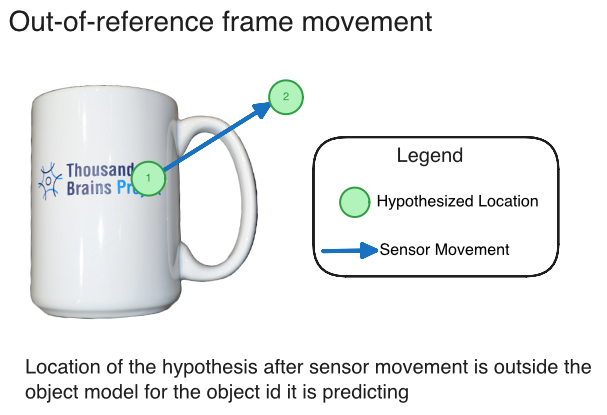

- Start Date: 2025-07-08
- RFC PR: (leave this empty, it will be filled in after RFC is merged)

# Intelligent Resampling in Monty

This is a high-level RFC on intelligence resampling in Monty, considering the below three questions:

1. How can we realign hypotheses to model points for robustness to noise and distortions?
2. How can we implement and test resampling informed by out-of-reference-frame movement?
3. How can we use prediction errors in off-object observations to eliminate hypotheses? 

## Note on Terminology

In neuroscience, the term "re-anchoring" may be used broadly. In this RFC, we divide re-anchoring into either:
1. **Remapping** - when we re-anchor to a new object, i.e. a different reference frame
2. **Realignment** - when we re-anchor to correct for location (_phase_ in biology) and orientation within a reference frame

This RFC primarily focuses on realignment of hypotheses.

## How can we realign hypotheses to model points for robustness to noise and distortions?

Realigning means updating the `locations` or `poses` of the `Hypotheses` object to an existing point in the object model. This mechanism is informed by feature observations.

**Distortion** refers to cases where features, object parts, or morphologies appear at different locations and rotations than expected in the original model (e.g., a bent TBP logo vs. the standard TBP logo). **Noise** refers to errors in location estimates from imperfect path integration, such as inaccuracies in optic flow, proprioception, or inertial measurement units that lead to imperfect estimates of movement displacement and direction.

### Problem Statement and Proposed Solution

The `Hypotheses` class in `tbp.monty==0.8.0` is defined as follows:

```python
@dataclass
class Hypotheses:
    """Set of hypotheses consisting of evidence, locations, and poses.

    The three arrays are expected to have the same shape. Each index corresponds to a
    hypothesis.
    """

    evidence: np.ndarray # numpy array of confidence scores
    locations: np.ndarray # numpy array of 3D positions in the object's reference frame
    poses: np.ndarray # numpy array of 3x3 rotation matrices, shape
```

**Current limitation:** When a hypothesis is initialized, its `poses` attribute remains fixed. While we can create new hypotheses with different poses, these start from zero evidence and require time to accumulate confidence.

**Objective:** Implement a mechanism to update the location or pose of existing hypotheses without resetting their accumulated evidence values.

### Feature Matching for Hypothesis Realignment

At a high level, realigning a hypothesis involves matching **observed features** to **stored features** in object models. If a unique match is found, we can update the hypothesis location and pose to match the stored object model.

Below we work through some key questions and implications:

#### How can we meaningfully compare features?

The comparison method depends on the specific feature type. For now, we can leverage existing code in the `check_feature_change()` method of the `FeatureChangeSM` class. As of `tbp.monty==0.8.0`, we have the following distance definitions for `hsv` and `pose_vectors`:

```python
# HSV (line 717)
hue_d = min(abs(current_hue - last_hue), 1 - abs(current_hue - last_hue))

# Pose Vectors (line 729)
angle_between = get_angle(last_feat[0],current_feat[0],)
```

For a valid "match", all $N$ features must be similar within specified thresholds. _Why all?_ This requirement is necessary because partial matches can be uninformative, e.g., if `hsv` matches but `pose_vectors` do not, this provides little information for objects with uniform color (e.g., a red mug).

**Note**: Future extensions of observed features in Monty should consider meaningful distance metrics. The examples above demonstrate cases where L2 distance is not suitable.  

#### What if there are multiple matches?

Multiple matches indicate that the observed feature set exists at multiple locations in the object model, i.e. the observed features are not sufficiently distinct. Increasing the number of measured features (larger $N$) reduces the likelihood of such "collisions." It is also not necessary to realign at every step - we may choose not to realign if there are multiple matches, and only realign if there is a unique match.

**Note**: We may want to "mark" nodes in the graph object model when unique matches occur, indicating they contain distinctive features. These landmark nodes could be valuable for learning sparse object models and may improve computational efficiency (see below).

#### What if there are no matches?

This scenario may occur during inference when sensor noise exceeds the matching threshold. We could temporarily increase the matching threshold to find a match, penalizing the evidence proportionally to the threshold increase required. The simplest/initial implementation may consider skipping "no match" cases (i.e., no realignment), though this mechanism could potentially be used to decrease evidence scores.

#### Computational Complexity

Re-anchoring can be computationally expensive due to two factors: (1) the number of observed features (more features require more distance calculations), and (2) the number of nodes in the object model (more nodes require more comparisons).

Currently, case 1 is not a major concern since we only have "few" features (e.g. `rgba` and `pose_vectors`). However, future implementations should consider efficient distance calculations and prioritizing feature subsets. For example, comparing `rgba` for a uniformly colored object (like a red mug) provides little discriminative value.

Case 2 is more concerning until we develop sparser models. We should benchmark comparison times against ~2,000 points in an object model. Potential optimizations include:

- **Local search**: Compare only points within an $\epsilon$-radius of the current location, assuming realignment targets nearby points. This is valid if we realign frequently to prevent large error accumulation.
- **Landmark prioritization**: Prioritize comparisons with nodes previously "marked" as containing unique features. 

#### How can sparse models affect location accuracy?

In sparse models, the nearest stored point might be significantly distant from the actual location. Several mitigation strategies are possible:

1. **Constrained re-anchoring**: Limit re-anchoring to points within an $\epsilon$-radius to prevent large positional jumps.

2. **Interpolation**: Instead of snapping to existing model points, re-anchor to an intermediate position between the hypothesis location and the model location. The interpolation weight could be based on feature matching confidence, which can be proportional to distance error when comparison features. This may create a "virtual anchor point", i.e. a point not necessarily stored in the model (to preserve sparsity) while still benefiting from re-anchoring.

For sparse models, matching only when features are distinctive becomes even more critical.

#### What are the implications for unsupervised learning?

Re-anchoring during unsupervised learning has several important implications that require careful consideration. Re-anchoring changes where we think we are 
(which may possibly affect policy or what we decide to learn next), which could lead to missing parts of the object (by skipping areas from re-anchoring). 

Potential mitigation strategies include:

1. **Frequency control**: The re-anchoring frequency should be a configurable parameter. We may need to disable re-anchoring during early exploration phases until sufficient steps have been taken.

2. **Delayed re-anchoring**: To increase confidence in re-anchoring decisions, we could **delay** re-anchoring until multiple consistent feature matches are observed across several steps. This approach may also better reflects real-world experiences, where we may accumulate/experience features at several locations (or across time in case of looking at objects through straws) - the relative positions of multiple features and experiential history provide stronger localization cues than a single distinctive feature match. 

## How can we implement and test resampling informed by out-of-reference-frame movement?

The aim of this question is to eliminate hypotheses when they have moved outside the object's reference frame. Figure 1 illustrates this scenario.


_Figure 1_. Case where hypothesis has moved out of object's reference frame. 

### Implementation Strategy

We propose eliminating hypotheses that are more than 10% away from the object's boundary. This percentage threshold is arbitrary but was chosen as a relative distance (rather than a fixed distance like 3 cm) to accommodate objects of different sizes. This elimination step should occur after updating hypotheses but before the next sensing step. 

### Computational Complexity

A naive approach would find the nearest point and determine if it exceeds the distance threshold. To minimize the computational cost of nearest-point searches, we propose approximating the object model with a convex hull and comparing only against the points that constitute this hull.

Figure 2 demonstrates this concept using a 2D example. While object model points exist in 3D space, the convex hull optimization principle remains applicable.

 
_Figure 2_. **Left**: Naive approach requires comparing distances to all ~2,000 points in the object model to determine if a hypothesis is out of reference frame. **Right**: Convex hull approach pre-computes a convex hull (after training or during pre-epoch in inference) and reduces comparisons to only the hull's points.

While sparse models may reduce this computational burden, the convex hull approach should still provide significant performance improvements. 

## How can we use prediction errors in off-object observations to eliminate hypotheses? 

Figure 3 illustrates two types of prediction errors that may arise in Monty and can be used to eliminate hypotheses.


_Figure 3_. Two cases where prediction errors may arise in Monty.

### Case 1: Hypothesis believes it is within an object but has actually moved off the object

**Note**: There is also a scenario where the hypothesis has moved off one object and landed on another object. This can be handled by Case 2, since features sensed from a different object will presumably result in large prediction errors.

To compute prediction errors, we need a representation of "null" observations. We define "null" features as the absence of **morphological** features (surface normal and principal curvatures), since depending on the sensing modality (vision or touch), not all **non-morphological features** may be detected.

**Current representation**: In the existing implementation, off-object observations result in an empty dictionary for `morphological_features`:

```python
# relevant code from sensor_modules.py
if obs_3d[center_id][3] or (
    not on_object_only and features["object_coverage"] > 0
):
    (
        features,
        morphological_features,
        invalid_signals,
    ) = self.extract_and_add_features(
        features,
        obs_3d,
        rgba_feat,
        depth_feat,
        center_id,
        center_row_col,
        sensor_frame_data,
        world_camera,
    )
else:
    invalid_signals = True
    morphological_features = {}

...

observed_state = State(
    location=np.array([x, y, z]),
    morphological_features=morphological_features,
    non_morphological_features=features, # Note: This may throw an error since 'features' is undefined in off-object cases
    confidence=1.0,
    use_state=bool(morphological_features["on_object"]) and not invalid_signals,
    sender_id=self.sensor_module_id,
    sender_type="SM",
)
```

**Proposed representation**: To enable meaningful prediction error calculations, we may use some default null values that maintain consistent data structure:

```python
NULL_MORPHOLOGICAL_FEATURES = {
    "pose_vectors": np.array([np.nan, np.nan, np.nan]),
    "principal_curvatures": np.array([np.nan, np.nan]),
    "mean_curvature": np.nan,
    "gaussian_curvature": np.nan,
    "on_object": False,
}
```
This representation ensures that all observations have consistent keys regardless of on/off-object status.

**Note**: Off-object observations should trigger FeatureChangeSM but **should not create new nodes in the object model**

### Case 2: Hypothesis remains within the object but expected features are incorrect due to location or pose mismatch

This scenario is far more common than Case 1.

**Current state**: The existing `hypotheses_displacer.py` already handles feature mismatches by:
- Computing pose evidence based on angle errors between observed and stored pose vectors
- Calculating feature evidence for non-morphological features (e.g., color)
- Combining evidence with distance-based weights

A possible improvement may simply just be able to handle "null" features since there are existing mechanisms for handling feature mismatches.

```python
class PredictionErrorHypothesesDisplacer(HypothesesDisplacer): # or just update existing DefaultHypothesisDisplacer class
    def _calculate_evidence_for_new_locations(
        self, graph_id, input_channel, search_locations, 
        channel_possible_poses, channel_features
    ):
        # Handle off-object observations
        if not channel_features.get("on_object", True):
            num_hypotheses = search_locations.shape[0]
            return np.ones(num_hypotheses) * self.off_object_penalty  # e.g., -100
        
        # existing code
        ...
``` 

### Implications for FeatureChangeSMNo, 

The following changes would be made to `sensor_module.py`:

**1. Handling `check_feature_change()` in `sensor_modules.py`**
```python
# the if statement below needs update
if not observed_features.get_on_object():
    # Even for the surface-agent sensor, do not return a feature for LM
    # processing that is not on the object
    logger.debug(f"No new point because not on object")
    return False
```

Expected behavior with the proposed changes:
- **On-object to on-object**: Feature changes will continue to work as currently implemented
- **On-object to off-object (and vice versa)**: Will be treated as significant changes; the learning module will receive "null" features when transitioning from on-object to off-object
- **Off-object to off-object**: Same as on-object to on-object - there should be no feature change (may need to handle different in NaN values)

**3. How `on_object` is used in SM**

- The `on_object` is set to `float(semantic_id > 0)` where `semantic_id` indicates if an object is detected at the sensor's center point
- The `use_state` flag combines `on_object` status AND signal validity
```python
use_state=bool(morphological_features["on_object"]) and not invalid_signals
```
A `False` value currently prevents null observations from being processed by LM. With the proposed RFC, this should only be set to False when we go from off-object to off-object transition.

### When we're learning an object, we don't have a complete graph model. How do we deal with this?

During object learning, we lack a complete graph model, creating challenges for prediction error interpretation. Prediction errors can signal both the need to eliminate hypotheses and the need to update the model. I think one way to go about this is to store a `num_visited` in nodes of object models (similar to if were to add `is_distinct` during realignment in Question 1). This informaton can be utilized to see if the prediction error is occuring at a point where it has been visited frequently or not - if visited frequently, then it is likely a prediction error. If not, then it may just be a part of the model that hasn't been explored enough. 