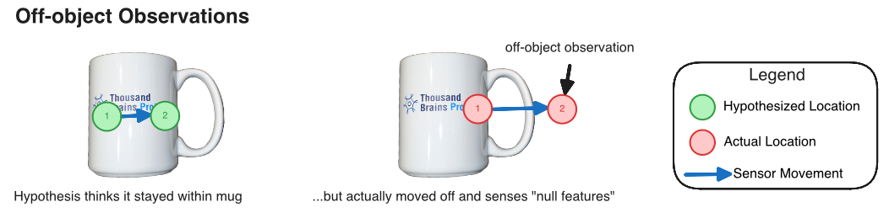

- Start Date: 2025-08-12
- RFC PR: (leave this empty, it will be filled in after RFC is merged)

# Sending and Processing Off-Object Observations in Monty

**Note**: This RFC is a spawn from [Question 3 of the Intelligent Resampling in Monty PR (closed)](https://github.com/thousandbrainsproject/tbp.monty/pull/366). For richer theoretical discussions please check the previous RFC. This RFC will put more emphasis on implementation. 

## Question and Goal

The question that we are addressing is: How can we send and process off-object observations in Monty?

The goal of the RFC is to layout current state of Monty and implementation plan to process off-object observations. 

## Summary

This RFC proposes extending Monty's sensory processing pipeline to handle off-object observations (when a sensor has moved to a location in the environment where no features are sensed). Currently, these observations are filtered out and not passed to Learning Modules (LMs), limiting our ability to leverage prediction errors for penalizing hypotheses' evidence. By defining "null features" to represent the absence of morphological features, modifying the `FeatureChangeSM` to forward these observations, and updating the Learning Module to process off-object observations, we can enable more intelligent hypothesis management when sensors transition from on-object to off-object status. This enhancement will improve Monty's ability to recognize when it has moved off an object and reduce evidence for hypotheses that predict the sensor should still be detecting object features. 



_Figure 1_: Illustration of an off-object observation sensed by the Sensor Module (right). In this RFC, we will utilize this to penalize the evidence of hypotheses that incorrectly think they are still within the object's reference frame (left).

## Motivation

In real-world scenarios, sensors frequently move off objects during exploration - whether transitioning between objects, reaching object boundaries, or moving through empty space. These off-object observations contain valuable information that Monty currently does not utilize. While [Question 2 of the Intelligent Resampling RFC](https://github.com/thousandbrainsproject/tbp.monty/pull/366) addresses hypotheses that have moved beyond the internal model's boundaries using path integration, this RFC focuses on a complementary approach: using sensory prediction errors to penalize hypotheses' evidence when the sensor has moved off the object.

The core idea is to leverage the mismatch between predicted and observed features when sensors transition off objects. When a sensor moves off an object but active hypotheses still predict on-object features, this creates a strong prediction error signal that should penalize those incorrect hypotheses. Currently, off-object observations are filtered out and therefore not sent to the Learning Module, preventing the system from using this information.

## Current Architecture and Limitations

### Overview of Current Sensory Processing Pipeline

Monty's sensory processing pipeline filters observations in `HabitatDistantPatchSM` by marking off-object states as `use_state=False`, and `FeatureChangeSM` (when enabled) adds a further gating layer on top of that change-detection logic. Currently, this filtering excludes off-object observations entirely.

### The Off-Object Filtering Problem

Currently, `FeatureChangeSM` filters out observations where `on_object` is False. 

```python
if not observed_features.get_on_object():
    logger.debug(f"No new point because not on object")
    return False
```
[Source for `sensor_modules.py` lines 680-684](https://github.com/thousandbrainsproject/tbp.monty/blob/9677cc918adeca9ae21233d957c0401e84f482ab/src/tbp/monty/frameworks/models/sensor_modules.py#L680-L684)

This means that when a sensor moves off an object into empty space, the resulting off-object observation, which could provide valuable prediction error signals, is discarded before reaching the LM. Consequently, the LM's `step()` method is never called for these off-object observations, preventing any processing or learning from this information.


### Sensor Modality Considerations

The challenge of representing off-object observations varies by sensor type:

- **Touch sensors**: Naturally detect "nothing" when not in contact with surface.
- **Vision sensors**: Always detect something (even if just background), making the definition of "off-object" more complex and context-dependent.

Taking this into consideration, we treat "null features" as the absence of morphological information tied to the tracked object only when the center pixel’s semantic ID is zero (i.e. no object at that location). If the sensor lands on another object (semantic ID > 0), morphological pose and curvature are still computed for that surface and `on_object` remains 1, even though the appearance cues may change.

## Proposed Implementation

The following implementation addresses the limitations identified above by enabling off-object observations to flow through the sensory processing pipeline and be used for hypothesis elimination. The approach involves two main steps: modifying the sensor module's filtering behavior and extending learning modules to process off-object observations.

### Step 1: Update `sensor_modules.py` to Send Null Features

The `sensor_modules.py` file requires modifications to enable off-object observation processing. Currently, when off object, morphological_features are represented as an empty dictionary in `sensor_modules.py`. Depending on the implementation, this may be updated to `None`. 

### Step 2: Update `use_state` variable

In addition, the `use_state` variable will need to account for the four transitions are happening:

1. **On-object --> On-object**: Existing delta threshold feature comparison logic 
2. **On-object --> Off-object**: Treated as significant change; LM receives null features for hypothesis elimination
3. **Off-object --> On-object**: Treated as significant change; LM receives actual features for new processing
4. **Off-object --> Off-object**: No change detected; observation filtered out

### Step 3: Update Learning Module to Process Null Features

Once off-object observations reach the learning system, we need logic that distinguishes between hypotheses that correctly predicted the sensor would leave the object and those that insisted we would still be on surface. The updates fall into three design elements:

- **Propagate the on/off-object signal**: the CMP message already carries `on_object`. We should keep that flag available when assembling the inputs for the hypothesis displacer (e.g. by ensuring `channel_features["on_object"]` survives any feature-selection step). That gives every downstream component an explicit indicator that no surface geometry was sensed.
- **Short-circuit feature comparisons when nothing was sensed**: if `on_object == 0`, the feature matcher should skip the call to `feature_evidence_calculator.calculate`. There are no normals or curvatures to compare, so forcing that calculation would only inject artificial zeros and make it look as if every stored node mismatched equally.
- **Adjust hypothesis evidence selectively**: `_calculate_evidence_for_new_locations` already builds a distance-based mask showing which hypotheses remained near stored nodes (`mask == False`) versus those that routed the sensor outside the object's reference frame (`mask == True`). During an off-object step we should penalize only the former group (since their predictions were wrong) and possibly reward the latter group (for correctly predicting "off-object observation"). 

## Benchmarking

Besides adding new or updating existing unit tests for the above functions in `FeatureChangeSM`, `DefaultHypothesesDisplacer`, and `DefaultFeatureEvidenceCalculator` for correctness of implementation, the expectation for results on benchmarks are:

- **Accuracy**: In best case scenarios, implementing this RFC will improve accuracy in object recognition to more quickly eliminate bad hypotheses, but it is not a guarantee. It should not decrease the performance, however.
- **Steps to Convergence**: This is where this RFC will likely have the largest impact. By quickly removing bad hypotheses, Monty may converge faster.


## Future Work

Please see the [Open Question](https://github.com/hlee9212/tbp.monty/blob/hlee9212/intelligence_resampling_rfc/rfcs/0000_intelligent_resampling.md#when-were-learning-an-object-we-dont-have-a-complete-graph-model-how-do-we-deal-with-this) from [Previous RFC on Intelligent Resampling](https://github.com/hlee9212/tbp.monty/blob/hlee9212/intelligence_resampling_rfc/rfcs/0000_intelligent_resampling.md). 
