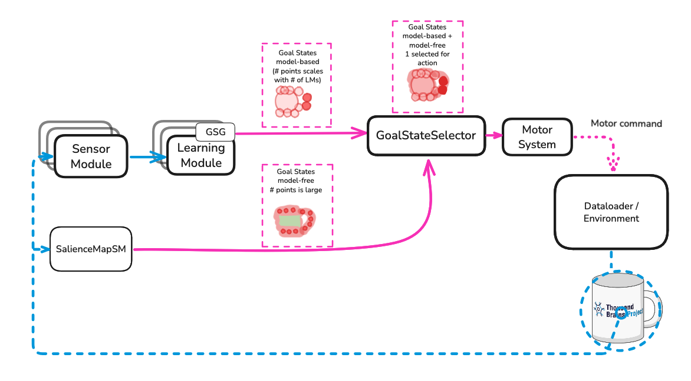

- Start Date: 2025-06-16
- RFC PR: 

# Summary
This RFC proposes changes to Monty’s architecture designed to improve support for compositional objects and multi-object environments[^1]. More specifically, this document addresses the intermediate goal of [implementing efficient saccades driven by model-free and model-based signals](https://thousandbrainsproject.readme.io/docs/implement-efficient-saccades-driven-by-model-free-and-model-based-signals).

In single-object, one-object-per-episode experiments, we make the following simplifying assumption -- all observations in an episode correspond to exactly one object (henceforth, "one-object criterion"). In this case, the following important conditions are automatically guaranteed:
  1. Object models are stored in their own reference frames.
  2. During inference, a sequence of observed locations forms an approximate subset that is contained within a learned model (up to rotation + displacement).

In general, the one-object criterion is not met when operating with compositional objects and multi-object scenes. For example, if a saccade moves a sensor module's small receptive field off one object and onto another, its downstream learning module has no way of knowing that it is looking at a different object. During learning, this would result in a single "object" model that contains points from several objects, thus violating the requirement that each object is stored in its own independent reference frame. During inference, integrating the off-object observations will likely result in having collected a set of locations that does not exist as a subset in any stored models. The ensuing weakening of true hypotheses intended to estimate the target region's object will eventually have to be "made up" for, assuming we later return to the target object, which ultimately results in delayed convergence[^2].

This RFC outlines two main strategies aimed at improving the speed and robustness of object recognition with compositional objects and in multi-object environments.
  1. We propose a strategy for selecting saccade targets that are contained within a region estimated to satisfy the one-object criterion. This depends on first having reasonably good estimates of the locations and spatial extents of one-object regions. To accomplish this, we plan to apply model-free segmentation techniques to wide field-of-view imagery. Model-based signals may also be used to generate segmentation maps de novo and/or refine model-free maps, but this topic is currently marked as an [open question](#open-questions).
  2. In addition, we propose a set of optimization strategies designed to improve efficiency. In this context, efficiency refers to the number of steps taken to converge on an object + pose estimate. While these optimization strategies should improve inference speed in any setting (single-object, multi-object, etc.), faster inference may serve an additional purpose in the compositional/multi-object context; by reducing the number of steps needed to recognize an object, we may also reduce the likelihood of collecting mislabeled, off-object observations[^3].

To implement these strategies, we propose the addition of two new components.
  - `SalienceMapSM`: a sensor module type that receives a wide, low-resolution field-of-view, performs model-free processing (e.g., salience estimation or segmentation), and outputs a set of CMP-compliant goal states.
  - `GoalStateSelector`: an arbiter that receives goal states from all sources (LMs and `SalienceMapSM`) and outputs a single goal state for the motor system.

# Architecture

**Proposed Routing Pathways**. LM- and `SalienceMapSM`-derived goal states will be routed to the  `GoalStateSelector`, and the `GoalStateSelector`'s output will be routed to the motor system. All other routing pathways are unchanged.

### `SalienceMapSM`

  - **Type**: `DetailedLoggingSM`
  - **Input**: Wide field-of-view imagery, depth data, and each pixel's associated 3D coordinates. No special handling of input data is required beyond standard processing steps performed for all other sensor modules.
  - **Output**: A set of CMP-compliant `GoalState` objects.
  - **Consumers**: `GoalStateSelector`  

The primary purpose of the `SalienceMapSM` is to help action policies make better decisions about where to observe next. There are no strict requirements for how it should do this, but we plan to implement the following:
  - Segmentation: To support action policies that require staying on-object (or moving off-object).
  - Salience Detection: To support rapid inference by targeting an object's more informative areas.

The results of these processes may be (a) used to filter out goal states and/or (b) embedded into `GoalState` objects. On the one hand, filtering is pretty unambiguous way to indicate whether a target location is worth considering at all. On the other hand, filtering out goal-states based on model-free criteria might prematurely eliminate candidates that would have been very promising had they been allowed to mix with model-based information. At this stage, I'm learning towards minimal output filtering since (a) we want to avoid repeatedly saccading between a handful of salient locations, and (b) the `GoalStateSelector`'s filtration should be "smarter" since it has access to model-based information[^4]. Some metadata will be added to each goal state's dictionary of non-morphological features (such as `region_id` and `salience`) which the `GoalStateSelector` can use to filter and rank goal states[^5]. 

### `GoalStateSelector`

  - **Type**: `object`
  - **Input**: All `GoalState` objects produced by LMs and the `SalienceMapSM`.
  - **Output**: `GoalState`
  - **Consumers**: `MotorSystem`  

With the addition of a `SalienceMapSM`, the number of goal states generated at each time step will jump from ~1 to ~1000 (roughly). Consequently, we need something to pool LM- and SM-derived goal states together and decide which should be acted upon by the motor system. These requirements place the `GoalStateSelector` in a uniquely powerful position to integrate model-free and model-based data. In addition, it can easily maintain a recent history of visited (or at least attempted) locations since it has the final say about which goal state the motor system should attempt.

In its simplest/dumbest form, a `GoalStateSelector` could choose a goal state like so:
  - If an LM emitted a goal state, use it. In the case of multiple LM-derived goal states, pick the one with the greatest confidence value. If there are ties, break them at random.
  - If no LM has emitted a goal state, use one of the `SalienceMapSM`'s most salient goal state.

If we take advantage of the `GoalStateSelectors`'s unique input/output values, we could instead do any or all of the following:
  - If an LM emitted a goal state, use it. In the case of multiple LM-derived goal states, pick the one with the greatest confidence value. If there are ties, select the one with the highest expected salience.
  - If no LM has emitted a goal state, focus on the `SalienceMapSM`'s goal state.
    - Initialize some scoring variable for each goal state. Let's call it `priority`.
    - Weight `priority` values based on `region_id` (e.g., make it zero or `nan` if it's on the wrong region, or simply filter out the off-object ones).
    - Weight `priority` values by salience.
    - Weight `priority` values by the magnitude of the displacement it would generate. (bigger displacements => faster hypothesis elimination)
    - Weight `priority` values by a goal state's distance from previously visited areas.

Some of these rules help satisfy the one-object criterion, and others support efficiency. There are a lot of things we could try here, and we won't know what works until we do. Other potential rules are left as an exercise for the reader.

### Integration

### Executing Goal States
This RFC would move us down a very goal-state-heavy path. It's easy to imagine that a distant agent performing inference will produce achievable goal states at every step. This is a pretty big departure from Monty's existing behavior in which goal states are only occasionally generated and acted upon. The remainder of the time, actions are derived from model-free policies.

Implementing this RFC is going to require at least some revisions to our goal-state execution framework. First, we
only have one goal-state-attempter -- `InformedEnvironmentDataLoader.execute_jump_attempt` -- and it has only one strategy. All attempts consist of an agent-pose and sensor-orientation setting actions. This RFC entails that most of goal states will have been produced by the `SalienceMapSM`, and are therefore achievable through saccades alone. At a mimimum, we should build out some system that's capable of deciding whether a saccade is sufficient or whether it should perform pose-and-orientation resets. Second, I believe there are existing plans (desires?) to move `execute_jump_attempt` out of `InformedEnvironmentDataLoader`. I'm assuming it's headed for a `MotorPolicy`, but I don't really know.

Also, I'd like to make one thing clear: The `MotorSystem`/`MotorPolicy` situation is probably my biggest Monty blindspot. I'm also aware that Tristan has been actively refactoring `Motor*` code, which means I'm at least as ignorant about the future as I am the present.

### Modifying Monty Classes
The `MontyBase` or one of its subclass will need a `goal_state_selector` attribute. Which subclass? TBD.
  
`SalienceMapSM` is a sensor module, so it can be added to `Monty`, and it will be called like any other. But we will need to implement the passing of its new routing pathways.

**Routing**
  - Add: `SalienceMapSM` ->  `GoalStateSelector`.
  - Add: LM/GSG -> `GoalStateSelector`.
  - Add: `GoalStateSelector` -> `MotorSystem`.
  - Remove: LM/GSG -> `MotorSystem`. See `MontyForEvidenceGraphMatching._pass_infos_to_motor_system`.
  
**Potential issue**
  - All `MontyBase` subclasses appear to have the same set of attributes. I don't know how much code assumes that this is the case. If `MontyExperiment` classes assume a fixed set of attributes for initialization and logging, there could be a few pain points.

# Open Questions
 - Can/should we integrate model-based signals to inform segmentation or region selection?
 - Which segmentation methods, or combination thereof, might work well for multi-object environments (where objects do not share space) and compositional objects (where objects *do* share space). For example, depth-based segmentation will be no help in separating a logo from the mug it is on.
 
# Appendix: Superior Colliculus
The proposed architecture in this document is largely inspired by the superior colliculus (SC), a subcortical region involved in lower-level visual processing and dispatching saccade commands. Given visual input from a wide field-of-view, the SC generates one or more maps used to select the next location to attend to.
 - Salience Map: The visual-only superficial layer (SCs) of the superior colliculus is thought to generate maps based on features such as contrast, color opponency, and motion. Salience maps might help Monty move to areas that are more informative than a random-walk policy would. At a minimum, they should at least guarantee that the next viewed location is on some object (or very nearly so).
 - Priority Map: The intermediate layer (SCi) is believed to generate a priority map that reflects an organism's goals. Unlike the visual-only layer, the intermediate layer receives top-down and multimodal input. In Monty, a priority map may reflect the general regions we would like to keep our saccades within.

Finally, the SC is thought to be THE place where the saccade command are ultimately issued.

The system proposed here doesn't have an exact 1:1 relationship with the superior colliculus, but they do rhyme. The `SalienceMapSM` resembles the visual-only superficial layer of the SC, while the `GoalStateSelector` is perhaps most similar to the SC's intermediate layer. The `GoalStateSelector` also resembles the SC in that they both act as the input to the motor system.

Note: there is one part of our code that already implements SC-like behavior -- `GetGoodView`. This code uses raw sensor data and coordinates obtained via `DepthTo3DLocations`. With this data, it decides where it ought to look, and computes the necessary "look" actions used directly by the motor system. Niels has proposed reworking `GetGoodView` as an intermediate step to guide the development of this new system. I haven't given it much thought yet, but given that `GetGoodView` employs both translating and orienting actions, it could be an interesting spot to explore how motor systems decide which actions to perform to achieve a goal state.

# Footnotes
[^1]: For more discussion on how evidence drop-offs indicate changes to the sensed object's identity, see [RFC 9](https://github.com/thousandbrainsproject/tbp.monty/pull/196). Also see ["Use Off-Object Observations"](https://thousandbrainsproject.readme.io/docs/use-off-object-observations) for a general discussion about how off-object observations may be used in the future. 

[^2]: While this document is focused on inference, the model-free mechanisms proposed in this RFC seem well-suited to help improve unsupervised learning.

[^3]: This should be true with a random-walk policy, but I'm not sure it'll hold when saccade targets are chosen differently.

[^4]: The caveat here is that any filtration technique that needs a full image array or retinotopic coordinates may not be feasible or advisable within the `GoalStateSelector`. In that case, filtration would need applied by the `SalienceMapSM`. Alternatively, values that *would* filter goal states could be embedded as goal state metadata.

[^5]: Preferably, we don't get too crazy with goal state metadata. We should keep a goal state's actual properties in sync with what a `GoalStateSelector` expects.