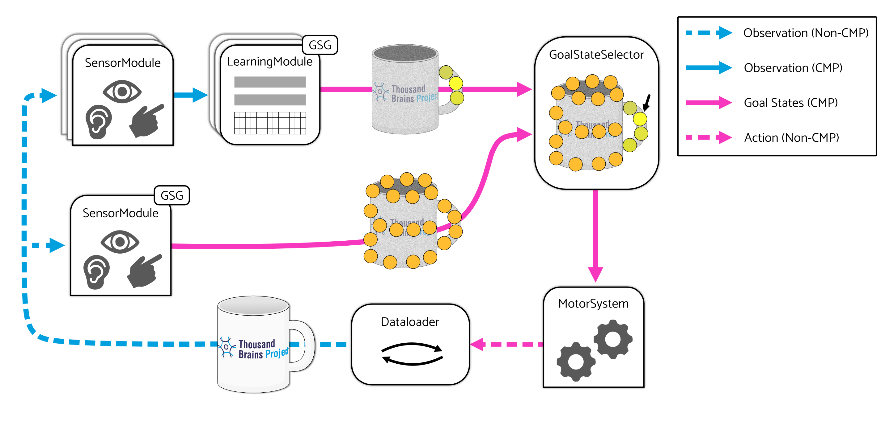

- Start Date: 2025-07-15
- RFC PR: 

# Summary
This RFC proposes several additions to Monty's architecture aimed at expanding the scope of Monty's goal-state system. The new components and pathways presented here were originally conceived of to improve the [efficiency of saccades driven by model-free and model-based signals](https://thousandbrainsproject.readme.io/docs/implement-efficient-saccades-driven-by-model-free-and-model-based-signals) and to [expand support for compositional objects](https://thousandbrainsproject.readme.io/docs/short-term-goals) and [multi-object environments](https://thousandbrainsproject.readme.io/docs/model-based-policy-to-recognize-an-object-before-moving-onto-a-new-object). However, several of the proposed changes to Monty's architecture are quite general, and we expect them to be broadly useful beyond our original objectives.

Briefly, the most significant changes proposed here are as follows:
 1. Sensor modules may be equipped with goal state generators.
 2. Goal states generated by learning modules and sensor modules will be sent to a `GoalStateSelector`, a new Monty component.
 3. The role of the `GoalStateSelector` is to produce a single output goal state from any number of input goal states.
 4. Motor systems will be responsible for selecting a policy appropriate to the goal state chosen by the `GoalStateSelector`.
 
# Implementation

**Proposed Routing Pathways**. Learning module (LM) and sensor module (SM) derived goal states will be routed to the `GoalStateSelector`, and the `GoalStateSelector`'s output will be routed to the motor system.

The `GoalStateSelector` will receive any number of goal states derived from learning and sensor modules, and it will produce at most one goal state for consumption by the motor system. There are many potential strategies for choosing a goal state, but the simplest initial approach will be to select the goal state with the largest `confidence` value. In this way, it will act exactly as the `Monty` class currently does. More complex methods are outside the scope of this RFC.

Many other Monty components will require modification. Below is a non-exhaustive list of anticipated changes.

### `SensorModule`
 - Will have an optional `gsg` attribute (i.e., it will be a `GoalStateGenerator` or `None`).
 - Will call its `gsg`'s `step_gsg` method before exiting its own `step` method (if `gsg` is not `None`).
 - Will have a `propose_goal_state` method that returns any number of goal states. Note that this differs from the learning module's `propose_goal_state` method which returns at most 1 goal state. Returing many goal states will enable planned work on salience-based targeting methods.

All of the above changes are meant to mirror existing learning-module/GSG behavior.

### `Monty`
 - Will have a `gss` attribute to hold a `GoalStateSelector`.
 - Existing machinery that collects goal states, performs selection, and updates the motor system will be replaced. More specifically, `Monty` will collect goal states from both learning modules and sensor modules, but it will defer goal state selection to its `gss` object. The output of the `gss` object will then be used to update the motor system.
 - Optionally, `Monty` may be equipped with additional `lm_to_gss` and `sm_to_gss` connectivity matrices to support more complex routing pathways, but this is not an immediate need.

### `MotorSystem`
 - Will be initialized with any number of policies.
 - Will perform policy/action selection based on a given goal state. Note that a goal state may not always be set, in which case it is expected that an appropriate model-free policy will be selected to produce an action.

### `GoalState`
 - May be augmented with metadata indicating the target of the goal, such as the agent's position or a sensor's sensed location.

Specific modifications to `GoalState` objects are not yet well understood. However, we expect that additional metadata may be required for the motor system to make correct judgments about which policy to select. For example, implementing behavior like `GetGoodView` will require some way to distinguish between goal states that specify an agent's translation and goal states specifying an orienting motion.

# Long-Term Objectives

Following discussions prior to this RFC, we have identified three objectives related to the functional and architectural changes proposed here.

  1. Implement the functionality of `GetGoodView` for the distant agent within the proposed framework. Goal-state-generating SMs will provide the model-free signals used to orient the agent to on-object regions. These signals can be filtered out or overridden when learning modules emit goal states, and the filtering will be performed by a `GoalStateSelector`.
  2. Integration of model-free segmentation and model-based policies to recognize an object before moving on to a new object. This objective is the primary motive that led to the formation of this specific RFC.
  3. Improve efficiency by learning and using sparser models. It has been suggested that our learned models are unnecessarily dense owing to the fact that non-salient and salient parts of an object are represented equally. If we can ensure that only the most salient parts of an object are attended to during inference, then we can effectively ignore (or at least sample less frequently) the non-salient areas during training without degrading performance.

Each of these tasks is significant, likely warranting its own RFC. Further discussion is outside the scope of this RFC.

# Discussion

The changes proposed here may disrupt the existing goal-state-execution system. More specifically, the dataloader is currently responsible for checking whether a motor system has a valid goal state and attempting to satisfy the goal state by "jumping" to a new location. I strongly suspect that the best course of action is to move the dataloader's jump-execution behavior into the motor system where it can be triggered by a policy. While the details are not yet fully defined, this refactor does appear to be consistent with already planned changes to the dataloader.
