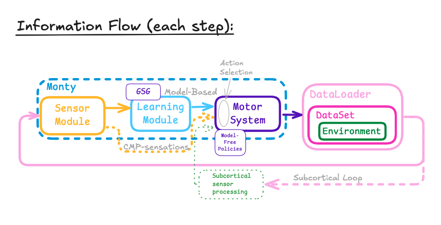

- Start Date: 2025-06-02
- RFC PR: 

# Summary
This RFC proposes a mechanism for efficient model-free saccades to be used by the distant agent.

# Motivation
There are two primary motivations
 1. Efficiency: We would like to reduce the number of inference steps required by the distant agent.
 2. Multi-Object Scenes and Compositional Objects: We would like to constrain saccades to either keep sensors on an object or move sensors to different objects.

# Background
The superior colliculus (SC) is a good mental model for what we need. Given visual input from a wide field-of-view, the SC generates one or more maps used to select the next location to attend to.
 - Salience Map: The visual-only superficial layer (SCs) of the superior colliculus is thought to generate maps based on features such as contrast, color opponency, and motion. Salience maps might help Monty move to areas that are more informative than a random-walk policy would. At a minimum, they should at least guarantee that the next viewed location is on some object (or very nearly so).
 - Priority Map: The intermediate layer (SCi) is believed to generate a priority map that reflects an organism's goals. Unlike the visual-only layer, the intermediate layer receives top-down and multimodal input. In Monty, a priority map may reflect the general regions we would like to keep our saccades within.

Finally, the SC is thought to be THE place where the saccade command are ultimately issued. If Monty were built this way, it would probably mean passing the vision-receiving LMs' goal states to the SC where they would leave a huge impact on priority maps, perhaps only being overriden if something really drastic happens (like a moving object you need to evade).

# Requirements
### Segmentation
Given the need to support saccades in multi-object scenes and compositional objects, its clear that we will need our superior colliculus to perform object segmentation, even if very approximate. One question is whether we want LMs to be able to inform segmentation maps. For example, if an LM has decided which object it is looking at, the region corresponding to the LM's observations could be "filled in" with an object ID. But this informed segmentation map would only be useful if the map persisted for some time. Another complication is what we do when there are multiple learning modules. We would have to know where the LM is "seeing" in the visual field in order to assign its output to a region in the visual field maintained by the SC.

### Memory
We would like to avoid returning to already viewed locations. An obvious solution is to maintain a map of where we have looked before and use it to weight salience/priority maps. For example, a "visitation map" would be initialized as a 2D array of 1s. When you visit an area, the location in the visitation map receives a small indentation that weights a saliency map towards zero. However, this would mean that visition maps are
 - persistent -- at least for a while, and
 - live in world/body coordinates.

More broadly, any map not imbued with world/body coordinates becomes stale after the next saccade. There is a workaround though -- maintain a memory of actions taken, and integrate those to populate a visitation map de novo after each observation. (I think this basically what the SC does, but only with the most recent action taken.)

However, the question of whether we think maps should be persistent is a general consideration. As mentioned above, segmentation maps may be most useful if they reflect object classifications produced by LMs. On the other hand, building persistent maps in world/body coordinates in SC is moving into "where" pathway and/or hippocampus territory, and we might end up placing a lot of demands on the SC that are better off done elsewhere.

### Policy Switching
The SC needs to know whether it should stay within an object or move to a new one. This makes it sound like the SC would be like a motor system with swappable motor policies, but that can't be quite right since the SC would perform lots of sensor processing.

# Architecture
How an SC would integrate into Monty's current architecture, including which components need to be added or augmented, will require a lot of feedback and discussion. Previously, the team put put together a version of this diagram:

Here, the "Subortical sensory processing" node is where the SC would fit.

### Input
For sensor data, this is relatively straightforward. We have a view-finder which captures a wide field-of-view, and we don't need (or want) CMP-compliant messages produced by sensor modules. Since the dataset applies `DepthTo3DTransform`, the SC will have access to the view-finder's data in world coordinates if necessary.

For non-sensor data, external objects may also interact with the SC in the following ways:
  1. Should we decide to have LMs inform the SC, we would need a pathway to allow for it.
  2. We need some way to switch the SC's "policy" between "stay-on-object" and "move-off-object" (or "move-to-a-specific-object").

### Output
What would an SC's output be? And who determines whether to enact the SC's suggestions or an LM's goal states? At first glance, it might seem like having the SC emit goal states would work, but the way goal states are handled by `InformedEnvironmentDataLoader` is much more than a saccade, including a full resetting of the agent's location and orientation (feel free to correct me on this).

It might make more sense to emit actions that can be executed directly. In this case, something would need to receive both SC actions and LM goal states. I don't know what this entity would be.

Note: there is one part of our code that already implements SC-like behavior -- `GetGoodView`. This code uses raw sensor data and coordinates obtained via `DepthTo3DLocations`. With this data, it decides where it ought to look, and computes the necessary "look" actions used directly by the motor system. This seems like a good template for an SC if we can work out how to do something similar within Monty's main execution loop.

