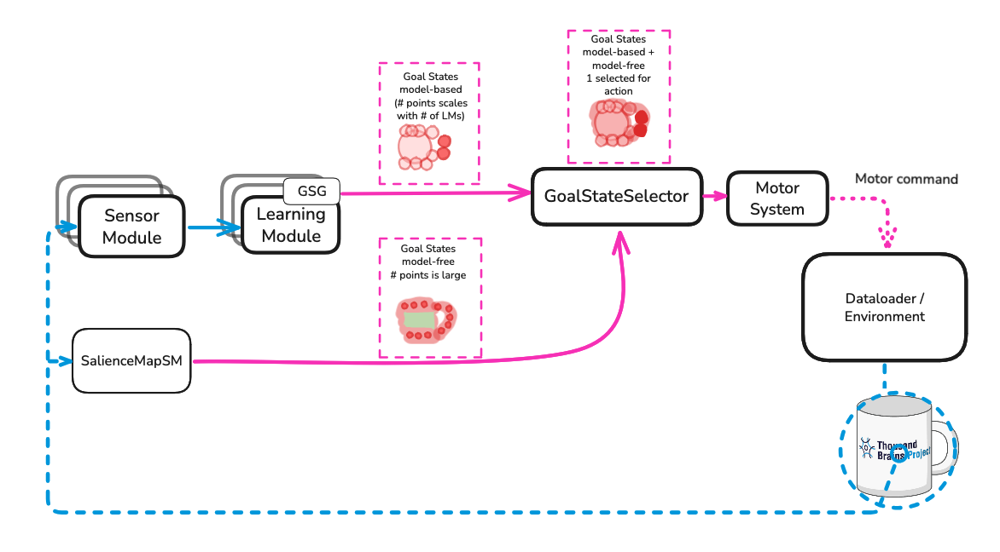

- Start Date: 2025-06-12
- RFC PR: 

# Summary
This RFC proposes several additions to and modifications of Monty’s architecture broadly aimed at supporting compositional objects, multi-object scenes, and unsupervised learning. More specifically, this document addresses the intermediate goal of [implementing efficient saccades driven by model-free and model-based signals](https://thousandbrainsproject.readme.io/docs/implement-efficient-saccades-driven-by-model-free-and-model-based-signals).

In single-object, one-object-per-episode experiments, we can make a simplifying assumption -- all observations in an episode correspond to exactly one object (henceforth, "one-object criterion"). In this case, the following critical conditions are are automatically met:
  1. Each object is stored in its own independent reference frame.
  2. During inference, a set of observations is approximately equal to some subset of a model in memory, up to rotation and displacement. (This may seem esoteric, but it's necessary for graph-matching.)

In general, compositional objects and multi-object scenes violate the one-object criterion. For example, if a saccade moves a sensor module's small receptive field off of one object and onto another, it has no way of knowing it is now sensing a different object. During learning, this would result in a single "object" model that contains points corresponding observed on both objects, therefore violating condition 1. During inference, integrating the post-saccade observation will likely result in a set of locations not found in any learned model and therefore violate condition 2. (Note that these kinds of predictionary errors can be useful indicators of object identity. See [RFC 9](https://github.com/thousandbrainsproject/tbp.monty/pull/196) and related PRs for more on that.)

Here we outline a strategy to satisfy a weaker, spatially restricted version of the one-object criterion by imposing constraints on the actions allowed during an inference window (i.e., a stretch of time where Monty attempts to recognize a single object). In particular, our goal is to restrict saccades so that they do not move a sensor module's receptive field off a sensed object until it has been recognized. We propose using model-free segmentation methods to generate spatial limits, though LMs may also play a role (uncertain).

In addition, we also propose a model-free, salience-based method to improve inference speed. This will improve inference speed in any setting (single-object, multi-object, etc.), but there is an equally important benefit to efficiency improvements in compositional/multi-object environments. By reducing the number of steps spent recognizing an object, we also reduce the number of opportunities for off-object observations to sneak in.

 - Generating model-free segmentation maps from wide field-of-view imagery.
 - Converting a segmented region into a CMP-compliant set of goal states.
 - Aggregating segmentation-derived (model-free) goal states and LM-derived (model-based) goal states.
 - Selecting a single goal state to relay to the motor system.
 
In addition, this document also proposes 
  - Weighting model-free goal states by salience values for faster inference.
  - Further weighting of all goal states to encourage larger saccades and discourage revisiting locations.
  

### Efficient Model-Free Policies

The distant agent has only one model-free action policy -- a random walk -- and it is relatively inefficient. Here, "inefficient" means that Monty requires a large number of observations to recognize an object. In contrast, a surface agent may be equipped with a curvature-guided model-free action policy that far outperforms the random walk with respect to efficiency and, to a lesser extent, accuracy.

**Selectivity**. 
In the context of multi-object scenes or compositional/nested objects, a random walk policy is also prone to failure on two accounts.
   - In the absence of movement constraints, such as a limiting boundary, it is highly likely that Monty will collect mixed-object observations (i.e., a set of observations where not all observations were taken from the same object). During learning, this tends to create object models that contain spurious points derived from off-object observations. Object recognition also tends to suffer from mixed-object observations for related reasons[^1](#footnote_1).
   - As the number of inference steps increases, so does the likelihood of collecting mixed-object observations. Therefore, inefficient action policies, such as the random walk, invite performance problems simply by keeping the inference window open for an extended period of time.
   

# Architecture

Here, the "Subortical sensory processing" node is where the SC would fit.

To implement the strategies outlined above, we propose two new Monty components:
 - `SalienceMapSM`: A sensor module subclass responsible for proposing a set of CMP-compliant goal states. These goal states can be thought of as salience-weighted, spatially constrained candidate locations. CMP-compliance is enforced to ensure these model-free goal states can be integrated with model-based, LM-derived goal states.
 - `GoalStateSelector`: A component that acts as a gateway between goal state proposers (i.e., learning modules and the `SalienceMapSM`) and the motor system. Its main job is to pool all goal states from all sources and decide which to send to the motor system. Since it produces the goal states used by the motor system, is the natural place to maintain a memory of previously visited locations, and therefore, the component that implements return inhibition (i.e., not returning to previously visited locations). 
 
Of course, these two components will require additions to and modifications of existing input/output pathways.

Finally, expect some refactoring of the motor system and the `InformedEnvironmentDataLoader`. At present, goal states are handled by `InformedEnvironmentDataLoader.execute_jump_attempt`. Some notes:
  - A DataLoader isn't the obvious place for this function, even now. Figuring out how to achieve a goal state is generally considered to fall within a motor system's reponsibilities.
  - This function is also too inflexible. It attempts all goal states in the same way -- a total (re)setting of the agent's pose. Since LMs emit goal states sparsely, I expect the vast majority of used goal states will be derived from `SalienceMapSM`, and all of these should be achievable with a saccade.

NOTE: The motor system is the side of Monty I've had the least contact with, so bear with me while I try to get more specific about any refactoring we may or may not need here. And please weigh in.

# Addendum
The superior colliculus (SC) is the primary template for this system proposed here. Given visual input from a wide field-of-view, the SC generates one or more maps used to select the next location to attend to.
 - Salience Map: The visual-only superficial layer (SCs) of the superior colliculus is thought to generate maps based on features such as contrast, color opponency, and motion. Salience maps might help Monty move to areas that are more informative than a random-walk policy would. At a minimum, they should at least guarantee that the next viewed location is on some object (or very nearly so).
 - Priority Map: The intermediate layer (SCi) is believed to generate a priority map that reflects an organism's goals. Unlike the visual-only layer, the intermediate layer receives top-down and multimodal input. In Monty, a priority map may reflect the general regions we would like to keep our saccades within.

Finally, the SC is thought to be THE place where the saccade command are ultimately issued.

The system proposed here doesn't have an exact 1:1 relationship with the superior colliculus, but they do rhyme. The `SalienceMapSM` resembles the visual-only superficial layer of the SC, while the `GoalStateSelector` is perhaps most similar to the SC's intermediate layer. The `GoalStateSelector` also resembles the SC in they both act as the input into the motor system.

Note: there is one part of our code that already implements SC-like behavior -- `GetGoodView`. This code uses raw sensor data and coordinates obtained via `DepthTo3DLocations`. With this data, it decides where it ought to look, and computes the necessary "look" actions used directly by the motor system. Niels has proposed reworking `GetGoodView` as an intermediate step to guide the development of this new system. I haven't given it much thought yet, but givenn that `GetGoodView` employs both translating and orienting actions, it could be an interesting spot to explore how motor systems decide which actions to perform to achiev a goal state.

# Footnotes
<a name="footnote_1">[^1]</a> Other approaches aimed at improving robustness under a multi-object, mixed observation setting are also being developed. See [RFC 9](https://github.com/thousandbrainsproject/tbp.monty/pull/196) for an LM-centric solution.

