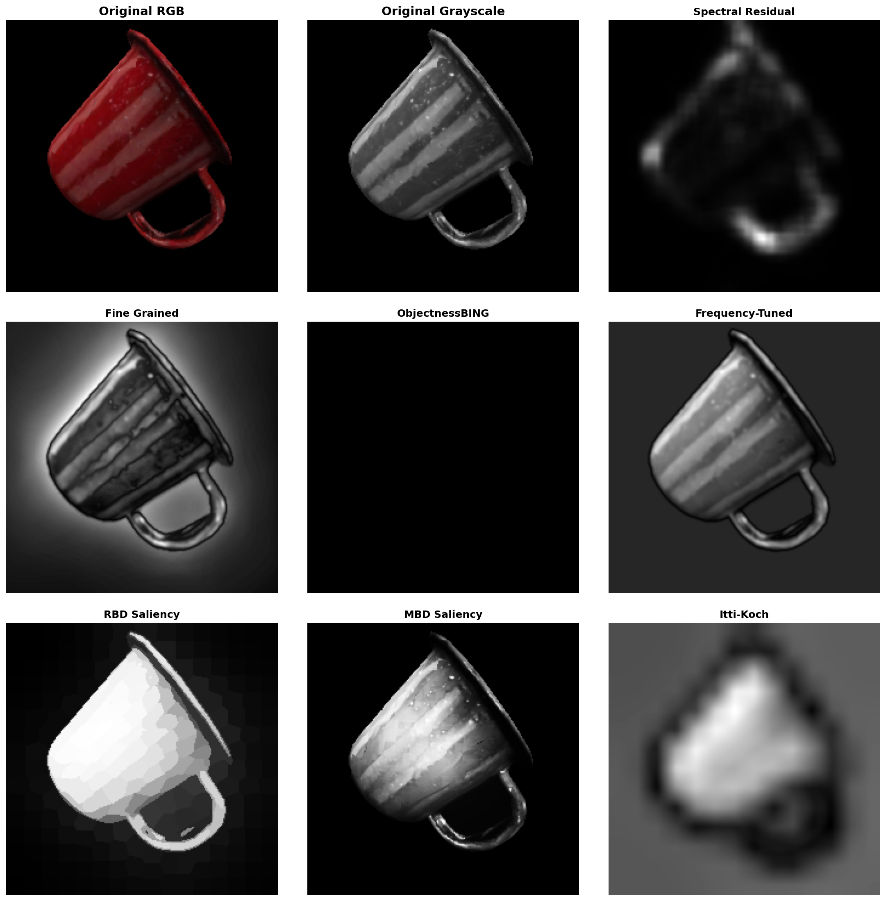

# Saliency Detection Methods

This directory contains implementations of various traditional saliency detection algorithms.

## Dependencies

- OpenCV  (`pip install opencv-contrib-python`)
- NumPy
- SciPy
- scikit-image
- matplotlib
- NetworkX

- You probably need to just activate `tbp.monty` and install `pip install opencv-contrib-python` (I think others are already included)

## Images
- `view_finder_images` located at `~/tbp/results/dmc/view_finder_images`
- Reads `.npy` files from the above path's `arrays` folder
- Saves a comparison of saliency maps called `saliency` (same parent directory as `arrays`) for each `.npy` file. 

## How to Run
```bash
cd ./src/tbp/monty/frameworks/utils/saliency
python run_saliency.py
```

## Example Output
