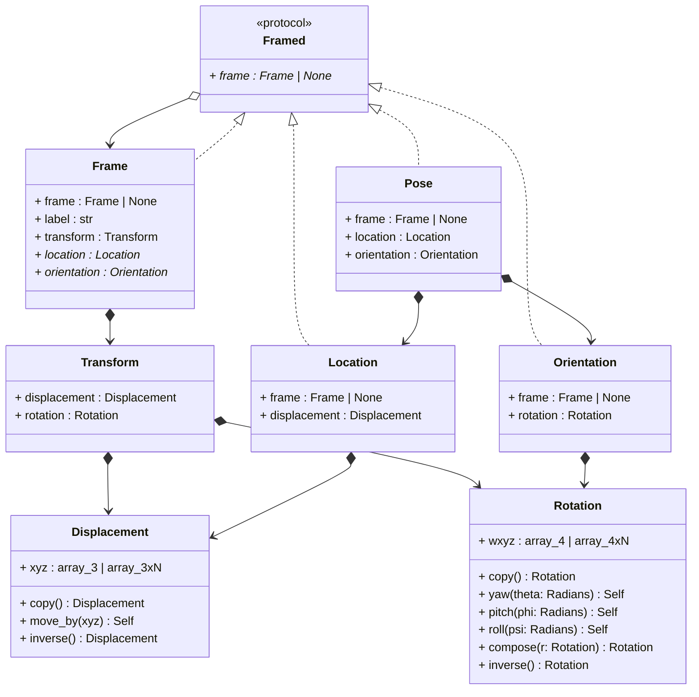

# Pose Utilities

```mermaid
classDiagram
    class Transform {
        + displacement : Displacement
        + rotation : Rotation
    }

    class Displacement {
        + xyz : array_3 | array_3xN
        + copy() Displacement
        + move_by(xyz) Self
        + inverse() Displacement
    }

    class Rotation {
        + wxyz : array_4 | array_4xN
        + copy() Rotation
        + yaw(theta: Radians) Self
        + pitch(phi: Radians) Self
        + roll(psi: Radians) Self
        + compose(r: Rotation) Rotation
        + inverse() Rotation
    }

    class Framed {
        <<protocol>>
        + frame : Frame | None*
    }

    class Frame {
        + frame : Frame | None
        + label : str
        + transform : Transform
        + location : Location*
        + orientation : Orientation*
    }

    class Pose {
        + frame : Frame | None
        + location : Location
        + orientation : Orientation
    }

    class Location {
        + frame : Frame | None
        + displacement : Displacement
    }

    class Orientation {
        + frame : Frame | None
        + rotation : Rotation
    }

    Transform *--> Displacement
    Transform *--> Rotation
    Framed o--> Frame
    Framed <|.. Frame
    Framed <|.. Pose
    Framed <|.. Location
    Framed <|.. Orientation
    Frame *--> Transform
    Pose *--> Location
    Pose *--> Orientation
    Location *--> Displacement
    Orientation *--> Rotation
```
